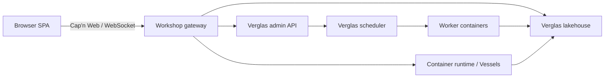

# Verglas OS

Verglas OS is a company's knowledge brain: an agentic data-lake application that
connects company data, builds repeatable workflows over that information, uses
graph relationships to connect entities and evidence, and produces analytics
dashboards. It is adapted from the open-source [Cloudflare OS](https://github.com/cloudflare/cloudflare-os)
Workshop, reoriented around a lakehouse-first product and a
**containerized Verglas runtime** instead of Dynamic Worker / Facet execution.

Workspaces are the place to chat over lakehouse data and to build or edit
Vessels (Applications and Integrations). The lakehouse remains the system of
record; Workspaces are not.

## What you get

1. **Agent chat** preloaded with how your company operates, connected to the
   lakehouse and approved integrations.
2. **Lakehouse-native jobs** — Sources and workers registered with the local
   Verglas admin/scheduler API, executed as ordinary Verglas worker deployments
   (containers in cloud; the same worker contract locally).
3. **Application Vessels** — compositional full-stack previews over lakehouse
   tables and integrations, deployed from chat.
4. **Workspaces** — agent chat over data, plus authoring surfaces for Vessels.
5. **Blueprints** — reusable Vessel / format templates for common outputs.

## Quick start

From the repository root, start the complete stack:

```bash
docker compose up -d --build
```

Visit http://localhost:8787

For UI-only development without rebuilding its container, install
[pnpm](https://pnpm.io/) and run `pnpm run-local` from `apps/os`.

This boots the Workshop stack locally (router + backend + frontend) and a
loopback-only [native model-runtime adapter](docs/model-runtimes.md). Point the
backend at a local Verglas admin/scheduler pair (`VERGLAS_ADMIN_URL`,
`VERGLAS_SCHEDULER_URL`, `VERGLAS_SCHEDULER_CONTROL_TOKEN`) to exercise Sources,
Jobs, Integrations, and Application Vessels against a real lakehouse.

### What to try

* "Ingest this CSV into a lakehouse table and chart the top categories."
* "Build a Source that polls this API and appends rows every hour."
* "Deploy an Application Vessel that lets the team browse those tables."
* "Make slides for my upcoming customer meeting." (built-in slides blueprint)
* "Make an issue dashboard for this GitHub repo." (attach a repo; GitHub
  Integration Vessel required)

### Early access

Verglas OS is under active development. The Workshop UI and Cap'n Web API still
run through the Cloudflare-style local stack today; durable Workspace/worker
execution is migrating onto Verglas containers. See
[Architecture](docs/architecture.md) and the
[backend migration plan](docs/verglas-backend-migration.md).

## Architecture in one page

| Concern | Cloudflare OS (upstream) | Verglas OS (this fork) |
| --- | --- | --- |
| Product center | Personal Workspaces / vibe-coded apps | Company knowledge lake + workflows |
| Execution | Dynamic Workers + Facets per Workspace | Verglas worker deployments / containers |
| Apps | Workspaces as the primary surface | Application Vessels + Workspaces as control UIs |
| Data plane | Durable Object SQLite, KV, R2 | Iceberg lakehouse, Verglas S3/cache, Postgres |
| Scheduling | DO alarms / facet lifecycle | Verglas distributed scheduler |
| Inference | User API keys (+ optional gateway) | User API keys or native CLI subscription runtimes |



The scheduler stays application-agnostic: it places and runs worker containers.
Workshop owns Workspace sequencing, approvals, Cap'n Web correlation, and product
semantics in its own state. Details:
[Architecture](docs/architecture.md).

## Features

### Knowledge-lake agent

The coding agent is a multi-purpose [Code Mode](https://blog.cloudflare.com/code-mode/)
agent. In Verglas OS it is steered toward lakehouse tables, Sources, workflows,
integrations, and Application Vessels — not toward treating every answer as a
new Workspace.

### Containerized Sources and jobs

Generated Source modules implement the portable Verglas worker contract
(`defineWorker`, `handler(ctx)`, append to `ctx.output`). They are registered
through the Verglas admin API and run by the scheduler — not loaded as Dynamic
Workers inside the Workshop process.

### Application Vessels

From chat, the agent can deploy compositional vessels (integrations and
full-stack application previews) into the local Verglas container runtime. The
Applications and Integrations pages list live vessels; credentials stay
server-side.

### Integration Vessels

Integrations are standalone API containers with a declared configuration schema.
Agents can generate them, users provide required credentials through the setup
UI, and Applications and Jobs consume their reflected APIs through the Verglas
SDK.

### Workspaces and Blueprints

Workspaces remain sandboxed private apps with Cap'n Web client/server APIs,
real-time sharing, and Blueprint-based cloning. In Verglas OS they are one tool
among many for building control surfaces on lakehouse workflows.

### Model choice

Use provider API tokens, Ollama, or an installed Codex / Claude Code / Cursor
CLI with an existing subscription. See [Model runtimes](docs/model-runtimes.md).
The deployment does not proxy inference through Cloudflare AI Gateway.

## Developing

```bash
pnpm dev-server   # backend + router (+ local model-runtime adapter)
pnpm dev-client   # Vite frontend on http://localhost:3000
```

Then open http://localhost:3000 (or the router at http://localhost:8787).

## Publishing cloud releases

The monorepo publishes immutable Cloudflare deployment bundles from
`.github/workflows/os-release.yml`. Pull requests build and retain the bundle as
a workflow artifact. Pushes to `main` also publish it to R2 after these repository
secrets are configured:

```text
R2_RELEASES_ACCESS_KEY_ID
R2_RELEASES_SECRET_ACCESS_KEY
```

The workflow writes to the existing `verglas-fleet-releases` bucket in the
Verglas Cloud account. Its `os/` prefix keeps these artifacts separate from
host and data-plane releases.

The published layout is:

```text
os/releases/<release-id>/manifest.json
os/blobs/modules/<sha256>
os/blobs/assets/<hash>
```

The manifest is uploaded last and carries the router, Workshop backend, frontend
asset index, required bindings, and ordered Durable Object migrations. Reusing a
release ID with different manifest bytes is rejected.

Build the same self-contained deployment directory locally from the repository
root:

```bash
pnpm --dir apps/os build
node apps/os/scripts/release/build-release.mjs --out release-out
```

The resulting `release-out` directory is the complete input required by the
Verglas Cloud deployer; it does not need an OS source checkout.

### Further reading

* [Architecture](docs/architecture.md) — containerized runtime and product shape
* [Backend migration](docs/verglas-backend-migration.md) — Workers → Verglas plan
* [Model runtimes](docs/model-runtimes.md)
* [Blueprints](docs/blueprints.md)
* [Sharing](docs/sharing.md)
* [AGENTS.md](AGENTS.md) — conventions for contributors and coding agents

### Contributing

See [CONTRIBUTING.md](CONTRIBUTING.md).
