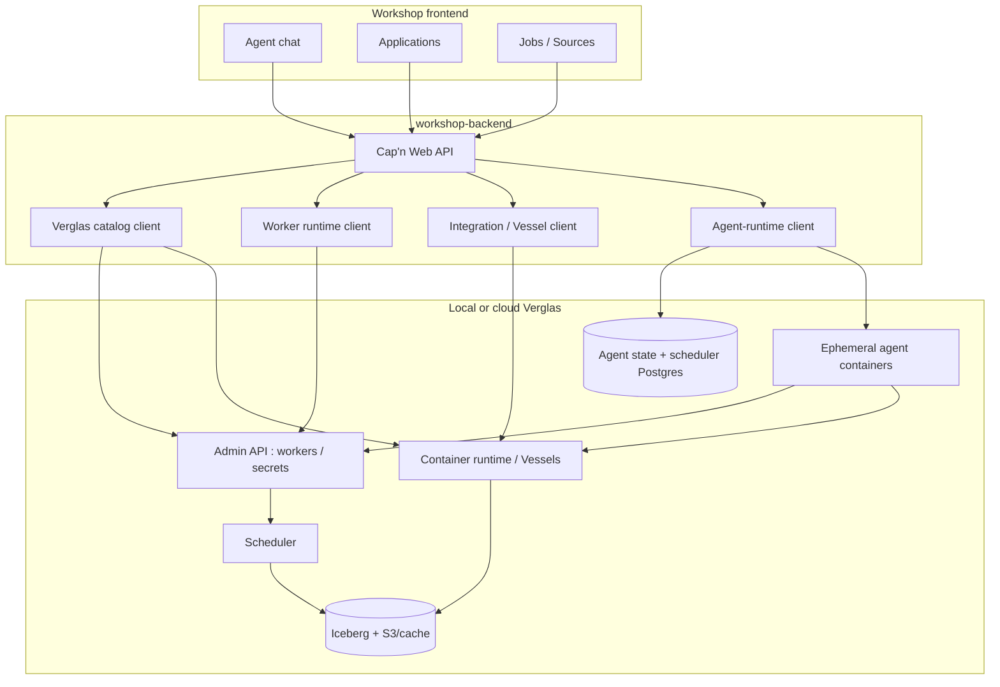

# Verglas OS architecture

Verglas OS adapts the open-source Cloudflare OS Verglas OS into an
agentic **company knowledge lake**. The Cap'n Web Workshop UI, Gatekeeper
security model, and Workspace sandbox ideas remain; the execution and data planes
move from Cloudflare Dynamic Workers / Facets / DO-SQLite toward **Verglas
workers, containers, Iceberg, and Postgres**.

## Product shape

Primary surfaces in the Workshop shell:

| Nav          | Role                                                |
| ------------ | --------------------------------------------------- |
| Workspaces   | Agent chats and Workspace control surfaces          |
| Jobs         | Scheduled / runnable Verglas workers (Sources)      |
| Applications | Application Vessels — full-stack lakehouse previews |
| Integrations | Integration Vessels with config schemas             |
| Lakehouse    | Tables, namespaces, and query entry points          |
| Explore      | Discovery across blueprints and lake artifacts      |

Workspaces are first-class agent sessions, but the agent is instructed to
prefer lakehouse tables, Sources, workflows, and vessels over creating a Workspace
for every task. Product SDKs may contribute ingestion definitions, graph
mappings, blueprints, and dashboard templates; no downstream app gets a
hard-coded privileged integration in the OS.

## Runtime shift: Workers → containers

### Upstream model (Cloudflare OS)

- Each workspace is a Durable Object.
- Each Workspace server runs as a Dynamic Worker Facet with bindings.
- Gatekeeper facets manage external access inside the workspace DO.
- Authoritative app state often lives in Durable Object storage / SQLite.

### Verglas model (this fork)

- **Sources / jobs** are ordinary Verglas worker deployments: TypeScript modules
  that `defineWorker()`, implement `handler(ctx)`, and append to lakehouse
  tables through the Verglas SDK. Registration goes through
  `VERGLAS_ADMIN_URL`; runs go through `VERGLAS_SCHEDULER_*`.
- **Application and Integration Vessels** are compositional containers managed
  by the local Verglas container runtime (`VERGLAS_CONTAINER_RUNTIME_*`). The
  Workshop lists them, opens previews, and patches config — it does not embed
  their processes.
- **Legacy Workspaces** (Overseer Durable Objects, Dynamic Worker LOADER,
  facets, and the Workspace editor) are removed. Workspace and chat records are
  Postgres-backed. Each agent turn is an ephemeral Verglas container run;
  persistent UIs are Application Vessels and batch work is Jobs.
- **Model subscription CLIs** (Codex / Claude Code / Cursor) run via a narrow
  loopback (or account-scoped container) adapter. Placement of that adapter is
  control-plane owned; the Workshop does not call the Verglas scheduler per
  model turn. See [model-runtimes.md](model-runtimes.md).

## PoC vs target

**Working on this branch today**

- Workshop gateway still boots under Wrangler for Cap'n Web and legacy login,
  user-list, and admin capabilities. The Overseer DO, Worker Loader, Workspace
  facets, and DO-backed chat state are removed.
- `agent-runtime` stores Workspace/chat/run state in the scheduler Postgres and
  launches one isolated container per turn through `/v1/runs/*`.
- Agent containers receive a random per-run controller capability, not shared
  data-plane credentials. The controller maps every exposed operation to a
  Verglas authorization check for the Workspace agent principal.
- Backend clients talk to a local Verglas admin, scheduler, and container
  runtime for Sources, vessel deploy/config, and lakehouse catalog reads.
- Native model-runtime adapter runs beside the OS and is called from agent
  containers through its narrow authenticated endpoint.
- Agent prompts and UI nav are lakehouse / vessel oriented (no createVessel).

**Target (see [verglas-backend-migration.md](verglas-backend-migration.md))**

- No runtime dependency on Workers, Durable Objects, Worker Loader, Facets, KV,
  R2, D1, or service bindings for the product path.
- PostgreSQL owns transactional Workshop state; Verglas KV for cache-shaped
  data; Iceberg for analytical / append history; S3 for large blobs.
- Remaining login, user-list, and admin Durable Objects move to Postgres/KV;
  agent turns already execute as Verglas container runs.
- Cap'n Web remains the browser RPC; transport is a normal local WebSocket
  server.

## Security boundaries that do not change

- Gatekeepers keep resource-scoped capabilities, observation authorization,
  queued approvals, and simulation of pending writes.
- Ambient gatekeeper singletons appear only by user/admin configuration — a
  gatekeeper never asserts its own ambience.
- Model-runtime and Verglas control-plane tokens stay server-side; the browser
  and workspace sandboxes never receive them.
- Generated worker / vessel code runs with scoped credentials, not tenant-root
  tokens.

## Package map

| Package                        | Role in Verglas OS                                             |
| ------------------------------ | -------------------------------------------------------------- |
| `workshop-frontend`            | Shell: chat, Jobs, Applications, Integrations, Lakehouse       |
| `workshop-backend`             | Kernel API; Verglas catalog / worker / vessel / model adapters |
| `workshop-shared`              | Cap'n Web RPC contract                                         |
| `router`                       | Public origin / local dev router                               |
| `scripts/pi-model-runtime.mjs` | Scoped Pi OAuth and native-message provider service            |

Implementation entry points worth reading:

- `packages/workshop-backend/src/verglas-worker-runtime.ts` — Source registration
- `packages/workshop-backend/src/verglas-integration-runtime.ts` — vessel deploy
- `packages/workshop-backend/src/verglas-catalog.ts` — workers + vessels listing
- `packages/workshop-backend/src/verglas-workspace-runtime.ts` — Workspace → Verglas bridge
- `packages/workshop-backend/src/model-runtimes.ts` — Pi subscription provider management
