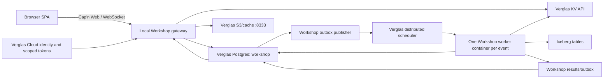

# Verglas backend migration

Status: in progress (local runtime PoC)

This document defines the changeover from the Cloudflare-backed Workshop runtime
(Dynamic Workers, Facets, Durable Object state) to a Verglas-backed,
**containerized** runtime. The target is a local Workshop web application
connected to a local Verglas cache/server and scheduler. Verglas Cloud may
continue to provide identity, scoped credentials, the Iceberg catalog and object
origin, and managed Postgres.

For the product-facing summary of what already shipped on this branch, see
[architecture.md](architecture.md).

The target architecture has no runtime dependency on Cloudflare Workers, Durable Objects, Worker Loader, Facets, KV, R2, D1, Queues, Pipelines, Workflows, Browser Rendering, or service bindings. Existing Cloudflare deployments may remain supported during migration, but they are not the target abstraction.

### PoC progress

Already wired in `workshop-backend` against local Verglas endpoints:

- Source / worker registration and runs (`verglas-worker-runtime.ts`)
- Integration and Application Vessel deploy/config (`verglas-integration-runtime.ts`)
- Catalog listing for workers and vessels (`verglas-catalog.ts`)
- Native model-runtime adapter for Codex / Claude Code / Cursor CLIs
- Agent and UI oriented around lakehouse tables, Jobs, Integrations, and Applications

Still ahead (remainder of this document): Workshop Postgres as system of record,
Verglas KV, Workspace execution as one scheduler job per event, and retiring DO /
Dynamic Worker dependencies on the product path.

## Fixed decisions

1. PostgreSQL is the authoritative operational database for users, sessions, workspaces, Workspaces, connected accounts, approvals, hooks, sharing, configuration, and all other transactional application state.
2. The PostgreSQL database used by `verglas-scheduler` is scheduler-owned. Workshop must use a separate Verglas-managed application database and must not create application tables in the scheduler database.
3. Verglas gains a small native KV module and HTTP API. Workshop uses it for cache-shaped and key/value-shaped data currently stored in Cloudflare KV or used as a non-transactional Durable Object cache.
4. SQLite and MySQL are not part of the target architecture. Generated Workspaces must not depend on Durable Object SQLite.
5. Iceberg remains the analytical and append-history store. It is not used as a substitute for transactional user/application state.
6. Large blobs use the Verglas S3 endpoint and backing object store. Postgres and KV store references and metadata, not large archive bodies.
7. Every Workspace invocation, hook, cron tick, webhook, and background operation is ultimately executed as an existing Verglas worker deployment. Do not introduce a second infrastructure scheduler.
8. The Verglas scheduler remains application-agnostic. It persists triggers, leases jobs, places worker containers, retries failures, and records completion. It does not know about Workspaces, Workshop mailboxes, RPC correlations, subscriptions, or per-Workspace serialization.
9. One scheduled Verglas job represents one Workshop worker event. Workshop owns only application sequencing, fencing, idempotency, and results in its Postgres schema; it does not drain a hidden secondary job queue inside a worker container.
10. Workspace execution is performed by a sandboxed Workshop runtime worker. Generated Workspace code is an input bundle, not a dynamically deployed Cloudflare Worker.
11. Cap'n Web may remain the browser-facing RPC protocol, but its backend transport is a normal local WebSocket server. Cloudflare RPC objects are not persisted.
12. Gatekeeper security behavior is preserved: resource-scoped capabilities, observation authorization, queued approvals, simulation of pending actions, hook enablement, and observer verification remain mandatory.

## Target topology



The initial laptop deployment consists of:

- `workshop-frontend`, served by the local router or Vite;
- a local Workshop gateway process;
- the existing local `verglas-server` on ports 8333 and 8334;
- the existing local `verglas-scheduler` and its scheduler-owned Postgres database;
- a separate Workshop Postgres database, normally provisioned through `verglas db create`;
- one Workshop runtime worker deployment registered with the local scheduler;
- optional local sandbox runner capacity, such as Docker-backed subprocesses.

A disconnected, fully self-hosted installation may run a second local Postgres container for Workshop. It must expose the same Postgres contract as the managed database. It remains separate from the scheduler database.

## Storage ownership

### PostgreSQL: authoritative operational state

Create a dedicated database, for example:

```bash
verglas db create workshop --type postgres
```

Postgres owns state requiring transactions, uniqueness, indexed point lookups, foreign keys, compare-and-set behavior, or atomic multi-record changes.

The initial schema families are:

| Schema family | Representative records |
| --- | --- |
| Identity | users, profiles, credentials, login sessions, password hashes, tenant membership |
| Workspaces | workspaces, Workspaces, code versions, collaborators, share links, observer registrations |
| Chats | chat metadata, messages, active agent turns, compaction checkpoints, callback arguments |
| Connections | connected accounts, OAuth grants, resource bindings, Gatekeeper accounts |
| Actions | proposed actions, approval state, simulation overlays, application/rejection results |
| Hooks | hook definitions, enablement, callback addresses, delivery cursors, idempotency keys |
| Configuration | admin settings, model configuration, provisioning policy, feature settings |
| Runtime | Workspace state versions, invocation records, correlation results, subscriptions |
| Catalog metadata | Blueprint ownership, featured state, pins, output metadata, blob references |

Postgres replaces the authoritative contents of `UserDurableObject`, `OverseerDurableObject`, `AdminSettings`, `PendingLogin`, Gatekeeper account Durable Objects, and Gatekeeper instance Durable Objects.

The migration must preserve existing uniqueness and ordering invariants. Examples include unique Workspace binding names within a workspace, monotonic chat sequences, unique connected-account identifiers, one live action transition, and idempotent external-message delivery.

### Verglas KV: cache and key/value state

Add a `verglas-kv` module to the open-source Verglas server and expose it through the admin/data API. KV is deliberately smaller than a database. It is appropriate for cached documents, mirrors, short-lived login state, precomputed summaries, and small objects fetched by exact key.

KV is not used for multi-record application transactions, relational queries, action state machines, user ownership, or anything that must atomically update Postgres records.

#### KV API

The first API version should provide:

```http
GET    /v1/kv/{namespace}/{key}
PUT    /v1/kv/{namespace}/{key}
DELETE /v1/kv/{namespace}/{key}
GET    /v1/kv/{namespace}?prefix=...&limit=...&cursor=...
POST   /v1/kv/{namespace}/batch
```

`PUT` accepts raw bytes and the following optional metadata:

- content type;
- expiration timestamp or TTL;
- application metadata with a strict size bound;
- an expected version for compare-and-set.

Every read returns:

- value bytes;
- content type;
- version/ETag;
- creation and update timestamps;
- expiration when present;
- bounded application metadata.

Required semantics:

- tenant and namespace isolation;
- exact-key reads;
- prefix listing with deterministic order, server-enforced page limits, and opaque cursors;
- atomic compare-and-set for one key;
- atomic bounded batch mutation within one namespace;
- TTL expiration;
- idempotency keys for write retries;
- explicit maximum key, value, metadata, and batch sizes;
- no unbounded list response;
- no SQLite or MySQL dependency.

The implementation should reuse Verglas's backend object and cache abstractions. Durable values live in the configured backing object store; the local Verglas cache serves hot values. The module owns any bounded in-memory index and durable manifest/log needed for prefix enumeration. That index is an implementation detail and must not become a second general-purpose database.

The TypeScript SDK should expose:

```ts
interface VerglasKvNamespace {
  get(key: string): Promise<KvValue | null>;
  put(key: string, value: Uint8Array, options?: KvPutOptions): Promise<KvWriteResult>;
  delete(key: string, options?: KvDeleteOptions): Promise<KvWriteResult>;
  list(options?: KvListOptions): Promise<KvListPage>;
  batch(operations: KvOperation[], options?: KvBatchOptions): Promise<KvBatchResult>;
}

interface VerglasClient {
  kv(namespace: string): VerglasKvNamespace;
}
```

Workshop namespace names must include the tenant and logical owner rather than relying on an unscoped global namespace. Examples include `workshop.blueprints`, `workshop.avatars`, `gatekeeper.github.cache`, and `context.collections`.

#### Existing KV binding migration

| Current binding/use | Target |
| --- | --- |
| `BLUEPRINTS` | Verglas KV for the hot public/admin mirror; Postgres remains authoritative |
| `AVATARS` | Verglas KV for small images or an S3 reference when over the KV value limit |
| `CONTEXT_COLLECTIONS` | Verglas KV for cached summaries; documents and ACLs move to Postgres/Iceberg |
| Gatekeeper response caches | Vendor-scoped Verglas KV namespaces with TTL/versioning |
| Admin config mirror | Verglas KV mirror written only after the Postgres transaction commits |
| OAuth nonce/temporary login state | Verglas KV with a short TTL; completed grants move to Postgres |

Code must access KV through an asynchronous repository interface. Do not recreate the synchronous Durable Object KV API over network calls.

### Iceberg: analytical, historical, and generated data

Use Iceberg tables for append-oriented or analytically queried state:

- chat and agent event history;
- model-step and cost events;
- observations and audit events;
- product analytics and browser/backend error events;
- Context Library document revisions and embeddings;
- Blueprint publication history;
- generated datasets;
- materialized query outputs;
- ingest provenance;
- worker/run logs retained for analysis.

An operation may write its transactional record to Postgres and asynchronously append an analytical event through a Verglas queue. The Postgres transaction is authoritative; failure of the analytical append must be retryable and must not roll back a completed user operation.

### S3/object storage: large immutable content

Use the Verglas S3 endpoint for:

- `.blueprint` archives;
- chat attachments;
- screenshots and exported PDFs;
- large avatars and site logos;
- generated bundles;
- large Context Library documents;
- staged ingest objects;
- generated exports.

Postgres stores object ownership, content hash, byte size, media type, lifecycle state, and object key. Clients must not receive general-purpose bucket credentials. The gateway or a scoped Verglas operation issues access for one object or prefix.

## Workspace execution

### Scheduler boundary

The Verglas scheduler is a distributed infrastructure scheduler. In cloud deployments it is responsible for selecting capacity and scheduling worker containers to execute. The Workshop migration does not add Workspace-specific semantics to that scheduler.

The scheduler owns:

- durable acceptance of supported triggers;
- deployment lookup;
- resource requests and placement;
- worker-container launch and termination;
- job leases, fencing, retry, and terminal execution status;
- generic logs and runtime accounting.

The scheduler does not own:

- Workshop RPC request or correlation identifiers;
- the meaning of per-Workspace ordering;
- Workspace state versions;
- subscription membership;
- browser connection state;
- result schemas;
- Workshop-specific queue names;
- persistent or warm Workspace actors.

Those are Workshop application concerns implemented with its Postgres database and worker code. The same Workshop worker image can be executed by the local scheduler or placed onto distributed worker containers by the cloud scheduler without changing this boundary. From the scheduler's perspective, each invocation is simply one event and one ordinary worker job.

### Invocation path

The gateway first records every call into Workspace server code in the Workshop database. The invocation and a transactional outbox record are inserted in one Postgres transaction:

```text
workshop_invocations
  id
  tenant_id
  workspace_id
  workspace_id
  sequence
  code_version
  method
  args
  status
  result
  state_version
  created_at
  started_at
  completed_at

workshop_outbox
  id
  aggregate_type
  aggregate_id
  event_type
  payload
  published_at
```

An outbox publisher submits one bounded CloudEvents 1.0 invocation event to the existing Verglas worker deployment:

```json
{
  "specversion": "1.0",
  "type": "org.verglas.workshop.workspace.invoke",
  "source": "workshop/workspace/WORKSPACE_ID",
  "subject": "workspace/VESSEL_ID",
  "id": "OUTBOX_EVENT_ID",
  "data": {
    "tenantId": "TENANT_ID",
    "workspaceId": "WORKSPACE_ID",
    "workspaceId": "VESSEL_ID",
    "invocationId": "INVOCATION_ID"
  }
}
```

The event asks Verglas to execute the Workshop worker deployment once. Its payload is a bounded application message; the scheduler does not interpret the Workspace identifier, invocation identifier, or sequencing policy.

The outbox event identity is the scheduler idempotency key. Retrying publication does not produce two logical jobs. The invocation record is also idempotent, so a retried or redelivered worker event observes the same terminal result instead of executing twice.

### Application-owned sequencing and fencing

The gateway assigns a monotonic sequence to each invocation within a Workspace as part of the transaction that creates the invocation and outbox record. The distributed scheduler may start worker containers in any order or concurrently. Workshop enforces its own application ordering in Postgres without adding Workspace semantics to scheduler placement.

A worker run:

1. loads the exact invocation named by the event;
2. returns the already-committed result when the invocation is terminal;
3. atomically acquires the Workspace execution lease and receives its monotonically increasing fence generation;
4. verifies that the invocation is the next sequence eligible to execute;
5. if an earlier sequence is still active, releases the lease and returns a generic retryable worker failure so the scheduler can retry the same job later;
6. executes the invocation outside the claiming transaction;
7. commits the result only when the Workspace lease still has the same fence generation;
8. advances the Workspace's next sequence after either successful execution or a terminal application failure;
9. exits after this one invocation.

Only the live fence generation may mutate a particular Workspace. Workers for different Workspaces acquire different leases and remain parallel. Duplicate, concurrent, or out-of-order distributed dispatches are safe because the application sequence and fence determine which invocation may commit.

Postgres contains no container placement, fleet inventory, infrastructure worker lease, or job retry machinery. It contains only Workshop invocation records and the application lock needed to preserve Workspace state semantics.

### Workshop runtime worker

Register one ordinary Verglas worker deployment owned by Workshop. In cloud it runs in worker containers selected by the distributed scheduler. Locally it runs through the same worker contract. It:

1. validates the wake event and scoped principal;
2. loads the invocation named by the event and acquires its Workspace execution fence;
3. resolves the requested code version;
4. loads the bundle from Verglas S3/KV;
5. loads operational state from Workshop Postgres;
6. executes one method inside a sandbox;
7. commits state, invocation status, result, sequence advancement, and application outbox events transactionally;
8. exits after the invocation.

The worker must not receive an account-administrator credential. Its token is scoped to:

- the current tenant;
- the Workshop database/schema operations needed for one Workspace;
- the Workspace bundle object;
- the declared Verglas tables and queues;
- the declared Gatekeeper capabilities for that Workspace invocation.

### Results and subscriptions

Results and subscriptions are Workshop application data. Their canonical records live in Workshop Postgres. The gateway may receive notifications through Postgres notification, a Workshop outbox consumer, or ordinary Verglas queues, but no Workshop-specific result protocol is added to the scheduler.

If Verglas queues are selected as the notification transport, Workshop may use application-owned queues such as:

| Queue | Purpose |
| --- | --- |
| `workshop.workspace.results` | Correlated method results and bounded errors |
| `workshop.workspace.events` | State-change and subscription notifications |
| `workshop.analytics` | Best-effort analytical events destined for Iceberg |
| `workshop.gatekeeper.events` | External-service and hook delivery events |

These names and payloads belong to Workshop. The Verglas queue API treats them like any other tenant queue.

The canonical invocation record contains its correlation id, status, state version, and bounded result or error. Large results remain in Verglas and are represented by a table, snapshot, or object reference.

The Workshop gateway resolves an attached Cap'n Web promise when the invocation reaches a terminal state. If the browser disconnects or the wait times out, the result remains addressable by invocation id in Postgres until expiration.

Browser subscriptions are connection-local capabilities held only in gateway memory. Durable subscription intent lives in Postgres. A reconnect creates a new live capability and resumes from the last acknowledged event sequence.

### Warm execution

Cold start is not a separate correctness model. In cloud, the Verglas fleet and distributed scheduler decide how worker-container capacity is placed and reused. Locally, the worker runtime may keep sandbox capacity warm. Workshop does not require a scheduler-level per-Workspace warm-runner feature.

Initial optimizations may include:

- cached bundles by code version;
- a warm sandbox runner pool;
- reusing generic worker-container or sandbox capacity when the Verglas fleet/runtime elects to do so;
- pre-established local connections to Postgres and Verglas.

A warm runner or worker container is disposable. No authoritative state may exist only in runner memory.

### Sandbox

The first local implementation may use Docker Desktop as the security boundary:

- no network unless a specific capability proxy is mounted;
- read-only root filesystem;
- non-root user;
- no host filesystem or Docker socket;
- dropped Linux capabilities;
- seccomp profile;
- CPU, memory, process, and wall-clock limits;
- tmpfs scratch directory;
- one private RPC channel to the runtime host.

Node `vm` and worker threads are not security boundaries and must not run untrusted generated code directly in the gateway process.

## Workspace programming model

Generated code moves from `cloudflare:workers` to a platform-owned module:

```ts
import { Workspace, RpcTarget, restore } from "@verglas/workspace-runtime";

export default class Tasks extends Workspace {
  async addTask(input: AddTaskInput) {
    const task = await this.db.tasks.create(input);
    await this.emit("tasks.changed", { taskId: task.id });
    return task;
  }
}
```

The runtime exposes:

- a transaction-scoped Postgres repository;
- a scoped Verglas KV namespace;
- declared table, queue, and object capabilities;
- event emission;
- restoration of durable callback addresses;
- logging with tenant/workspace/Workspace context.

It does not expose:

- Durable Object APIs;
- SQLite;
- MySQL;
- ambient network access;
- ambient object-store credentials;
- an account-wide Verglas administrator token.

Existing Workspaces may be migrated by transforming the supported `DurableObject` storage calls to the new runtime APIs. Do not implement a hidden SQLite database to preserve `ctx.storage.sql`. Unsupported arbitrary SQLite usage must produce an explicit migration error and require conversion to Postgres.

## Cap'n Web and local gateway

Cap'n Web remains useful for the browser because it already provides promise pipelining, callbacks, subscriptions, and MessagePort support. Replace `newWorkersRpcResponse()` with a WebSocket transport hosted by the local Workshop server.

The gateway owns only live connection state:

- WebSocket sessions;
- live callback capability maps;
- correlation waiters;
- bounded response buffers;
- cancellation when a client explicitly abandons an invocation.

It does not own durable user, workspace, Workspace, callback, or approval state.

No RPC stub is stored in Postgres or KV. Persistent callbacks are encoded as durable addresses:

```json
{
  "tenantId": "TENANT_ID",
  "workspaceId": "WORKSPACE_ID",
  "workspaceId": "VESSEL_ID",
  "handler": "receiveEmail",
  "restoreParams": {
    "mailbox": "sales"
  },
  "codeVersionPolicy": "current"
}
```

When a hook fires, the Gatekeeper emits a scheduler event containing this address. The Workshop runtime worker loads the current permitted version and invokes the restored handler.

## Gatekeepers

The three logical levels remain, but they are records and scoped services rather than Cloudflare entrypoints/facets:

| Current concept | Target concept |
| --- | --- |
| `GatekeeperVendor` Worker entrypoint | Registered vendor module/service |
| `GatekeeperUser` entrypoint | Connected-account service backed by Postgres |
| Gatekeeper Durable Object facet | Resource-binding record plus scoped session service |
| Durable Object cache | Vendor-scoped Verglas KV namespace |
| Stored persistent stub | Durable callback address |
| Service binding | Registered local/remote service endpoint with a scoped token |

Security invariants remain unchanged:

1. Read-only external observations must be authorized before data is returned.
2. Externally visible writes must be submitted as actions and applied only after approval.
3. Pending actions must be simulated for subsequent reads where the current Gatekeeper does so.
4. Resource bindings remain capability-scoped; a Workspace does not receive a vendor-wide client when it was granted one document, repository, table, or project.
5. Observer verification must use the observer's own account authority and fail closed on unavailable verification.
6. Hook enablement and disablement remain explicit and idempotent.
7. OAuth tokens and external credentials are encrypted at rest in Postgres or stored through Verglas secrets. They never enter Iceberg, logs, KV metadata, job payloads, or browser-visible responses.

Gatekeeper cache namespaces must be scoped by tenant, vendor, account, and resource as appropriate. Cache entries may improve API shape and support pending-action simulation, but Postgres remains authoritative for approval and observer state.

## Current Cloudflare component mapping

| Current component | Target implementation |
| --- | --- |
| `UserDurableObject` | Workshop Postgres repositories and transactions |
| `OverseerDurableObject` | Workspace service plus Postgres-sequenced Workspace invocations |
| `AdminSettings` | Postgres authoritative record plus Verglas KV hot mirror |
| `PendingLogin` | Postgres or short-lived Verglas KV record with TTL |
| Gatekeeper account DOs | Postgres connected-account records plus secrets |
| Gatekeeper facets | Resource-binding records and scoped session services |
| `LOADER` | Bundle build/store plus the Workshop runtime worker |
| `ctx.facets` | Postgres Workspace identity, execution fences, and state versions |
| Durable Object alarms | Verglas cron workers |
| Persistent RPC stubs | Callback addresses and restore parameters |
| `BLUEPRINTS` KV | Verglas KV mirror plus Postgres authority |
| `AVATARS` KV | Verglas KV or S3 objects by size |
| `CONTEXT_COLLECTIONS` KV | Verglas KV summaries plus Postgres/Iceberg content |
| `BLUEPRINT_CONTENT` R2 | Verglas S3/object storage |
| Cloudflare Pipelines | Verglas queues, workers, and Iceberg sinks |
| Cloudflare Queues/Workflows | Verglas scheduler and queues |
| Browser Rendering | Sandboxed Chromium worker/container |
| Worker service bindings | Explicit service registry and scoped HTTP/RPC endpoints |
| Static assets | Local router/Vite or a normal web server |

## Authentication and authorization

Verglas Cloud remains the identity issuer for connected deployments. The Workshop gateway accepts a user session and exchanges or resolves it into narrowly scoped Verglas principals.

Use the existing `vgst_` scoped-token model. Workshop and Gatekeepers must not hold the tenant root `vgk_` key during normal operation.

Required grant boundaries include:

- tenant/account;
- Workshop database/schema;
- exact table or namespace prefix;
- table read and write;
- SQL query over authorized tables;
- worker registration/management;
- worker invocation;
- queue enqueue/consume;
- KV namespace and operation;
- object or object-prefix access;
- administration.

The migration depends on completing scoped query enforcement, worker management/run separation, namespace-prefix matching, and a caller-relative access check in Verglas. These extend the existing authorization model; they do not replace it.

## Repository changes

### Verglas

Add or extend:

- `verglas-kv` crate/module and its backend/cache integration;
- `/v1/kv/*` routes;
- Rust and TypeScript KV SDKs;
- scoped KV grants;
- tests and documentation proving the existing scheduler can execute the Workshop worker deployment locally and through distributed cloud worker containers.

Do not add:

- another scheduler;
- a separate query-job or ingest-job framework;
- SQLite or MySQL;
- a source/MV/sink orchestration layer.

### Verglas Cloud

Add or extend:

- provisioning of the dedicated Workshop Postgres database;
- scoped credentials for the Workshop gateway and Workspace workers;
- KV namespace grants when cloud traffic reaches the local/tenant KV surface;
- worker deploy/run permission separation;
- table authorization for SQL queries;
- encrypted Gatekeeper secret management;
- audit entries for token creation, grant changes, and administrative operations.

Do not add Workshop correlation, sequencing, fencing, result, subscription, or warm-runner policy to the cloud scheduler. Its responsibility remains distributed placement and execution of generic worker containers.

### Verglas OS

Add:

- a normal local HTTP/WebSocket Workshop gateway;
- Postgres repositories replacing typed Durable Object storage;
- a Verglas KV client/repository layer;
- bundle creation and storage by code version;
- the Workshop runtime worker deployment;
- invocation sequencing/fencing, transactional outbox, result, and subscription repositories;
- optional application-owned result/event queue consumers;
- scheduler-backed hook and cron delivery;
- the `@verglas/workspace-runtime` programming API;
- schema migrations from existing deployment exports where available.

Remove after cutover:

- imports from `cloudflare:workers` in the Workshop runtime and generated Workspace contract;
- Durable Object classes and migrations;
- Worker Loader and Facet calls;
- KV, R2, Browser, Pipeline, and service bindings from Wrangler configuration;
- Cloudflare router deployment assumptions;
- stored native RPC stubs;
- Durable Object alarms used for scheduled work;
- Durable Object SQLite expectations.

## Migration phases

### Phase 1: Verglas platform prerequisites

1. Implement and test Verglas KV.
2. Add scoped KV authorization.
3. Verify the existing scheduler worker contract locally and against distributed cloud worker-container execution.
4. Complete scoped query and worker-run enforcement.
5. Provision a dedicated Workshop Postgres database.

Exit criterion: a standalone Workshop worker can be dispatched through the unchanged generic scheduler contract, read Postgres state, use KV, and complete successfully in both local and distributed cloud execution.

### Phase 2: Workshop persistence

1. Define the Postgres schema and migrations.
2. Introduce repository interfaces in `workshop-backend`.
3. Move users, sessions, workspaces, chats, approvals, hooks, and Gatekeeper records to Postgres.
4. Move KV bindings and caches to Verglas KV.
5. Move archive/blob content to Verglas S3.
6. Dual-read only where needed for one controlled migration; do not maintain two long-lived authorities.

Exit criterion: the existing Workshop behavior passes integration tests with Durable Object storage disabled.

### Phase 3: Scheduler-backed Workspace runtime

1. Register the Workshop runtime worker deployment.
2. Store bundles by code version.
3. Add the Postgres invocation, Workspace sequence/fence, and transactional outbox records.
4. Publish one ordinary worker event per invocation to the existing scheduler worker deployment.
5. Enforce per-Workspace sequencing and fenced commits in the Workshop worker.
6. Resolve results through Postgres correlation records and optional application queues.
7. Implement subscriptions and reconnect replay.
8. Add the local sandbox runner and warm-pool optimization.

Exit criterion: multiple browser clients can mutate one Workspace without lost updates, different Workspaces execute concurrently, and a gateway/scheduler/runner restart loses no accepted invocation.

### Phase 4: Gatekeepers and hooks

1. Port connected-account and token state to Postgres/secrets.
2. Port caches to Verglas KV.
3. Replace facet sessions with resource-binding services.
4. Replace persistent stubs with callback addresses.
5. Deliver hooks through the scheduler.
6. Preserve approvals, simulation, and observer verification.

Exit criterion: representative private, ACL-checked, and dataset-tracking Gatekeepers pass authorization and sharing tests without Durable Objects.

### Phase 5: Remove Cloudflare runtime

1. Replace the Workers Cap'n Web transport.
2. Remove Worker Loader, Facets, DOs, Wrangler bindings, and Cloudflare router assumptions.
3. Update the agent prompt and all blueprints to `@verglas/workspace-runtime`.
4. Provide explicit migration errors for unsupported Durable Object SQLite usage.
5. Validate local-connected and fully self-hosted deployment modes.

Exit criterion: the application starts and completes its end-to-end test suite without Wrangler or workerd installed and without Cloudflare runtime bindings.

## Failure and recovery model

- The gateway may fail before enqueue: no invocation was accepted; the client retries with the same request id.
- The gateway may fail after enqueue: the scheduler retains the invocation and the reconnecting client reads the correlation record.
- A runner may fail before committing: its Workshop Workspace lease expires, the scheduler retries the same invocation job, and the next run acquires a newer fence generation.
- A runner may fail after committing: invocation state, result, and application outbox entries were committed together, so a retry observes the terminal invocation and does not execute it again.
- A result consumer may fail: the queue consumer-group watermark prevents loss and allows replay.
- A warm runner may disappear: no authoritative state is lost.
- KV may be unavailable: cache reads fail or fall back according to the call site; transactional operations do not silently switch authority away from Postgres.
- Iceberg analytical append may fail: an outbox record in Postgres or a durable queue retries it without rolling back the user transaction.

## Acceptance criteria

- [ ] The local Workshop web application runs without workerd or Wrangler.
- [ ] `verglas-server`, `verglas-scheduler`, and the Workshop gateway are the only required local platform services beyond sandbox execution.
- [ ] Workshop operational state lives in a dedicated Postgres database, not the scheduler database.
- [ ] No target component requires SQLite or MySQL.
- [ ] Cloudflare KV use is replaced by the Verglas KV module and API.
- [ ] Cloudflare R2 use is replaced by the Verglas S3 endpoint.
- [ ] Every accepted Workspace invocation is durable, idempotent, and recoverable.
- [ ] Calls to one Workspace are sequenced and fenced by Workshop Postgres; different Workspaces can execute concurrently.
- [ ] The cloud scheduler remains application-agnostic and is responsible for distributed worker-container placement and execution.
- [ ] Large results remain in Verglas and only bounded references cross RPC/queues.
- [ ] Hooks, cron, webhooks, and interactive calls use the same scheduler execution model.
- [ ] Browser reconnects can recover invocation results and subscriptions.
- [ ] Generated code cannot access ambient network, host files, administrator credentials, or undeclared Verglas resources.
- [ ] Gatekeeper observations, approvals, simulation, hooks, and observer verification retain their current security behavior.
- [ ] Normal Workshop and Workspace execution uses scoped tokens, never the tenant root credential.
- [ ] The end-to-end suite passes with all Cloudflare runtime bindings removed.

## Explicit non-goals

- Reimplementing Cloudflare Durable Objects under a different name.
- Introducing a second scheduler beside Verglas.
- Adding Workspace, RPC, sequencing, fencing, result, subscription, or per-Workspace warm-runner semantics to the Verglas scheduler.
- Using Iceberg for transactional user/application state.
- Using the scheduler's Postgres database as the Workshop database.
- Adding SQLite or MySQL for compatibility.
- Proxying large query or ingest payloads through the Workshop gateway.
- Storing live RPC objects or external credentials in KV, Iceberg, queues, or logs.
- Giving generated Workspace code ambient access to Verglas or the public network.
