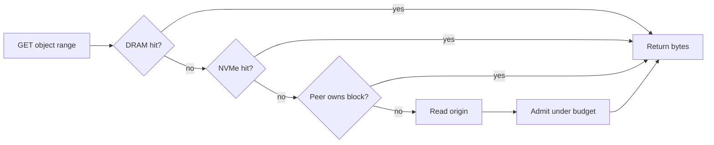

Verglas exposes an S3-compatible endpoint. A client changes its S3 endpoint;
its bucket names and object keys do not change.

## Read path



The hot path does not aggregate statistics or coordinate cluster state. It
records bounded observations and lets background tasks update admission,
warming, and telemetry.

## Cache identity

An object path is mutable; an object generation is not. Verglas keys a cached
block by:

```text
provider + bucket + object key + object version + aligned byte range
```

When Iceberg publishes a new metadata file or replaces a Parquet object, the
new generation cannot collide with old cached bytes. This is the correctness
property that a path-only HTTP cache cannot provide.

## DRAM and NVMe

DRAM serves the smallest latency-sensitive working set. NVMe carries the larger
resident set. Both are accelerators: losing either tier never loses the source
table.

Cache budgets are ceilings. Startup rejects a configured NVMe capacity larger
than the backing filesystem can hold. Scan-resistant admission prevents a
one-touch scan from evicting frequently reused blocks.

Iceberg ranges and Neon layer ranges use the same DRAM and NVMe admission
ledger without static workload partitions. Repeated Neon `GetPage`
reconstruction results use an exact tenant, timeline, relation, block, and LSN
identity in the pageserver's shared page cache. This keeps a hot database page
resident without confusing versions.

Explicitly pinned Iceberg planning metadata uses its reserved metadata budget
ahead of ordinary data heat. Dirty write-back fragments are protected
separately by durability state and never depend on a heat score for retention.

## Cluster ownership

A weighted rendezvous ring assigns every block to a live member. The same ring
interface is used with one node, where that node owns all keys. Reads never
assume that the process receiving the request owns the requested block.

When membership changes, only keys whose winning owner changed move. During a
failure, a request can fetch from another peer or the origin. Slow recovery is
acceptable; returning an incorrect block is not.

## Background work

Background tasks operate under explicit limits:

| Task | Limit |
| --- | --- |
| Origin fills | Maximum concurrent requests and retry circuit breaker. |
| Metadata warming | Concurrent requests and byte-rate budget. |
| Prefetch | Bounded queue, concurrency, and organic-read yield threshold. |
| Eviction | Fixed DRAM and NVMe capacity. |
| Telemetry | Bounded per-core tapes folded off the request path. |
