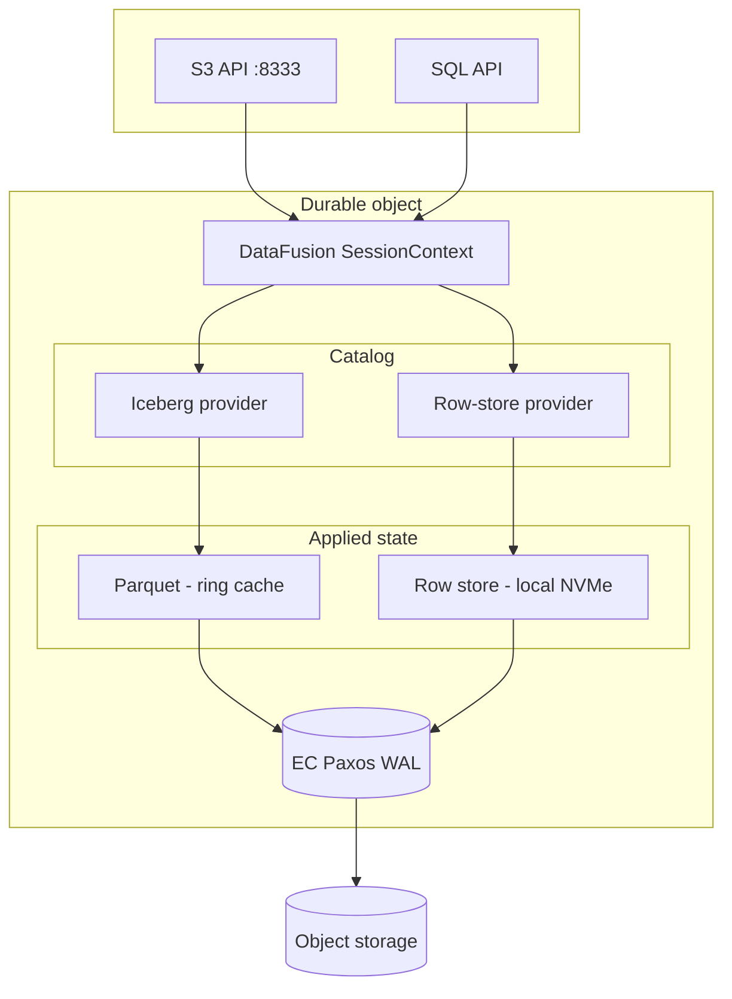
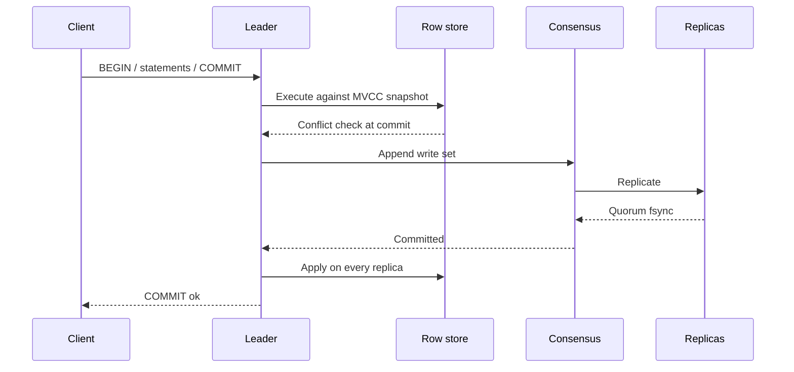

A Verglas durable object is one ring, one bucket, one consensus group. It
serves two surfaces — an Iceberg analytical surface and a SQL transactional
surface — from a single committed WAL. The surfaces share a query plane, a
cache, and a durability path. They are not two systems in one process.

## Shape

Three to seven nodes. Exactly three of them are consensus voters; the rest
carry cache and serve reads. The group hibernates when idle and wakes on
request.



The committed WAL is the source of truth. Parquet files and row-store state
are both materializations of it. That decision and its reasoning are recorded
in the [write path](/architecture/writes).

## One query plane

Both surfaces are `TableProvider` implementations registered in the same
DataFusion `SessionContext`. There is one catalog with two schemas.

| Schema | Provider | Backing store | Access pattern |
| --- | --- | --- | --- |
| `iceberg` | Iceberg table provider | Parquet on the ring cache | Scans, prefetchable |
| `db` | Row-store table provider | Row store on local NVMe | Point reads, range scans |

A query may span both:

```sql
SELECT o.id, o.status, h.lifetime_spend
FROM db.orders o
JOIN iceberg.customer_history h ON o.customer_id = h.customer_id
WHERE o.status = 'open'
```

DataFusion plans this as one join. The `db` side reflects the committed tail.
The `iceberg` side reflects committed state up to the materialization lag.
Both sides push down projections and filters into their provider.

This is the reason the two surfaces live in one object. Federating them across
processes would put a serialization boundary in the middle of every join.

### Point reads bypass the planner

Query planning costs more than a point lookup. A `GET` by key resolves
directly against the row store and never constructs a plan. DataFusion serves
SQL; it is not on the key-value path.

## Write paths

Both surfaces acknowledge only after the same quorum commit. One log carries
both payload types.

### SQL transaction



Transactions execute concurrently against the row store's MVCC snapshots.
Optimistic concurrency control resolves conflicts at commit; losers retry
without ever reaching the log. The log therefore sees a serial stream of
write sets that are already conflict-checked.

Consensus supplies order, replication, and quorum durability. It does not
supply isolation — a log has no notion of concurrent transactions conflicting.
Isolation is the storage engine's job, and the two layers are independent.

The row store runs with its own journal unsynced. The Paxos log is the
durability boundary, so a second fsync on the same write buys nothing.
Recovery replays the committed log from the applied-index watermark, which is
written into the same atomic batch as the data it describes.

### Object commit

Unchanged from the [write path](/architecture/writes): the body stages as
erasure-coded fragments across the ring, then an immutable header commits
through the same consensus group. Offload to object storage runs behind the
acknowledgement.

### One log, three payload types

| Payload | Mode | Carries |
| --- | --- | --- |
| SQL write set | Complete | Row mutations from one committed transaction |
| Object header | Complete | Key, length, hash, geometry, placements |
| Catalog commit | Complete | Iceberg snapshot metadata |

Object bodies stay out of the log. Only the header commits through consensus;
the bytes stage as fragments on the ring.

## Materialization

A background consumer reads committed WAL entries and materializes row-store
history into Parquet row groups, registering them with the Iceberg catalog.
Hot rows live in the row store, cold rows migrate to Parquet, and a union
provider can present both as one logical table.

The lag is bounded by the conversion interval and is a configured value, not
a consistency question. Reads needing the committed tail go to the row store.
The consumer reads committed state only and never opens a second write path
to the origin.

## Horizontal scalability

Three axes scale independently. Conflating them is the mistake this
architecture is built to avoid.

| Axis | Scales by | Does not scale by |
| --- | --- | --- |
| Write throughput | More durable objects | Adding voters to a group |
| Read and cache | Adding ring nodes | Adding voters |
| Analytical compute | Independent query workers | Anything in the write path |

### Writes

One durable object is one consensus group with one leader. Adding voters
widens the acknowledgement quorum and raises leader egress; it does not raise
throughput. Write scaling is more objects — one per bucket, one per tenant,
one per timeline.

Within a single object, concurrency comes from the storage engine, not the
log. Concurrent transactions execute in parallel and batch into shared log
appends through group commit.

### Reads

The voter set is pinned and independent of ring size, so a ring may grow from
three nodes to seven without touching the write quorum. Nodes outside the
voter set join as learners or as pure cache members. They hold ring cache,
replicate row-store state, and serve reads at a snapshot.

### Query workers

A query worker is a single process with no quorum role. It opens the catalog,
reads through the ring cache and the origin, and serves analytical SQL. It
may be deployed and destroyed independently of the object's consensus group.

## Component layout

| Concern | Status |
| --- | --- |
| EC Paxos WAL, groups, membership | Exists — `verglas-consensus` |
| Object staging, fragments, offload | Exists — `verglas-writeback` |
| Iceberg catalog and DataFusion provider | Exists — `verglas-iceberg` |
| Ring cache, rendezvous placement | Exists — `verglas-cluster`, `verglas-cache` |
| Standalone query worker | Exists — `verglas-query-node` |
| Row store, apply loop, table provider | New |
| SQL write-set log entry | New — extends the existing entry enum |
| Union provider over hot and cold tiers | New |

Most of the durable infrastructure already exists. The new work is a storage
engine behind an apply loop, a payload type on a log that already carries
three, and a provider on a catalog that already has one.

## What this does not do

- **No range splitting.** One durable object is one consensus group over one
  keyspace. Splitting is not implemented and is not planned.
- **No distributed transactions.** A transaction is scoped to one object.
  Cross-object atomicity is not offered.
- **No second write path.** Every acknowledged mutation, on either surface,
  passes through the same committed log.
- **No row-store pages on the ring.** B-tree and LSM reads are latency-serial
  and unprefetchable. They resolve on local NVMe or the origin, never through
  a peer fragment request.
