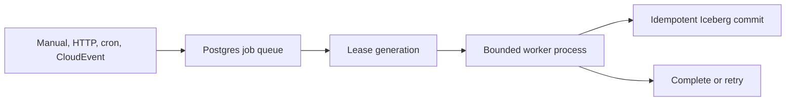

Verglas separates durable state from execution. Iceberg tables and object
storage hold data; Postgres holds the worker queue; execution roles can stop,
restart, or move without carrying local correctness state.

## Isolated query and write roles

The self-hosted image packages `verglas-query` and `verglas-write`. The REST
service starts one bounded role process per request and passes it the current
catalog and Verglas S3 coordinates. A broken or missing role is an error; the
server does not fall back to an embedded implementation.

Cloud runs those roles as independently scalable microVMs using the same
request contracts.

## Worker lifecycle

Every trigger becomes one CloudEvent and one durable job. The scheduler claims
the job with a lease generation, executes the bundled command, and accepts
completion only from the live generation. Restarting the scheduler does not
depend on a process-local cursor or mounted queue filesystem.

Cron jobs carry a logical date and a half-open interval. Backfill creates the
same job shape for historical intervals, allowing one worker implementation to
serve both historical and live runs.

## Trigger boundaries

| Trigger | Producer | Scheduler receives |
| --- | --- | --- |
| Manual | REST request | `org.verglas.worker.manual` CloudEvent |
| HTTP | Dynamic REST path | Complete request in `org.verglas.http.request` |
| Cron | Scheduler timer | Logical interval CloudEvent |
| CloudEvent | Catalog, Kafka, RabbitMQ, or another producer | Structured event matched by type, source, and subject |

The scheduler owns no WebSocket or long-lived client connection. An HTTP
callback is accepted after its job is durable and execution proceeds
asynchronously.

## Containers

Containers are for service processes rather than bounded events. A stateless
container can scale horizontally to zero. A stateful container has one active
instance and requires snapshot-and-restore to idle. Container routing and cold
connection brokering are cloud control-plane responsibilities, not scheduler
features.
