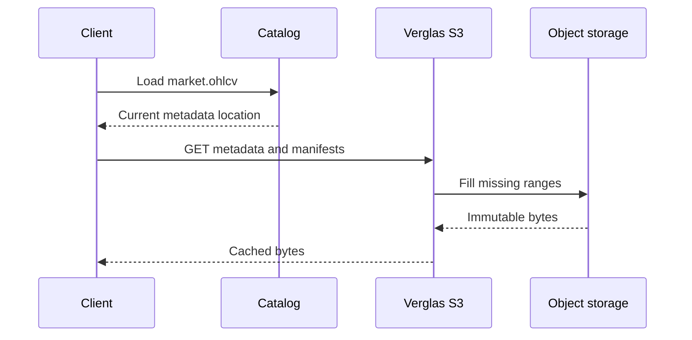

Iceberg separates a small mutable catalog pointer from immutable metadata and
data objects. Verglas uses that distinction to cache aggressively without
guessing whether bytes are still current.

## Catalog requests versus S3 requests

An Iceberg client uses the catalog to resolve and commit table state. It uses
S3 to read and write the files referenced by that state.

| Catalog | S3-compatible object storage |
| --- | --- |
| List namespaces and tables. | Read table metadata JSON. |
| Load the current metadata location. | Read manifest lists and Avro manifests. |
| Atomically commit a new metadata location. | Read Parquet, ORC, Avro, delete, and Puffin files. |
| Enforce catalog authorization. | Write new data and metadata objects before commit. |

## Self-hosted catalog composition

The self-hosted REST service exposes the cache, query/write API, and a shallow
Iceberg REST catalog path on the same container. The catalog component caches
successful metadata reads, polls the configured upstream catalog for changes,
and writes mutations through. It does not implement an independent catalog or
become the system of record.

Cloud deployments do not need that cache. Their Lakebase catalog emits commit
events directly to the cache and execution roles.

## Warming and snapshot changes

The catalog watcher learns when a table's current snapshot changes. It warms
the new metadata tree—metadata JSON, manifest list, manifests, and Parquet
footers—through the ordinary S3 cache path. Compaction can transfer observed
heat from replaced data files to their replacements before the next query.

## Property graphs

A property graph is stored as ordinary node and edge Iceberg tables. An
explicit graph-index build writes a Puffin adjacency index and attaches it to
the table snapshot it describes. Clients that understand the blob use it;
other Iceberg clients ignore it and continue reading the tables normally.

## Vector indexes

A Vamana ANN index is serialized as a `verglas-vamana-v1` Puffin blob. An
explicit index build writes the Puffin file through the table's `FileIO` and
publishes it as an Iceberg statistics file on the exact source snapshot.

The snapshot binding prevents a query from using an index built for different
rows. Verglas may retain a decoded local copy for speed, but the durable index
remains in the customer bucket and is discoverable through ordinary Iceberg
metadata.
