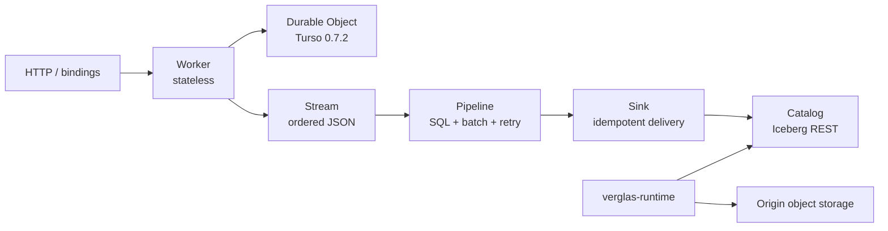

Verglas has exactly six products: **Worker**, **Durable Object**, **Stream**,
**Pipeline**, **Sink**, and **Catalog**. Worker is the stateless primitive. DO
is the stateful primitive, backed by Turso `0.7.2`. Stream, Pipeline, Sink, and
Catalog are prebuilt Worker/DO deployments with separate ownership boundaries.
See the [normative platform page](/docs/architecture/primitives-platform) for
PP1–PP10.

The platform also contains independent infrastructure. A storage binding is
either customer-owned or managed. Against a customer binding, the object store
and Iceberg catalog remain authoritative and Verglas accelerates access to them.
Against a managed binding, Verglas owns the object layout, serves every read,
and is the authority for acknowledged cache state until it drains to the
origin.

## Repository boundary

| Repository | Responsibility |
| --- | --- |
| `verglas` | Public Worker/Durable Object runtime, Turso/Foyer adapters, Iceberg/Catalog capabilities, clients, documentation, and product contracts. |
| `verglas-cloud` | Hosted access, product provisioning, placement, lifecycle, integrations, applications, and agent runtime. |
| `verglas-app` | Private cloud console and workspace client. |

The public repository does not add a hidden job runtime, queue service, custom
DO database, or direct DO-to-Iceberg path. Hosted services consume explicit public
contracts. Product implementations that are not yet accepted are documented as
Target or Gap rather than as shipped features.

## Product and infrastructure roles

| Role | Responsibility |
| --- | --- |
| Worker | Stateless ingress and binding calls. |
| Durable Object | Serialized per-object state in Turso, including KV, SQL, alarms, attachments, and optional Stream outbox rows. |
| Stream | Ordered durable JSON records and producer-identity deduplication; no offload or consumer offsets. |
| Pipeline | Stream cursor, stateless SQL transform, batching, retry, and Sink confirmation. |
| Sink | Idempotent delivery; first adapter writes Parquet and commits Iceberg through Catalog. |
| Catalog | Iceberg REST and metadata commits using the existing catalog and object-storage libraries. |
| Runtime | Wasmtime component execution, Turso Durable Object state, Foyer cache tiers, origin access, and narrow privileged capabilities. |

## Standing requirements

- A customer binding stays readable through its original catalog and bucket.
- A managed binding is left through an explicit detach that drains acknowledged
  state to the origin.
- Object version participates in cache identity, so stale paths cannot return
  bytes from another generation.
- DRAM, NVMe, CPU, concurrency, and background work obey hard ceilings.
- A DO never receives raw object-store or catalog credentials; Sink and Catalog
  use explicit narrow bindings for privileged operations.

Continue with [Iceberg awareness](/docs/architecture/iceberg) and the [product
execution roles](/docs/architecture/execution).
