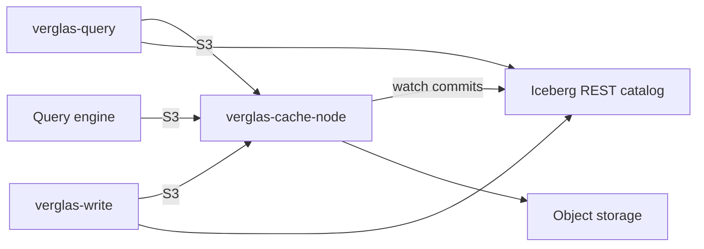

Verglas sits between compute and object storage. The object store and Iceberg
catalog remain authoritative; turning Verglas off makes reads slower, not
incorrect or unavailable.

## Repository boundary

| Repository | Responsibility |
| --- | --- |
| `verglas` | Public cache, storage, query, and write engine roles. |
| `verglas-client` | Public CLI, Rust SDK, and TypeScript SDK. |
| `verglas-cloud` | Hosted access, scheduler, workers, databases, integrations, applications, and agent runtime. |
| `verglas-app` | Private cloud console and workspace client. |
| `rime` | Public parallel software-engineering plugin. |

The engine does not import a hosted control-plane package. Hosted services run
the same public role binaries and interact through explicit network and process
contracts.

## Engine roles

| Role | Responsibility |
| --- | --- |
| Cache | Serve S3 ranges, route ownership, warm Iceberg metadata, and read or write through to object storage. |
| Query | Execute bounded SQL against a catalog while reading data only through the cache endpoint. |
| Write | Commit isolated logical table writes through the cache and authoritative catalog. |

## Standing requirements

- Turning Verglas off leaves customer data readable through its original
  catalog and bucket.
- Object version participates in cache identity, so stale paths cannot return
  bytes from another generation.
- DRAM, NVMe, CPU, concurrency, and background work obey hard ceilings.
- Every operation resolves ownership through the ring, including a one-node
  deployment.

Continue with [cache design](/docs/architecture/cache),
[Iceberg awareness](/docs/architecture/iceberg),
[write path](/docs/architecture/writes), and
[engine roles](/docs/architecture/execution).
