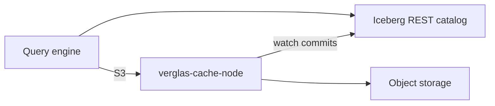

Verglas sits between compute and object storage. A storage binding is either
customer-owned or managed. Against a customer binding, the object store and
Iceberg catalog remain authoritative and Verglas accelerates access to them.
Against a managed binding, Verglas owns the object layout, serves every read,
and is the authority for acknowledged state until it drains to the origin.

## Repository boundary

| Repository | Responsibility |
| --- | --- |
| `verglas` | Public lakehouse runtime (cache and consensus engine), CLI, SDKs, documentation, and RIME package. |
| `verglas-cloud` | Hosted access, scheduler, workers, databases, integrations, applications, and agent runtime. |
| `verglas-app` | Private cloud console and workspace client. |

The engine does not import a hosted control-plane package. Hosted services run
the same public role binaries and interact through explicit network and process
contracts.

## Engine and client roles

| Role | Responsibility |
| --- | --- |
| Cache | Serve S3 ranges, route ownership, warm Iceberg metadata, stage writes on the ring, and offload to object storage. |
| CLI and SDKs | Use the public S3, catalog, vector, graph, and administrative contracts. |
| RIME | Package the evaluated parallel software-engineering skill installed by the CLI. |

## Standing requirements

- A customer binding stays readable through its original catalog and bucket.
- A managed binding is left through an explicit detach that drains acknowledged
  state to the origin, never by stopping nodes.
- Object version participates in cache identity, so stale paths cannot return
  bytes from another generation.
- DRAM, NVMe, CPU, concurrency, and background work obey hard ceilings.
- Every operation resolves ownership through the ring, including a one-node
  deployment.

Continue with [cache design](/docs/architecture/cache),
[Iceberg awareness](/docs/architecture/iceberg),
[write path](/docs/architecture/writes), and
[engine roles](/docs/architecture/execution).
