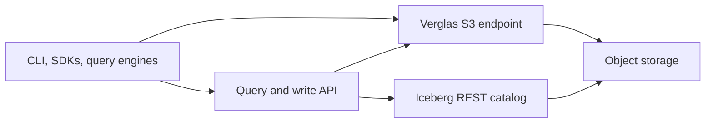

Verglas is an Iceberg-aware S3 cache placed between compute and object storage.
Query engines, SDK workers, and analytics tools read object bytes through
Verglas. The Iceberg catalog and customer bucket remain authoritative.

## Product boundary

The open-source Docker application composes independently testable crates into
one self-hosted service:

| Surface | Responsibility |
| --- | --- |
| S3 | Serve cached ranges and forward misses and writes to object storage. |
| Catalog | Cache shallow Iceberg REST metadata reads and pass mutations to the configured catalog. |
| Query | Run bounded SQL in the isolated query role. |
| Write | Commit logical table writes in the isolated write role. |
| Scheduler | Persist and execute worker events when the optional Workers profile is running. |
| Analytics | Run a Rill-owned project against the Verglas live OLAP query connector. |

Cloud deployments use the same crates as separate roles. They do not run the
self-hosted REST composition as one container. Cache, query, write, catalog,
and scheduling can scale independently.

## Design requirements

<CardGroup cols={2}>
  <Card title="Turn-off test" icon="power-off">
    Removing Verglas leaves ordinary Iceberg tables in the original catalog and
    bucket. Workloads become slower, not unavailable.
  </Card>
  <Card title="Correct bytes" icon="shield-check">
    Cache identity includes object version. A stale path cannot return bytes
    from a different object generation.
  </Card>
  <Card title="Hard budgets" icon="gauge">
    DRAM, NVMe, CPU, request concurrency, and background work are bounded
    operator inputs.
  </Card>
  <Card title="No local ownership assumptions" icon="share-nodes">
    Every cache operation resolves ownership through the ring, including a
    single-node deployment.
  </Card>
</CardGroup>

## Read the architecture by concern

- [Cache design](/docs/architecture/cache) covers the read path, tiers, ring,
  and failure behavior.
- [Iceberg awareness](/docs/architecture/iceberg) separates catalog metadata
  from object reads and explains warming, graphs, and vector indexes.
- [Write path](/docs/architecture/writes) explains staging, quorum, and
  propagation to object storage.
- [Execution model](/docs/architecture/execution) explains isolated roles,
  workers, scheduling, and containers.
- [Benchmarks](/docs/architecture/benchmarks) records the current measured
  results and their limits.
