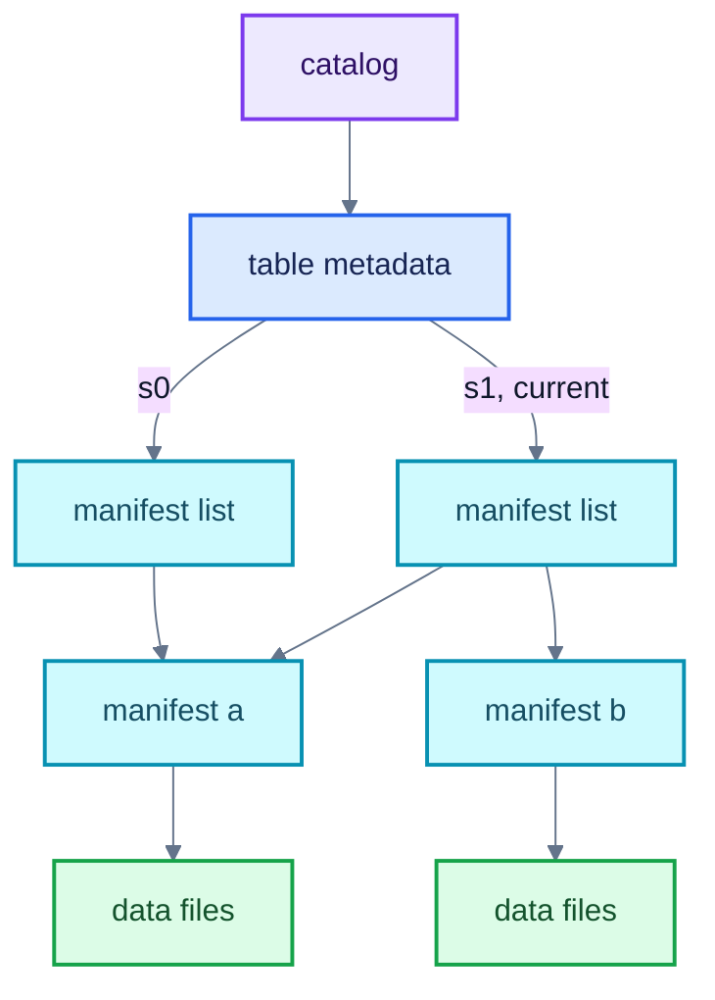
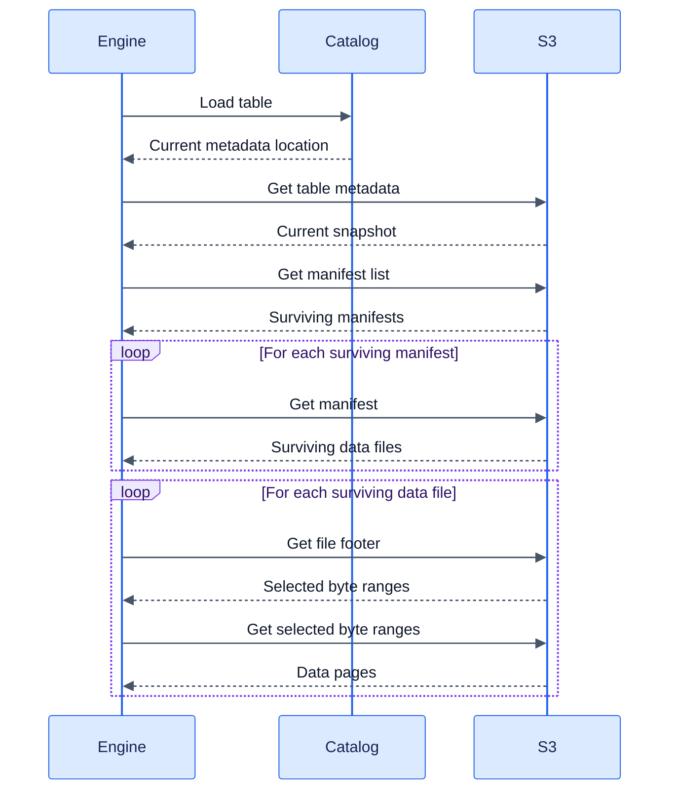
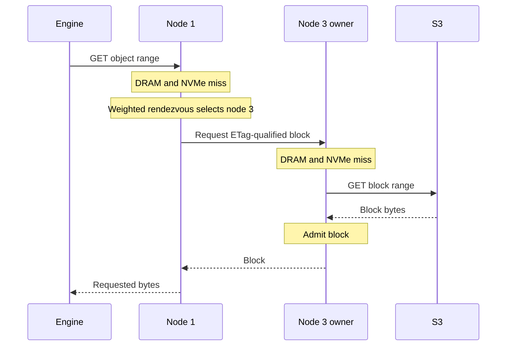
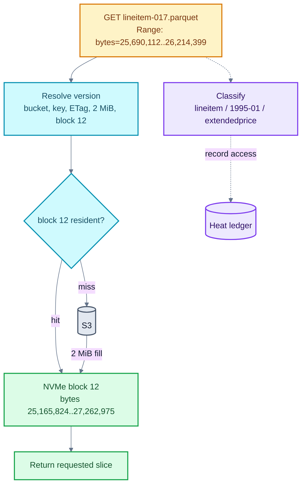
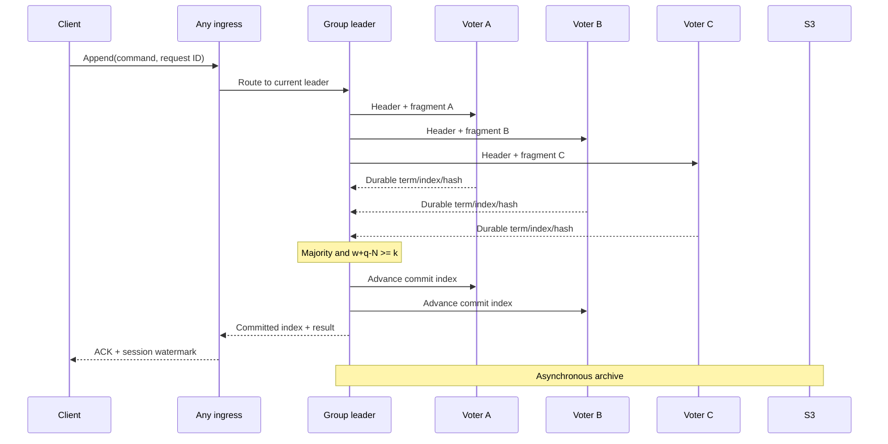
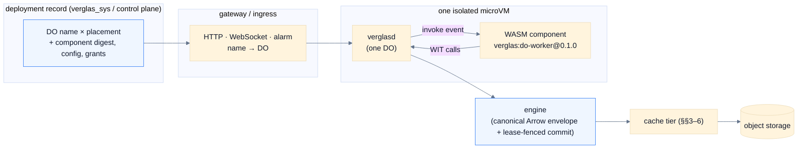

**The lakehouse runtime: an Iceberg-aware statekeeper that brings the warehouse to compute**

---

## Abstract

Iceberg over object storage has become the dominant substrate for analytical data, but object-store latency makes direct reads too slow for interactive queries and low-latency serving. Production estates therefore maintain derived copies in real-time OLAP stores, key-value caches, feature stores, and vector databases. Each copy adds ingest pipelines, synchronization cost, and another source of inconsistency. Format-blind caching can reduce repeated fetches, but cannot infer immutability or table-level change notifications, and so must trade staleness against hit rate through operator tuning.

We propose Verglas, an Iceberg-aware lakehouse runtime that colocates an S3-compatible cache and Postgres WAL persistence with compute. A shared coded Multi-Raft substrate runs many independent consensus groups across the cache nodes: warehouse groups serialize Iceberg transactions, while timeline groups fence Postgres writers and order WAL. Entry headers and control commands are fully replicated; large immutable payloads are erasure-coded. A write is acknowledged only when the intersection of its durable fragment quorum and every possible future election quorum can reconstruct it. This combines agreement, immediate read availability, and NVMe-latency acknowledgment in one call, while complete segments and Iceberg objects drain to S3 asynchronously. The public repository owns the cache and consensus engine plus its CLI, SDKs, documentation, and RIME package; the hosted control plane owns the authenticated Lakekeeper REST composition, provisioning, and Durable Object platform that consumes those engine contracts.

---

## Repository scope

This open-source repository is the Verglas data engine: the Iceberg-aware cache
node (including WAL and virtual block devices) plus its public clients. Cache
nodes implement the coded Multi-Raft substrate and
the typed warehouse and timeline state machines. They expose private engine
contracts, not hosted identity, provisioning, or public catalog REST modules.
The hosted Lakekeeper adapter translates authenticated Iceberg REST operations
into the warehouse state-machine commands defined here. External-catalog
databases bypass the managed warehouse state machine and retain the semantics
of their configured catalog.

The public CLI, SDKs, documentation, and RIME package live beside the engine.
RIME is an evolutionary search over code states; its algorithm and the
git-SHA evolution record are specified in [RIME architecture](/docs/architecture/rime).
Hosted access, Durable Object placement and execution, databases, integrations,
applications, Lakekeeper service, and agent runtime services live in the private
`verglas-cloud` repository. The private `verglas-app` repository contains only
the cloud console and workspace client. CI rejects copies of those hosted
products in this repository.

---

## 1 Background

The lakehouse architecture stores analytical tables as open-format files on cloud object storage and lets independent query engines share them. Apache Iceberg has become the leading open specification for this arrangement. Two properties of the resulting stack shape everything deployments build around it: object-store access latency, and the catalog's dependence on a transactional database.

### 1.1 The Iceberg table format

Iceberg tracks the individual data files of a table rather than its directories. Table state lives in an immutable metadata file recording the schema, partition specs, and a log of snapshots, where each snapshot represents the complete table contents at a point in time [1]. The only mutable state is held by a catalog: the location of the current metadata file. Figure 1 shows the resulting structure for a table with two snapshots.



*Figure 1: Iceberg metadata for a table with two snapshots. Snapshot s1 reuses manifest a and adds manifest b. The catalog pointer is mutable; the files it references are immutable.*

**Catalog.** The catalog maps a table identifier to the location of its current metadata file. It is the entry point for every table load and the coordination point for commits. Changing this mapping atomically publishes a new table state [1].

**Table metadata.** The metadata file records the table schema, partition specifications, properties, snapshot history, and the identifier of the current snapshot. Each snapshot entry points to its own manifest list. The edges labeled s0 and s1 in Figure 1 represent these references.

**Manifest list.** A manifest list defines the manifests that belong to one snapshot. Its entries include partition summaries and file counts, allowing a query planner to discard irrelevant manifests without fetching them.

**Manifest.** A manifest is an immutable Avro file containing entries for a subset of the table's data or delete files. Each entry records the file path, partition tuple, row count, and column-level metrics used to discard irrelevant files. A manifest may be shared by multiple snapshots. In Figure 1, both s0 and s1 reference manifest a, while only s1 references manifest b.

**Data and delete files.** Data files hold table rows in Parquet, ORC, or Avro. Delete files encode row-level deletions separately from the data files they affect. Both are immutable and are included in a snapshot through manifest entries [1].

Writers create new files instead of modifying existing ones. A commit writes any required data or delete files, manifests, manifest list, and table metadata before atomically updating the catalog to reference the new metadata file. Readers that loaded the previous metadata file continue to see the previous snapshot, while later readers see the new snapshot. This atomic publication provides serializable isolation without modifying files already visible to readers [1].

Query planning follows the same hierarchy. An engine loads the metadata location from the catalog, reads the current snapshot's manifest list, uses its partition summaries to select manifests, and uses manifest metrics to select data and delete files. It may then read format-specific metadata, such as Parquet footers, to select byte ranges. Requests within one level can run concurrently, but each level depends on the results of the preceding level.

### 1.2 Object-store access latency

The metadata tree of §1.1 determines the request pattern of every Iceberg query. Figure 2 shows the calls a single query issues against the catalog and the object store before any result is produced.



*Figure 2: Catalog and object-store calls for one Iceberg query. Manifest and data-file requests run concurrently within their respective stages, but each stage depends on the results of the preceding stage.*

The cost of this pattern is well characterized. Durner et al. measure AWS S3 at a median base latency of roughly 30ms per request, with first-byte latency dominating small reads, and show that saturating a 100 Gbit/s instance requires 200–250 concurrent requests [2]. Three consequences follow:

1. **Serial metadata reads pay full round-trips.** Each level in Figure 2 depends on the output of the previous one; concurrency shortens none of the chain. Caching immutable Iceberg manifests inside the engine has been shown to reduce Impala query compilation time by up to 12× on TPC-DS, direct evidence that repeated metadata fetches dominate planning cost [3].
2. **Selective reads cannot hide latency.** A point lookup or index probe issues few requests, so per-request latency, not bandwidth, bounds its response time.
3. **Request sizing is an economic trade-off.** Object stores charge per request. Larger reads amortize latency and cost but over-fetch relative to partition, column, and page pruning; smaller reads do the opposite. Cost-model analyses of cloud caching find the break-even points workload-dependent, and observe that object-store caches are near-universal in cloud analytics systems for exactly this reason [4].

Aggregate bandwidth is not the constraint: in-region object-store throughput is high and scales with concurrency [2]. The constraint is latency under repetition. The same manifests, footers, and hot data ranges are fetched by many queries, from many engines, every day, and a cache inside any single engine cannot serve its neighbors.

### 1.3 Workload patterns around the lakehouse

Lakehouse deployments serve heterogeneous consumers, and for many of them the latency floor of §1.2 is disqualifying. The prevailing mitigation is to materialize a derived copy in a system built for the workload's access pattern.

**Interactive analytics.** Dashboards and user-facing analytics require low query latency over recent data. Real-time OLAP systems meet this requirement by continuously ingesting source data into indexed, column-oriented storage designed for high query concurrency. Pinot, for example, combines near-real-time stream ingestion with tens of thousands of analytical queries per second [5]. Freshness therefore depends on the progress and correctness of a separate ingestion path.

The hosted platform serves dashboards as declarative json-render specs whose
sources are live: commit-driven follow subscriptions on Iceberg tables and
graph traversal views, so a dashboard is created once and updates as commits
land. Verglas remains the catalog-aware cache path, and no dashboard registry
is stored in customer tables.

**Online serving and feature stores.** Applications and ML inference require low-latency retrieval by entity key. Feature-store architectures address this by retaining historical features in an offline store and materializing their latest values into a separate online store. Scheduled or streaming materialization keeps the two stores eventually consistent; failed or partial updates can produce training-serving skew [6].

**Vector retrieval.** Embedding-based search conventionally requires a dedicated vector database that owns its index storage, consistency model, and operational lifecycle, an arrangement at odds with compute-disaggregated analytics, where executors are stateless and read all state from object storage [7]. The embeddings themselves typically originate in lakehouse tables and are copied out at index-build time.

**S3 Vectors and Graph API.** The cache node's S3 listener also owns the exact
AWS S3 Vectors REST-JSON surface and Verglas Graph REST-JSON surface. They are
adapters over customer-owned Iceberg node, edge, and vector tables; Puffin
attachments are snapshot-bound acceleration only. There is no query-node,
write-node, local vector bucket registry, or second graph database.
Each vector bucket has a reserved Iceberg control table for its creation fields,
encryption, tags, and policy; this avoids relying on optional catalog namespace
mutation and keeps every control-plane read restart-safe.

Verglas instead serializes each Vamana ANN index as a `verglas-vamana-v1` Puffin blob, writes the Puffin file through the source table's `FileIO`, and publishes it as the `StatisticsFile` of the exact Iceberg snapshot it reflects. The catalog therefore exposes the durable snapshot-to-index binding to every Iceberg client; clients that understand the blob type can use it, while other clients ignore it. Verglas fetches the attached Puffin file through its S3 endpoint and retains a decoded local copy for ANN serving, so customer object storage remains authoritative and local DRAM/NVMe remains disposable acceleration. A query never uses an index attached to a different snapshot.

**ML training.** Training jobs repeatedly consume the same dataset across epochs and parameter-search experiments. Quiver reports that deep-learning jobs commonly run 50–100 epochs and that many concurrent jobs may read the same underlying dataset in different random orders, motivating distributed caches between cloud storage and GPU workers [8].

These systems are effective because they change the physical access path: they place selected rows, features, indexes, or training samples on faster media in layouts matched to the workload [5–8]. Their recurring cost is a second data lifecycle. Each derived representation needs a process that selects and transfers updates, recovers from interruption, and exposes its freshness boundary to readers. Unless the source and destination participate in the same commit protocol, publication cannot be atomic across both systems; the design must tolerate lag or add coordination.

### 1.4 Catalog persistence

Iceberg leaves catalog implementation outside the table format but requires it to perform the atomic pointer swap [1]. Production catalogs therefore keep their state in a transactional database. Lakekeeper requires PostgreSQL [9]; Apache Polaris recommends its PostgreSQL JDBC metastore for production [10]; Nessie lists PostgreSQL among its production version stores [11]. Hosted catalogs such as AWS Glue provide the same mutable service behind an API without exposing the database.

A complete lakehouse deployment thus contains two kinds of state: immutable table metadata and data files in object storage, and mutable catalog, authorization, and coordination state in a transactional service. The transactional side is what makes atomic commits possible, but it is provisioned, secured, backed up, and scaled separately from the data it governs. A parallel industry trend couples operational Postgres to lakehouse tables through replication (§2.4), adding a further synchronization boundary between row-oriented and columnar representations of the same data.

---

## 2 Related Work

Existing systems address different portions of the problem described in §1: engine-local caches accelerate one runtime, distributed filesystems place a new namespace over object storage, faster storage products change the backing medium, and OLTP–lakehouse products replicate between storage engines. The relevant distinction is not whether each system caches data, but which layer owns naming, consistency, and lifecycle.

### 2.1 Engine-captive caches

Engine-integrated caches exploit information already available to the query runtime: split placement, projected columns, file-format metadata, and the local availability of worker storage. Databricks disk cache, for example, copies remote Parquet data into a proprietary intermediate format on worker SSDs [12]. Trino is a query engine, but its Iceberg connector can cache object-store reads on each worker. The cache uses Alluxio libraries beneath the connector and treats Iceberg metadata and data as files; snapshot and manifest interpretation remains inside Trino. Each worker maintains and evicts its own cache, while scheduling only expresses a preference for workers that may already hold the requested file [13]. Dremio similarly allocates its local cache independently on each executor node [14].

This placement removes an additional network hop and lets the scheduler favor workers that already hold the requested data. The cache, however, exists only on those workers. Replacing the cluster discards it. A second cluster or query engine builds another cache from the same objects, duplicating both remote reads and local storage.

Engine integration also determines which Iceberg operations are available. Iceberg standardizes metadata and commit semantics, not connector feature sets or maintenance policy. For example, Databricks reserves automatic compaction and snapshot expiration for Iceberg tables managed by Unity Catalog. Foreign Iceberg tables remain under their external catalog, are read-only in Databricks, and do not receive those maintenance services [15]. Obtaining managed-table behavior therefore requires adopting Unity Catalog as the table's lifecycle owner, not merely exposing an Iceberg table to Databricks. Dremio makes a similar trade-off. Automatic compaction and cleanup apply to tables in its built-in Open Catalog and run on a Dremio-configured maintenance engine [14]. This reduces manual work inside Dremio, but ties maintenance policy and execution to Dremio's catalog and runtime.

Externally managed tables require an additional synchronization boundary. Snowflake accesses Iceberg through an external volume and catalog integration [16]. It discovers external catalog changes by polling, with a default refresh interval of 30 seconds, and schema changes made only through DDL require a manual refresh [17]. The files remain Iceberg, but visibility and freshness inside the engine depend on its catalog adapter.

Open-source engines expose the same maintenance burden more directly. Trino supplies separate procedures for compacting files, expiring snapshots, and removing orphan files, and recommends that operators run the cleanup procedures regularly [18]. These operations modify shared table state, so their retention settings and schedules must be coordinated with writers and with every other engine that relies on older snapshots.

The central limitation is that storage interoperability stops at the engine boundary. Iceberg files can be read by many engines, but cached bytes, catalog state, and maintenance policy remain private to the engine that produced them. A second engine reading the same table begins cold, builds another cache, and may observe commits through a different refresh path. Engine-captive caching preserves format portability without providing performance portability.

### 2.2 Format-blind neutral caches

Distributed filesystem and data-orchestration systems provide a shared, engine-neutral layer, but their contracts are filesystem contracts rather than table contracts.

**Alluxio** mounts under-file systems into a unified namespace and caches their contents. Its documentation notes that changes made directly in an under-file system can leave the Alluxio namespace out of sync until metadata synchronization runs [19]. This is a valid filesystem contract, but it introduces namespace state that must be reconciled with the object store.

**JuiceFS** takes a different approach: it is an independent filesystem whose clients split files into chunks in object storage while a separate metadata engine records paths, attributes, and chunk mappings [20]. This avoids mirroring an external namespace, but the bucket no longer contains the original files in their original layout. JuiceFS is therefore a primary filesystem over object storage, not a transparent cache for an existing Iceberg warehouse.

Neither design interprets Iceberg snapshots, manifests, or logical file identity. A compaction rewrite consequently appears as unrelated new files, and the system cannot transfer observed heat from old files to their replacements or warm a snapshot from its catalog commit. Adding those behaviors requires a table-aware layer above the filesystem cache.

### 2.3 Faster storage products

Faster object and file stores reduce remote-read latency directly. This is appropriate when the faster store can become the authoritative location. It is less attractive for an existing lakehouse when doing so requires moving data, rewriting producers, or provisioning low-latency capacity for the full dataset rather than its active working set.

Research systems such as AnyBlob instead optimize the object-store client through high concurrency, request sizing, and lower CPU overhead [2]. These techniques improve cold-scan throughput and complement any caching layer, but they do not eliminate repeated remote reads or the latency of serial metadata dependencies. Caching and retrieval optimization address different portions of the path [4].

### 2.4 Lakehouse–OLTP integration via replication

Databricks Lakebase combines disaggregated Postgres with lakehouse data through explicit synchronization. Synced tables copy Unity Catalog tables into Postgres for low-latency serving. Delta sources may use continuous synchronization with a documented minimum 15-second interval, while Iceberg sources currently support snapshot synchronization because they do not expose Delta Change Data Feed [21]. In the other direction, Lakebase Change Data Feed uses logical decoding to batch Postgres WAL changes into managed Delta tables at approximately 15-second intervals [22].

This architecture provides operational and analytical access under one platform, but the row and columnar representations remain separate physical copies with an explicit freshness boundary. Neon's underlying storage architecture independently demonstrates that Postgres compute can be made stateless when durability is delegated to a quorum-acknowledged WAL service, pageservers, and object storage as durable history [23]. This is evidence that the transactional side of the lakehouse does not inherently require a dedicated storage stack.

---

## 3. Verglas Overview

Verglas interposes a shared storage and consensus service between engines and object storage. Engines continue to issue S3 requests, and Iceberg remains the table format, but a managed deployment no longer requires a separate transactional database for catalog commits. The same cache nodes that hold hot bytes host many isolated coded Raft groups. These groups order the small mutable state that cannot be made safe by immutable object naming alone: Iceberg catalog transactions, Postgres writer ownership, WAL positions, archive checkpoints, and membership changes.

The design separates unordered immutable reads from ordered mutation streams. Cached immutable reads need no consensus and remain available from any valid copy. Managed catalog and WAL mutations enter the group leader through any ingress, become committed commands in one replicated log, and are applied deterministically. Large WAL or object payloads are erasure-coded across voters while their hashes, terms, indexes, lengths, coding geometry, modes, and request identities are fully replicated. External Iceberg catalogs remain available through database-scoped gateways in eventual mode, but managed catalogs are authoritative Verglas state machines and provide linearizable commits and reads. Logical SQL and table-write requests remain isolated roles whose object I/O returns through the shared S3 surface.

### 3.1 System boundary

Each tenant cache serves a dynamic set of storage bindings through one S3-compatible endpoint. A binding selects an origin provider, scope, and authorized secret resource; adding a database can add a binding without restarting or duplicating the cache. Adoption requires changing the engine's S3 endpoint and supplying endpoint credentials; no engine connector is required. The server resolves origin credentials independently and forwards cache misses through the selected binding to S3-compatible storage, Azure Blob Storage, or Google Cloud Storage. Retry limits and circuit breakers are isolated per binding, while admission and heat remain shared so the tenant's hottest workload wins unless explicitly pinned.

The server implements the S3 object operations Iceberg clients use: signed GET, HEAD, range, LIST, PUT, DELETE, COPY, and multipart requests. Compatibility is exercised by the Ceph `s3-tests` suite. A separate engine matrix compares direct, cold-cache, and warm-cache results from DuckDB and Polars at the Arrow level. Parquet queries are compared end to end; Avro and mixed-format fixtures are additionally compared byte for byte because the tested engine versions do not decode Avro data files.

The server runs as a container. Self-hosted deployments use the published Docker image; production fleets sit behind an L4 load balancer and deploy through container orchestration such as Terraform or Helm. The CLI remains a pure client — of the server's admin API, of the S3 listener's semantic graph and vector surfaces, and of the Iceberg REST catalog directly for table metadata and ingest — and does not manage server processes.

### 3.2 Design requirements

Six requirements constrain the design.

1. **Open durable output.** Verglas does not replace Iceberg objects with a proprietary table representation. Data, manifests, and metadata files drain to ordinary object storage. A deliberate detach first fences new mutations, archives committed WAL, exports and checkpoints the managed catalog, and then redirects clients; after that drain, the lakehouse remains standard Iceberg. Abruptly destroying a quorum while acknowledged state is not yet archived is data loss, not a supported way to stop.
2. **Version-specific reads.** Cached blocks are identified by object ETag, bucket, key, block geometry, and block index. A mutable read spanning multiple blocks commits to one ETag before streaming, so a response cannot combine cached bytes from one object version with origin bytes from another.
3. **Shared acceleration.** Cache state belongs to the Verglas nodes rather than to a query-engine process. Any S3 client using the endpoint can reuse blocks populated by another client. Cluster ownership distributes the cache across nodes while preserving a backend path for every miss.
4. **Bounded resource use.** DRAM, NVMe, metadata, and write-back fragment capacity are configured as ceilings. Admission and background warming operate within those budgets. Property tests exercise the DRAM and disk ceilings under randomized workloads.
5. **One agreement boundary.** Acknowledgment of managed catalog or WAL state means that the command is durably committed by its coded Raft group. Verglas does not acknowledge from a process-local journal, delegate agreement to PostgreSQL, or run a second proposer quorum above the ring.
6. **Linearizable multi-ingress operation.** Any ingress may accept a request, but only the current group leader orders it. Committed writer epochs fence stale Postgres computes, catalog compare-and-swap requirements execute in log order, and linearizable reads wait for a ReadIndex fence before observing state.

---

## 4. System Architecture

Figure 3 follows one pod-wide miss through the cluster. A request may arrive at any node; the receiving node checks its own tiers, computes the key's owner locally, and asks that owner directly. Ownership is a pure function of the key and the membership set — there is no directory service, no routing tier, and no extra hop to consult.



*Figure 3: One pod-wide miss, the slowest path a read can take. Node 1 misses locally, computes the owner with no lookup hop, and fetches the exact ETag-qualified block from node 3, which fills from the origin once — concurrent requests for the same block coalesce at the owner. A warm read stops at the first or second step; node 1 may retain the returned block as a local replica, subject to admission.*

### 4.1 Cache node

A cache node is one `verglas-cache-node` process. Its S3 front end validates SigV4 requests and maps supported operations onto separate read and write interfaces. Its private admin listener exposes health, metrics, cache-local catalog access, and managed Durable Object ingress. External Iceberg query and write processes remain independently deployable; a managed DO instead runs one tenant WASM component inside an isolated `verglasd` process in one microVM through the reusable `verglas-do-engine` library. DataFusion plans and executes SQL but never assigns a commit sequence: the configured lease-fenced authority commits the canonical Arrow transaction envelope, and the DO component applies relational, Vamana, and graph projections atomically. The backend layer applies concurrency limits, retry policy, and circuit breaking before issuing origin requests. The cache engine, live DO state, and Iceberg layer sit between these interfaces.

The data cache divides objects into configurable 1–8 MiB blocks (2 MiB by default) and stores them in a hybrid DRAM and NVMe cache. The default follows a local Iceberg TPC-DS SF1000 measurement: DuckDB's 1–2 MiB Parquet ranges made 8 MiB fills fetch 70.67 GB from S3 to serve 12.61 GB, while 2 MiB blocks fetched 33.29 GB and cut cold wall time from 658.142 s to 329.440 s. Block geometry is part of the block identity, so a divergent peer configuration is a miss rather than a wrong-offset serve. Changing the configured geometry is a pre-release flag day and requires an empty cache directory; Verglas deliberately has no on-disk compatibility layer. A separate hybrid store holds metadata files and bounded Parquet footer suffixes. Separating the stores prevents a data scan from consuming the capacity reserved for planning metadata. Both stores recover their NVMe indexes after restart; a recovery test reopened a 256 MiB cache containing 32 blocks in approximately 11 ms.

Admission is scan resistant after the cache reaches pressure. A compact frequency sketch rejects one-touch blocks unless they meet the configured admission threshold. The metadata store bypasses this admission rule because metadata objects are small and lie on the serial planning path. A constrained SF1 experiment found that probabilistically thinning later admissions to 10% increased backend fills from 317–325 to 493–500, so deterministic second-touch admission is the default; admission policy stays configurable because it is workload dependent.

### 4.2 Cluster organization

Nodes exchange membership and configured cache capacity through gossip. For each `(bucket, key)`, every node computes a deterministic score for every live member from the key, node identity, and advertised capacity. The member with the highest weighted score owns the object. Nodes with more capacity therefore win a proportionally larger share of keys.

This calculation requires no directory lookup or coordination on the request path. Given the same membership view, an ingress node and the selected owner independently reach the same result. Adding, removing, or resizing a node changes only the keys for which the winning score changes. Property tests cover deterministic placement, minimal movement on membership changes, and capacity proportionality; an in-process three-node test covers convergence and failure detection.

Any node may receive a client request, and it checks its own DRAM and NVMe tiers before consulting ownership. The order is safe because ownership is a placement mechanism, not a consistency mechanism: blocks are version-keyed (§5.1), so a locally retained replica is exactly as authoritative as the owner's copy, and there is no freshness question a peer hop could answer that the local lookup cannot. The ring instead determines where the canonical copy lives, where concurrent fills coalesce, and whom a joining node warms from — which copy serves is decided purely by latency. Deterministic placement states where misses converge, not where all copies are: replicas accumulate on non-owners deliberately (a sole owner of a hot block is a NIC bottleneck; retained replicas spread read load), and membership changes reassign ownership instantly while bytes move only as they are re-requested. The local probe that catches these copies is a memory-resident index lookup the node performs to serve from its own tiers at all — roughly nanoseconds against a peer round trip of hundreds of microseconds, a break-even hit rate of a fraction of a percent. On a local miss, the node asks the home node for the exact ETag-qualified block; a peer hit may be retained as a local replica subject to admission, so hot keys stop paying the peer hop. A peer miss or transport failure falls through to the origin rather than failing the read. Concurrent identical backend fills are coalesced by singleflight, with the owning node as the coalescing point: requests for the same cold object converge on its home node, so a request stampede produces one backend fill.

When ownership moves, a joining node requests blocks from its rendezvous predecessor during a bounded warming interval. A draining node remains available as a donor while it is removed from new ownership, so scale-in and replacement transfer warmth instead of discarding it.

### 4.3 Failure behavior

The immutable read-cache path does not require consensus. If a node disappears, gossip removes it from the cache placement view and the ring reassigns its objects. Blocks unavailable from a peer are fetched from the origin. The consequence is lost cache warmth rather than lost table data. Gossip never changes consensus membership and never decides whether a catalog or WAL command is committed.

NVMe entries survive process restart and checksum-failed tail entries are discarded during recovery. A permanent node loss discards that node's cache contents. If all cache nodes are unavailable, clients must use the origin endpoint directly or through deployment-level failover; this transition is not performed by the server.

Host-managed scale-to-zero fences foreground admission and transfers leadership before stopping a node. A node that is still a voter may stop only when the remaining live voters preserve a legal election quorum and every committed coded entry needed for recovery remains reconstructable. Scaling an entire authoritative ring to zero requires an explicit checkpoint: stop new mutations, wait for accepted requests, archive WAL and dirty objects, export a catalog checkpoint to object storage, commit the checkpoint watermarks, and only then stop the final quorum. Retained NVMe can shorten restart, but it is not used to excuse an uncommitted membership change or an unsafe stop.

Consensus-backed write-back changes the failure model because acknowledged catalog and WAL state may not yet exist at the origin; §6 describes its protocol.

### 4.4 Coded Multi-Raft substrate

The cache fleet hosts independent Raft groups for managed warehouse catalog and Neon timeline state instead of one global log. Durable Objects are deliberately outside that substrate: each DO has one isolated `verglasd` process in one microVM and uses either a lease-fenced managed S3 CAS or one explicitly configured durable replica service endpoint. Catalog and timeline groups elect leaders and commit concurrently, so one busy timeline or warehouse does not serialize unrelated tenants. Requests for those groups may arrive at any cache node and are forwarded to the known leader. A client retry carries the same request identity and never becomes a second command.

Each group has a committed voter configuration. Reconfiguration uses joint consensus; gossip supplies reachability hints only. Terms, votes, log indexes, command kinds, payload lengths and hashes, coding geometry, storage mode, writer epoch, and idempotency identity are fully replicated. Large payloads may be stored as Reed–Solomon fragments, but agreement remains over the complete logical entry identified by its hash.

At staging time an ingress may prefer voters it has recently reached, but the
candidate pool is the complete committed voter configuration. A failed preferred
holder therefore causes staging to try another committed voter; it never changes
membership or treats gossip as a commit decision. The eventual header records
the exact voters that fsynced the selected representations, making that durable
certificate immutable after acknowledgement.

Let `N` be the voter count, `q` the smallest legal future election quorum, `k` the number of fragments required to reconstruct a coded entry, and `w` the number of distinct voters that durably store fragments before acknowledgment. A coded entry is eligible to commit only when

```text
w + q - N >= k
```

so every legal future leader quorum intersects the durable write set in at least `k` fragments. This is the RS-Paxos quorum-intersection condition [32]. The usual Raft majority rule is also required. Configuration validation rejects a geometry that cannot satisfy both constraints. When a majority is available but the coded threshold is not, the leader may append a complete-entry representation to a majority. This CRaft-style fallback [33] preserves Raft liveness without relaxing safety; the chosen storage mode is part of the replicated entry header and cannot change locally after acknowledgment.

A newly elected leader first reconstructs every committed coded entry needed by its state machine and completes Raft's log-matching repair before serving. It may fetch fragments from voters outside its election quorum, but it cannot expose state or acknowledge new entries until its committed prefix is complete. Linearizable reads use Raft ReadIndex (or an equivalent current-term quorum fence) and wait until the local applied index reaches the returned commit index. Session responses carry a commit-index watermark so a client routed to another ingress cannot move backward.

---

## 5. Iceberg Awareness

Iceberg awareness contributes four properties to the cache, each unavailable to a system that sees only buckets, keys, and bytes:

1. **Exact consistency without revalidation** (§5.1). Version-keyed block identity plus the format's immutability contract reduce the cache-invalidation problem from every cached object to a single mutable pointer per table.
2. **Version-atomic reads** (§5.1). A read commits to one object version before it streams, so concurrent overwrites cannot produce a response stitched from two versions.
3. **Planning-path residency** (§5.2). The metadata that gates every query — about 1% of table bytes, read serially — lives in an isolated store that data scans structurally cannot evict, warmed at commit time rather than on first miss.
4. **Heat that survives rewrites** (§5.3). Access frequency is recorded against logical identity (table, partition, column), which compaction preserves, rather than physical identity (file, offset), which compaction destroys.

Figure 4 shows the cache's handling of one illustrative range read. An external query engine plans through the walk of Figure 2 — manifest pruning selects the file, the Parquet footer selects the column chunk's byte range — and issues an ordinary range GET. That S3 serving path never parses SQL. Managed DO SQL is a separate ingress above the cache: its embedded DataFusion providers resolve explicit transaction fences and ultimately issue the same storage reads. Two things then happen to a range request independently: the serving path resolves it to version-keyed blocks, and the classification path maps it to its logical table, partition, and column and records the access in the heat ledger, off the serving path.

```sql
SELECT sum(l_extendedprice)
FROM lineitem
WHERE l_shipdate >= DATE '1995-01-01'
  AND l_shipdate <  DATE '1995-02-01';
```



*Figure 4: Serving and classification of one range read (offsets illustrative). The solid path serves: the requested 512 KiB column slice resolves to block 12 under `(storage_binding_id, bucket, key, ETag, block_bytes, block_index)`; a miss fills the covering 2 MiB block from that binding's origin, and only the requested slice is returned. The binding ID prevents identical bucket/key names under different providers or credentials from colliding. The dotted path classifies: the same range maps to its database, table, partition, and column, and the access is recorded in the shared heat ledger without touching the serving path — the logical identity that lets heat survive compaction while the physical cache key stays version-exact.*

### 5.1 Versioned block identity

A shared cache must answer one question before serving any byte: are these bytes current? The generic answer is a freshness policy — TTLs and conditional revalidation — which costs origin round-trips proportional to the cached population and still leaves a staleness window between checks (§2.2). Verglas restructures the problem so that, for most of the estate, the question does not arise.

The cache stores blocks under `(bucket, key, etag, block_bytes, block_index)`: the object version and block geometry are part of the identity. An overwrite produces new block identities rather than modifying existing entries, so a cached block cannot hold wrong bytes for its key — it can only be the bytes of the version and byte range named in its key. Staleness is thereby confined to a single small mapping per object, from `(bucket, key)` to the current ETag, and correctness reduces to resolving that mapping. Ring ownership uses `(bucket, key)`, so placement remains stable across versions while stored bytes remain version specific.

The Iceberg contract then eliminates the mapping problem for the bytes that dominate the estate. Data files, delete files, manifests, manifest lists, and metadata files are immutable [1]: once resolved, their mappings are valid forever, with no revalidation traffic at any interval. The consistency workload of the cache collapses from all cached objects, forever to the catalog pointer plus whatever non-Iceberg objects share the bucket — the former invalidated when the private watcher observes commits, the latter given a configurable TTL with `If-None-Match` revalidation. Immutability is classified from object paths and, when the catalog watcher is active, from catalog metadata, which is authoritative.

Version-in-key identity also yields read atomicity. A read resolves the key-to-ETag mapping once, before streaming; every cache hit and origin fill for that read then resolves against the committed ETag. A concurrent overwrite either remains invisible to the read or surfaces as an ETag mismatch — never as a response mixing bytes of two versions across a block boundary. A deterministic regression test and randomized interleaving tests exercise this boundary-crossing overwrite case in addition to ETag isolation, singleflight, post-ack mutation ordering, purge behavior, and resource ceilings.

### 5.2 Metadata isolation and warming

The planning walk of §1.2 is a serial dependency chain: its latency is depth times per-level round-trip, and no concurrency shortens it. The only lever is the per-level latency itself, which makes table metadata — roughly 1% of table bytes that gates 100% of queries — the highest-leverage bytes in the system. Two mechanisms exploit this asymmetry.

**Isolation.** Metadata is admitted into a dedicated store rather than the data-block cache. A shared eviction policy cannot express that a manifest is worth more than a data block of equal recency — under LRU-family policies a large scan evicts both alike. A separate store encodes the priority structurally: no data workload, at any scan rate, can displace planning state. The store bypasses scan-resistant admission for the same reason; metadata objects are small and always on the critical path.

**Commit-driven warming.** A demand cache faults metadata in one miss at a time, on the first query after every change. A managed catalog commit is already an ordered warehouse-group command naming the new immutable metadata location. Applying that command atomically publishes the new catalog snapshot, invalidates prepared responses, emits the data-update event, and schedules the metadata walk. A lagging query node must reach the command's ReadIndex fence before serving a linearizable response. External catalogs use their database binding's polling or notification semantics and remain eventual unless that service independently guarantees more. On startup and after each observed commit, the control path walks the new table metadata, current manifest list, manifests, and Parquet footers through the normal cache interface. Footer warming uses a bounded suffix request, with a second request only when the footer exceeds the initial window. Warming concurrency and byte rate are bounded independently, and if a table's metadata footprint exceeds the configured budget the warmer stops admitting rather than thrashing the store.

The combined effect is that the serial planning walk runs against local media for the first query after a deployment and the first query after every commit — the cases where a demand cache is coldest; §8.1 measures the resulting origin-request elimination.

### 5.3 Snapshot transitions and heat transfer

Compaction is where demand-driven caching fails structurally. An `OPTIMIZE` rewrites data files without changing table contents: every physical identity the cache has learned — file path, ETag, byte offset — is destroyed, while the logical distribution of future accesses is unchanged. A cache that indexes heat by physical identity loses its entire learned working set on the schedule its own table maintenance runs, and relearns it one miss at a time (§2.2).

The algorithm that avoids this separates the two identities. A background heat ledger aggregates accesses under logical coordinates — table, partition, column — which survive any rewrite; the classification from request to logical coordinate is the mapper's job (Figure 4). When the watcher observes a commit, the lifecycle component classifies it from Iceberg snapshot metadata: an append introduces new data, an overwrite changes contents, and a compaction (`replace`) preserves contents under new files. For a compaction, diffing the changed manifests yields the replacement file set, and the prefetcher projects the accumulated logical heat onto it — the heat of a partition's hot columns transfers to the new files that now hold them. Prefetch fetches footers before hot column ranges, shares a byte-rate budget with metadata warming, and yields to foreground requests.

Version-keyed identity also makes the transition itself a non-event for concurrent clients. A commit creates version skew by design: engines that planned against the previous snapshot continue reading the old files, possibly for hours, while new queries read their replacements. Because blocks are keyed by object version (§5.1), the cache serves both file sets hot side by side — there is no invalidation event, no flush, and no revalidation storm at the moment of commit. Each client stays warm on whatever snapshot it is pinned to, and the old files retire on a grace window aligned with snapshot expiry, so time-travel reads stay fast until the snapshots themselves are gone. When the new snapshot does become visible, the first wave of workers faulting the same replacement files coalesces through owner-keyed singleflight into one origin fill per object.

The compaction job itself also runs through the endpoint. Its reads of source files are served from cache rather than the origin, and its rewritten files can enter the write-back path of §6, acknowledged at NVMe latency and propagated in the background. Maintenance therefore runs faster and stops competing with query traffic for origin bandwidth — and a shorter compaction directly shrinks the window in which its commit can conflict with concurrent writers at the catalog.

The S3 serving path pays nothing for any of this. The mapper's index — parsed Iceberg metadata, manifest lists, manifests, and Parquet footers — is immutable in memory; request classification reads it through an atomic snapshot, and catalog updates build a replacement index off the serving path and publish it in one pointer swap. No lock, allocation, or catalog I/O appears on an S3 request. The watcher communicates privately with the customer's catalog service; cache hits require no provider I/O.

A hermetic cache-engine test models a compaction rewrite: with prefetch disabled, the first post-compaction query wave is constrained to at most 5% cache hits; with prefetch enabled, the test requires at least 90% hits before the first query arrives. A live Polaris harness exercises the same watcher and prefetch path end to end.

### 5.4 Format coverage

Manifest entries identify Parquet, ORC, and Avro data files, and the mapper records all three formats. Parquet receives column-chunk classification and footer warming. ORC and Avro use whole-file classification: row-oriented formats do not expose sub-file structure worth keying on, and they still receive metadata warming, snapshot-driven prefetch, and compaction heat transfer. The engine matrix verifies Parquet query results and direct-versus-cached byte identity for Avro and mixed-format snapshots.

The catalog watcher implements the Iceberg REST interface, with Glue following. Puffin deletion-vector warming, persistent Puffin checkpoints for the heat ledger, and prewarm manifests layer onto the same warming pipeline.

LIST requests are forwarded to the origin. Requests that specify an S3 `versionId` are also served directly from the origin and are not admitted to the cache. These choices keep unsupported namespace and version semantics out of the cached read path while the protocol surface is expanded.

---

## 6. Consensus-Backed Erasure-Coded Writes

The write path combines Raft agreement and erasure-coded persistence instead of stacking a process-local coordinator above passive fragment holders. A leader proposes one logical command. Voters persist the fully replicated header and either one coded payload fragment or, in fallback mode, the complete payload. A follower acknowledges only after its entry metadata, payload representation, and containing directory are durable. The leader commits only after the normal Raft majority condition and the reconstructability condition in §4.4 both hold. There is no separate local journal whose acknowledgment can outrun group consensus.

### 6.1 Append and commit

Encoding streams one stripe at a time and reserves fragment capacity before accepting an unbounded body. The replicated header binds the term, index, group and configuration generation, command type, payload length, cryptographic hash, `k`, `m`, storage mode, and client request identity. Fragments are deterministically assigned to distinct voters for that configuration. A fragment received under another geometry, generation, term, index, or hash cannot satisfy the proposal.



*Figure 5: One coded Raft append. The ingress is only a router. The group leader orders the command, voters durably store mutually verifiable representations, and acknowledgment follows the group commit. S3 archival is not on the foreground path.*

The request identity makes retries exact. Repeating an identity with the same group, command, payload hash, and writer epoch returns the original result. Reusing it for different content fails closed. An ingress cannot manufacture success: client-visible success includes the committed group index and is produced only after the state machine applies the command.

### 6.2 Degraded operation and repair

If the coded write threshold cannot be reached but a Raft majority remains, the leader proposes a complete-entry representation to that majority. This is a committed storage-mode decision, not an origin-write fallback. If no majority exists, no managed mutation is acknowledged. A partitioned minority may continue serving immutable origin-backed cache reads, but it refuses catalog writes, WAL writes, and linearizable reads.

Each representation carries a checksum, and the replicated header carries the logical payload hash. Reconstruction verifies both before applying an entry. Corrupt or missing fragments are erasures. Repair runs from committed placement metadata, reconstructs only from verified fragments, and writes replacement fragments under the same logical entry hash. Compaction may rewrite the physical representation after a new safe representation is durable, but cannot change the logical log entry.

Committed immutable object bodies, complete WAL segments, and catalog checkpoints drain to object storage behind the acknowledgment, through the offload path of §6.6. Origin failure consumes the configured dirty-state budget and eventually applies backpressure; it never permits unsafe eviction or an acknowledgment from RAM.

### 6.3 Authoritative Iceberg catalog

Managed catalog state is partitioned into a tenant-root group and one group per warehouse. The root group owns warehouse identity and routing. A warehouse group owns namespaces, table registrations, current metadata locations, optimistic commit requirements, idempotency records, and its applied event stream. Hosted REST handlers authenticate and validate requests, translate each transaction into one typed deterministic engine command batch, and submit it through any cache ingress to the warehouse leader. All compare-and-swap requirements are evaluated at one applied log index, so concurrent commits have one serial order without PostgreSQL.

The hosted catalog module retains Lakekeeper's Iceberg REST surface, domain validation, authorization model, and useful event schemas, but replaces its SQL transaction backend with the public Verglas state-machine client. The hosted module lives in `verglas-cloud`; the command types, consensus implementation, and durable applied state live in this engine. SQL-shaped repository calls are not emulated over a key-value shim. Operations are expressed as typed deterministic commands and reads against an immutable applied snapshot. A committed catalog index is also the outbox sequence: data-update events derive from applied commands and consumers resume by index, eliminating a second transactional outbox database.

Catalog reads are either explicitly stale or linearizable. A linearizable read obtains a ReadIndex fence from the current leader and waits until the serving replica has applied that index. Commit responses include the warehouse index, and a later request carrying that watermark cannot be served from an older view. External catalog bindings keep their existing remote semantics and are never silently upgraded or downgraded to the managed path.

### 6.4 Neon WAL groups

Each Neon timeline is one consensus group. Its state machine owns the PostgreSQL term, writer epoch, WAL start and commit LSNs, append identities, archive checkpoint, and truncation boundary. `AcquireWriter` is a committed command that increments the epoch. Every `Append` carries that epoch, its exact start and end LSN, and a payload hash. The leader rejects stale epochs, gaps, overlaps with different bytes, and conflicting retries before acknowledgment. Consequently, multiple ingresses can accept connections without allowing multiple live writers to commit on one timeline.

Verglas, not compute, runs election, quorum, donor selection, reconstruction, and commit advancement. The Neon fork replaces walproposer's safekeeper election/quorum state machine with a transport client for `OpenTimeline`, `AcquireWriter`, `Append`, `AppendAck`, `ReadWAL`, `ReleaseWriter`, and status operations. Compute may connect through several discovered ingresses and reconnect without changing the timeline's consensus identity. It does not count ingress connections as independent voters.

Pageservers read the committed stream through any ingress. A read carries an LSN range and optional minimum committed index; the serving node waits for that fence, then serves bytes from its local fragment, peer reconstruction, or the object-resident archived prefix. It never exposes uncommitted WAL. Complete 16 MiB segments archive asynchronously; partial tails stay consensus-durable until an explicit checkpoint or lifecycle flush. Truncation advances only after the timeline group commits the verified S3 archive checkpoint.

### 6.5 Safety evaluation

Deterministic model tests enumerate elections, partitions, message reordering, duplicate requests, fragment loss, corrupt fragments, joint membership, and crashes between every persistence and acknowledgment boundary. Integration tests use several independent ingresses and kill leaders during concurrent WAL and catalog writes. Required assertions are: one committed value per group index; every committed coded entry reconstructable by every legal successor quorum; no stale writer acknowledgment; no catalog requirement evaluated against stale state; no linearizable read below its fence; and no truncation beyond a committed archive checkpoint. Performance measurements report foreground acknowledgment latency, encoded bytes per logical byte, recovery time, and throughput per independent group, but no performance result can override a safety failure.

### 6.6 Offload

Offload is one streaming engine shared by immutable object bodies, WAL segments, and catalog checkpoints. A stream accumulates durably staged units and flushes when accumulated bytes reach its size limit or when a caller drains it explicitly. An uploader makes the flushed object visible and verifies its identity, then proposes the committed record for it. Only application of that committed record permits log truncation or release of the last reconstructable local representation.

The three uses differ in three policy values and nothing else: how a flush unit is named and given its idempotent request identity, whether committed records must advance monotonically, and whether a new record supersedes its predecessor fully, partially, or never. WAL requires monotonic records and never supersedes. A catalog checkpoint supersedes its predecessor entirely and does not accumulate, because its export reads applied state directly. Object groups carry no ordering requirement and supersede partially, leaving dead space that a repack reclaims.

Grouping is what makes small writes cheap. An object below the stream's size limit accumulates, so one flush writes many logical objects as a single origin object, and a committed index maps each logical key to its group object, offset, and length. An object above the limit bypasses accumulation and streams to the origin as it is written, so a large write never waits behind a buffer.

Offload uses the whole cluster. Fragments are already distributed across the voter set, so each flush unit is assigned to a node deterministically from its identity, preferring a node that already holds fragments for that unit. Uploads proceed concurrently under a per-node bound, and the group leader remains authoritative for the committed record without carrying the bytes. A unit whose assigned node leaves the live set is reassigned by the same function, and uploads are idempotent, so a brief overlap during reconfiguration still commits one unit.

Offload never materializes a second copy. The offloader receives fragment references rather than bytes, streams the group object from them, uploads it, inserts the decoded bytes into the cache when admission accepts them, and only then releases the fragments. The decode runs once and feeds both consumers. Releasing fragments before the cache insert would make a just-written object cost an origin fetch, so the order is load-bearing; admission rejection under budget pressure is a normal result and does not fail the offload.

Compaction runs before offload rather than after. Grouping reduces origin request count; compaction reduces the number of data files a query plans and reads, which grouping does not change because logical files remain separate inside a group object. Compacting after grouping would leave the group object immediately dead. Since acknowledged data files are staged but not yet persisted, a table over its compaction threshold has its buffered files rewritten first, and the rewritten files exceed the size limit and stream out directly. Files superseded by that rewrite never upload. Grouping then serves what remains genuinely small: manifests, manifest lists, metadata pointers, and delete files.

### 6.7 Managed and customer bindings

A storage binding is either customer-owned or managed, and the two carry different obligations.

A customer binding preserves the customer's object layout, and readers may reach the bucket without Verglas. A table commit against such a binding therefore waits for its referenced data files to reach the origin before it publishes, because a direct reader that followed the catalog would otherwise find a table pointing at absent files.

A managed binding has no direct reader. Verglas owns its object layout, serves every read of it, and returns an acknowledged object from its staged fragments or its group object before the origin has it. The wait is therefore unnecessary, and a commit against a managed binding publishes on the quorum acknowledgment. Grouping and pre-offload compaction apply only to managed bindings, since both change the origin layout.

Leaving a managed binding is an explicit detach, not a shutdown: fence new mutations, archive committed WAL, export and checkpoint the managed catalog, drain buffered objects, then redirect clients. After that drain the result is standard Iceberg in ordinary object storage.

---

## 7. The Agent-Data Platform

This section specifies hosted platform behavior implemented in
`verglas-cloud`. It explains the engine contracts that platform consumes; it
does not place hosted access, Durable Object gateway, database, application,
integration, or agent-runtime source in this repository.

The preceding sections argued that derived read copies — OLAP stores, feature
stores, caches — should collapse into one Iceberg-native tier. The same
principle applies to tenant code. Tenant compute has two tiers, the
Cloudflare/celld shape. A **Worker** is the general primitive: a stateless
WASM component fetch handler, pool-executed at the ingress, holding no
identity and no storage. A **Durable Object (DO)** is a stateful Worker
class: a named object with durable KV and SQL state, reached only through
Worker code via environment bindings (`env.NS.idFromName(name)` →
`get` → stub `fetch`). HTTP, WebSocket, and alarm events enter through the
platform gateway and execute Worker code first; DOs wake on demand and run
against their own state. Both tiers' contracts are fixed by the component
ABI, and the authoring surface is Cloudflare's spec, implemented by Verglas
SDKs ([Cloudflare compatibility](/docs/architecture/cloudflare-compat)).

The DO boundary keeps user code close to its state without making it a storage
authority. A stateless Worker holds no capabilities beyond its bindings; the
DO component can use only the capabilities in its WIT world.
`verglasd` owns event serialization, transaction assembly, and commit. The
lease-fenced commit authority remains the source of truth; SQLite is the local
pager and recovery image. The trust boundary is a WASM sandbox inside one
microVM inside the lease fence.

Three doctrines run through the whole design and are stated once here:

- **Engine/control separation.** Cache, query, and write roles are public and independently runnable. Hosted access, gateway routing, placement, and DO lifecycle live in `verglas-cloud`; they consume engine contracts without becoming storage-engine dependencies.
- **Scale-to-zero by default.** An inactive DO is checkpointed and archived, then its microVM can suspend. A request or alarm wakes it and restores the same durable state. The platform owns placement and lifecycle; tenant code owns only its state and event behavior.
- **Connections never pin compute.** HTTP and WebSocket connections terminate at the gateway. The gateway can hold a WebSocket while the DO hibernates and deliver each later message after wake. Catalog commit notifications remain applied-log events rather than a separate execution queue.



*Figure 7: the deployment record maps a name to an immutable DO component and its isolation placement. The gateway or lifecycle path wakes the cell; `verglasd` runs one event and joins its storage effects to the lease-fenced transaction envelope before releasing output.*

### 7.1 The Durable Object deployment record

A deployment is one record: a stable DO name, the immutable component digest,
configuration and secret references, placement, and the tables and lakehouses
it is granted (§7.3). The record maps the gateway name to one DO state
namespace. It is the unit for deployment, audit, pause, resume, and placement;
mutable state stays in the DO engine rather than in a separate run log. The
registry is the `verglas_sys` namespace: Iceberg tables whose rows are
append-only revisions, so the registry inherits the audit and time-travel
properties of §1.1 — the snapshot log is the complete lifecycle history of
every deployment, readable by any engine.

### 7.2 The DO component and event contract

Tenant code compiles to a WASM component targeting the `verglas:do-worker@0.1.0`
WIT `durable-object` world. The handler exports `init` once per component
instantiation before `fetch`, `alarm`, `websocket-message`, and
`websocket-close`. `verglasd` binds the storage
imports `get`, `put`, `delete`, `list`, `sql`, `set-alarm`, `get-alarm`, and
`delete-alarm` in-process to the DO engine. It binds the socket imports `send`,
`close`, `set-attachment`, `get-attachment`, and `attached` to the gateway's
connection state. These imports are capabilities, not network services.

The input gate admits one HTTP request, alarm, WebSocket message, or close
event at a committed DO fence. Events execute strictly serialized per DO, one
at a time. `verglasd` invokes the component, and its storage effects join the
event's canonical Arrow transaction envelope. The output gate holds WebSocket
sends, closes, and attachment updates until the envelope commits. Only then
does the gateway release those effects. A handler error is mapped to the event
outcome; the host does not roll back DO state that has committed. No event
observes another event's uncommitted state.

Catalog and table idempotency remain storage concerns. A table commit records
its idempotency key in the committed snapshot summary and warehouse-group
state, so a repeated commit can be recognized by the table commit path. This
does not require a dispatch queue or an external offset record.

The DO component artifact is an immutable, content-addressed object in the
managed bucket. Spawn fetches it by digest and verifies the digest before
execution. Compiled AOT artifacts may be cached outside the microVM. Wizer-
style pre-initialization keeps post-wake component instantiation in single-
digit milliseconds.

JavaScript and TypeScript compile into the component with ComponentizeJS and
StarlingMonkey, SpiderMonkey-on-WASM. Rust and other component-toolchain
languages compile directly to the world. There is no V8 runtime anywhere in
this path.

### 7.3 Data grants, durable state, and lakehouses

A deployment declares the data it may touch: the tables and lakehouses it is granted, per record. A grant is the access-control boundary: a DO component sees only what its record lists. A gateway request, WebSocket event, or alarm never expands its data grants. Grants are part of the one record (§7.1), so what a DO can reach is inspectable and auditable as a unit, not scattered across IAM policies and connection strings.

A DO's KV and SQL surfaces are its durable cross-event state. The single
durable alarm is a committed row in DO state. `set-alarm` replaces it,
`get-alarm` reads its deadline, and `delete-alarm` clears it within the event
transaction. The platform wakes the DO at the committed deadline. Alarm
delivery uses the same serialized event path and does not create a separate
queue.

Lakehouses are explicit tenant resources and the only database shape. `verglas lakehouse create NAME` creates managed storage plus an authoritative warehouse group in the tenant's Verglas ring. Supplying `--data-path s3://…` binds a scoped S3 secret while retaining the managed Verglas catalog; supplying `--catalog https://… --warehouse NAME` instead creates an external-catalog binding. The stable secret resource IDs are stored on the lakehouse record, so later secrets with overlapping scopes cannot silently rebind an existing lakehouse; rotating a secret replaces its value under the same ID.

There is one logical managed catalog service per tenant, exposed by the hosted REST fleet, not one catalog process or PostgreSQL database per warehouse. Each REST replica may route to any cache ingress. Tenant-root state maps each lakehouse to an independent warehouse group, so warehouses share the cache fleet but not a consensus log. The hosted REST and domain layer is adapted from Lakekeeper, while persistence, transactions, events, and read fencing use public Verglas engine groups. A physically dedicated voter set is an explicit isolation tier rather than the default consequence of creating a logical database.

Each cache node embeds a Postgres WAL ingress and may lead or follow timeline groups. Neon compute discovers several ingresses and speaks the Verglas WAL protocol described in §6.4; any ingress routes the session to the timeline leader. For the four-node managed geometry, `N=4`, majority `q=3`, and `k=2` require `w>=3`, so `k=2,m=2,w=3` is valid and a delayed fourth fragment does not delay commit. If coded placement cannot reach three voters but a majority survives, the entry is stored complete on that majority. Complete 16 MiB segments drain to object storage in the background; partial tails remain consensus-durable until an explicit lifecycle checkpoint. Pageservers read the committed EC tail and object-resident prefix through any ingress. The listener shares the cache node's NVMe store and peer transport without confusing gossip membership with consensus membership.

### 7.4 Placement, isolation, and scale-to-zero

Each active DO runs one `verglasd` process in one microVM. The process owns one
DO, one SQLite engine and pager, one data directory, and one private Unix
socket. It is the DO's only event executor; DOs do not run Raft or elect
leaders. `celld-host` allocates one isolated microVM-sized reservation,
passes data and socket paths plus the lease identity, waits for the socket to
bind, and fences routing after a crash or restore. The launcher passes the
opaque lease token, generation, current sequence, and conditional object
version; a stale process cannot acknowledge another mutation.

Fly.io Machines (Firecracker microVMs) are the initial isolation substrate.
MicroVM suspend/resume amortizes cold starts at the outer layer while
component instantiation stays cheap at the inner layer. Before suspension,
the applied sequence is covered by the managed transaction archive and a
verified object checkpoint. On wake, the platform restores SQLite from the
checkpoint, replays the archive tail, and releases the event at its requested
fence. A compiled AOT artifact may be cached outside the microVM, but mutable
state and execution are never shared with another tenant payload.

The isolation boundary is layered: a WASM sandbox inside the microVM inside
the lease fence. Tenant code reaches host state only through the WIT imports.
Lease-fenced commit authority, canonical Arrow envelopes, the SQLite pager,
and checkpoint/archive scale-to-zero machinery remain the DO engine described
in §§3–6.

### 7.5 Gateway, connections, and hibernation

HTTP and WebSocket connections terminate at the platform gateway/ingress
layer, never inside the guest. The gateway resolves `name → DO` and wakes a
hibernated DO on demand: `celld-host` performs the initial spawn, and a later
request resumes the Fly Machines microVM. The gateway holds WebSockets open
across hibernation and delivers each message as a serialized DO event. A
connection attachment is a small blob, at most 16 KiB, persisted in the DO's
own durable state. It survives hibernation without keeping `verglasd` running.

Applying a managed Iceberg catalog commit emits a CloudEvents 1.0 data-update
notification whose durable identity is the committed warehouse index. This is
a catalog event stream, not a DO dispatch queue or a tenant-code invocation.

### 7.6 Cache-pathed I/O

Local table and object I/O from a DO routes through the server's own S3 surface
— the cache. This is a wiring property, not a code dependency: the engine
reads and writes through whatever storage endpoint it is given, and the server
hands it its own. Two guarantees follow. First, residency: every table read
and write a DO makes populates the cache as a side effect, so the tables an
operator's DOs touch are precisely the tables the cache keeps warm. Second,
ownership: the §4 ring routes below the engine, so no component or gateway
path can assume a key is locally owned. A clean detach preserves portability
by draining objects and exporting the catalog as described in §3.2; destroying
the authoritative quorum before that fence is not equivalent to disabling a
disposable read cache.

External Iceberg ingest follows the same wiring. The SDK is a standard Iceberg client: `table create`/`append` infer an Arrow schema from the source file, write Parquet data files through the configured S3 endpoint using catalog-vended credentials, and commit an append snapshot through the Iceberg REST catalog's optimistic concurrency. The managed DO SQL route is different: DataFusion DML creates transaction-local Arrow mutations, and one lease-fenced S3 CAS, or one configured replica-service acknowledgement, makes the unified row/vector/graph envelope authoritative before asynchronous archive or Iceberg materialization. Against a customer binding the commit belongs to the catalog and object store, so a table write succeeds with the runtime node stopped and Verglas never publishes autonomous lake or index changes. Against a managed binding the commit belongs to Verglas, and acknowledged state reaches the managed origin through the offload path of §6.

### 7.7 Layering

The hosted control plane resolves `database_id → catalog_binding` and DO names
to deployment records. A managed binding routes REST operations through an engine ingress to `tenant root → warehouse group`; the ingress exposes the private state-machine contract, not the hosted Iceberg REST or identity surface. An external binding routes to a remote catalog gateway and carries its own endpoint and stable secret ID. The same query/write engine clients and metadata-warming code operate above both bindings, but their consistency contracts remain explicit: managed reads and commits are linearizable through Raft fences, while third-party catalogs retain their own polling, notification, and transaction behavior. No managed request falls back to an external catalog or PostgreSQL persistence.

---

## 8. Benchmarks

Results include an SF1,000 capacity run (§8.1) and a single-node compaction run (§8.2).

### 8.1 SF1,000 query wave (measured)

TPC-DS SF1,000 contains approximately 279 GB of Iceberg/Parquet data in S3 Standard. The representative wave contains three fixed queries: a fact-table count, monthly sales aggregation, and item-revenue aggregation. It is not the full 99-query TPC-DS suite. Each engine ran directly against S3 and through its applicable cache. Cold cache starts with no data blocks resident; warm cache is a replay after population converged. DuckDB has no built-in S3 cache. Speedup compares the warm-cache result with that engine's direct-S3 result.

| Engine | Storage path | Cold Cache | Warm Cache | Speedup |
|---|---|---:|---:|---:|
| DuckDB 1.4.5 | S3 direct | 618.098 s | — | 1.00× |
| DuckDB 1.4.5 | Verglas | 636.725 s | **42.128 s** | **14.67×** |
| Trino 446 | S3 direct | 296.762 s | — | 1.00× |
| Trino 446 | own file-system cache | 348.948 s | 69.892 s | 4.25× |
| Trino 446 | Verglas | 398.269 s | **67.060 s** | **4.43×** |
| ClickHouse 26.6.1 | S3 direct | 227.043 s | — | 1.00× |
| ClickHouse 26.6.1 | own file-system cache | 447.397 s | 25.776 s | 8.81× |
| ClickHouse 26.6.1 | Verglas | 461.587 s | **22.390 s** | **10.14×** |

*Hardware: Mac Studio with an Apple M3 Ultra (28 CPU cores) and 256 GB unified memory. Engines were limited to 48 GB and 24 CPUs and ran one at a time. Cache-owning configurations received the same 400 GB logical cache budget; Verglas used 48 GiB of DRAM and 2 MiB block geometry.*

DuckDB's warm Verglas replay was 14.67× faster than direct S3 and recorded zero backend fills and zero backend bytes. The corrected same-network Trino-through-Verglas warm runs were 67.060, 68.770, and 66.463 seconds; their 67.060-second median was 4.1% faster than Trino's own file-system cache and served 77.5 GB from DRAM with zero backend fills. Trino's catalog-prewarmed empty-data-cache run remained 14.1% slower than Trino's own cold cache because startup warming loaded metadata, manifests, and footers rather than the query's data ranges. The final weighted-egress ClickHouse-through-Verglas runs were 22.390, 21.921, and 23.081 seconds; the 22.390-second median was 13.1% faster than ClickHouse's own cache, again with zero backend data bytes and zero backend fills.

### 8.2 Cache recovery after compaction (measured)

Iceberg compaction rewrites a table into fewer, larger Parquet files. Those files have new S3 object names. A normal file cache indexes bytes by object name, so its entries for the old files are useless after the new snapshot commits. Verglas also sees the catalog commit: it connects the old hot files to their replacements and starts prefetching the replacement ranges before another query asks for them.

The experiment warmed a three-query working set, compacted one target table with `rewrite_data_files`, and measured the same workload after compaction. Each cache used a separate copy of the target table. The Verglas result below is the settled measurement after its catalog watcher prefetched the replacement files.

| Query path | Before compaction | After compaction |
|---|---:|---:|
| DuckDB through Verglas | 2.770 s | **2.587 s** |
| Trino with its file-system cache | 26.967 s | 25.981 s |

Verglas briefly rose to 4.489 seconds while prefetch was still running, then returned to 2.587 seconds with zero origin reads. Trino's result is its first post-compaction query; the improved file layout offset the cost of loading the new paths into its cache on demand. DuckDB through Verglas was 9.7× faster before compaction and 10.0× faster after Verglas recovered the replacement files.

ClickHouse is excluded from the table because the tested Iceberg path did not support compaction and then errored while reading the rewritten table, so it produced no comparable timing. ClickHouse's published Iceberg roadmap lists background merges as future work [29].

*Hardware: one `i4i.2xlarge` in `us-west-2a` with 8 vCPUs, 64 GB DRAM, and 1.75 TB NVMe. The dataset was TPC-DS SF100 in S3 Standard: 28.4 GB across 806 objects and 24 tables.*

---

## 9. Conclusion

The lakehouse settled where analytical data lives; it has not settled where hot bytes are served from or where its own transactional state runs. Today those gaps are filled by derived copies — OLAP stores, feature stores, vector databases, replicated Postgres — each with its own pipeline, freshness boundary, and failure modes, and by a managed database quietly required underneath every catalog.

Verglas closes both gaps with one tier. Version-keyed blocks cannot serve bytes from the wrong immutable object version, while coded Multi-Raft gives managed catalog commits and Postgres WAL one agreement and persistence boundary across every ingress. Catalog application warms metadata before queries ask, and WAL is readable as soon as its append commits rather than after S3 archival. Engines adopt the managed service through standard Iceberg REST and the Verglas Neon protocol. A clean checkpoint-and-detach leaves standard Iceberg objects and an exported catalog for another service; an authoritative ring cannot be destroyed like a disposable cache while acknowledged state is still local.

The platform layer applies the same discipline to stateful execution. Each Durable Object is a named WASM component in a lease-fenced `verglasd` process. Its serialized events commit storage effects as canonical Arrow transaction envelopes, and socket output is released only after commit. The trust boundary is the WASM sandbox inside one microVM inside the lease fence; suspending and resuming the outer machine does not change the durable state contract.

---

## 10. References

1. Apache Software Foundation. [*Apache Iceberg Table Specification*](https://iceberg.apache.org/spec/).
2. Dominik Durner, Viktor Leis, and Thomas Neumann. [*Exploiting Cloud Object Storage for High-Performance Analytics*](https://www.vldb.org/pvldb/vol16/p2769-durner.pdf). PVLDB 16(11), 2023.
3. Riza Suminto. [*12 Times Faster Query Planning with Iceberg Manifest Caching in Impala*](https://www.cloudera.com/blog/technical/12-times-faster-query-planning-with-iceberg-manifest-caching-in-impala.html). Cloudera, 2023.
4. Kira Duwe et al. [*The Five-Minute Rule for the Cloud: Caching in Analytics Systems*](https://www.vldb.org/cidrdb/papers/2025/p4-duwe.pdf). CIDR 2025.
5. Jean-François Im et al. [*Pinot: Realtime OLAP for 530 Million Users*](https://doi.org/10.1145/3183713.3190661). SIGMOD 2018.
6. Anya Li et al. [*Managed Geo-Distributed Feature Store: Architecture and System Design*](https://arxiv.org/abs/2305.20077). arXiv:2305.20077, 2023.
7. Artur Borycki. [*Puffin-Backed Vector Indexes: Attaching Approximate Nearest Neighbor Indexes to Apache Iceberg Snapshots for Compute-Disaggregated Query Engines*](https://arxiv.org/abs/2606.04196). arXiv:2606.04196, 2026.
8. Abhishek Vijaya Kumar and Muthian Sivathanu. [*Quiver: An Informed Storage Cache for Deep Learning*](https://www.usenix.org/conference/fast20/presentation/kumar). FAST 2020.
9. Lakekeeper. [*Concepts: Persistence Backend*](https://docs.lakekeeper.io/docs/0.11.x/concepts/).
10. Apache Polaris. [*Metastores*](https://polaris.apache.org/releases/1.5.0/metastores/).
11. Project Nessie. [*Server Configuration: Version Stores*](https://projectnessie.org/nessie-latest/configuration/).
12. Databricks. [*Optimize performance with caching on Databricks*](https://docs.databricks.com/aws/en/optimizations/disk-cache).
13. Trino. [*File system cache*](https://trino.io/docs/current/object-storage/file-system-cache.html).
14. Dremio. [*Open Catalog*](https://docs.dremio.com/current/data-sources/open-catalog/).
15. Databricks. [*What is Apache Iceberg in Databricks?*](https://docs.databricks.com/aws/en/iceberg/).
16. Snowflake. [*Apache Iceberg tables*](https://docs.snowflake.com/en/user-guide/tables-iceberg).
17. Snowflake. [*Automatically refresh Apache Iceberg tables*](https://docs.snowflake.com/en/user-guide/tables-iceberg-auto-refresh).
18. Trino. [*Iceberg connector*](https://trino.io/docs/current/connector/iceberg).
19. Alluxio. [*Unified Namespace and Under File System Namespaces*](https://documentation.alluxio.io/os-en/core-services/unified-namespace).
20. JuiceFS. [*Architecture*](https://github.com/juicedata/juicefs/blob/main/docs/en/introduction/architecture.md).
21. Databricks. [*Serve lakehouse data with synced tables*](https://docs.databricks.com/aws/en/oltp/projects/sync-tables).
22. Databricks. [*Lakebase Change Data Feed*](https://docs.databricks.com/aws/en/oltp/projects/lakebase-cdf).
23. Neon. [*Architecture overview*](https://neon.com/docs/introduction/architecture-overview).
24. David K. Gifford. [*Weighted Voting for Replicated Data*](https://doi.org/10.1145/800215.806583). SOSP 1979.
25. Giuseppe DeCandia et al. [*Dynamo: Amazon's Highly Available Key-value Store*](https://doi.org/10.1145/1294261.1294281). SOSP 2007.
26. Irving S. Reed and Gustave Solomon. [*Polynomial Codes over Certain Finite Fields*](https://doi.org/10.1137/0108018). Journal of the SIAM 8(2), 1960.
27. Hakim Weatherspoon and John Kubiatowicz. [*Erasure Coding vs. Replication: A Quantitative Comparison*](https://doi.org/10.1007/3-540-45748-8_31). IPTPS 2002.
28. Cheng Huang et al. [*Erasure Coding in Windows Azure Storage*](https://www.usenix.org/conference/atc12/technical-sessions/presentation/huang). USENIX ATC 2012.
29. ClickHouse. [*ClickHouse Release 25.7 Call*](https://presentations.clickhouse.com/2025-release-25.7/).
30. Apache Software Foundation. [*Kafka Connect*](https://kafka.apache.org/documentation/#connect).
31. Tyler Akidau et al. [*MillWheel: Fault-Tolerant Stream Processing at Internet Scale*](https://doi.org/10.14778/2536222.2536229). PVLDB 6(11), 2013.
32. Shuai Mu, Kang Chen, Yongwei Wu, and Weimin Zheng. [*When Paxos Meets Erasure Code: Reduce Network and Storage Cost in State Machine Replication*](https://doi.org/10.1145/2600212.2600218). HPDC 2014.
33. Zizhong Wang et al. [*CRaft: An Erasure-coding-supported Version of Raft for Reducing Storage Cost and Network Cost*](https://www.usenix.org/conference/fast20/presentation/wang-zizhong). FAST 2020.
