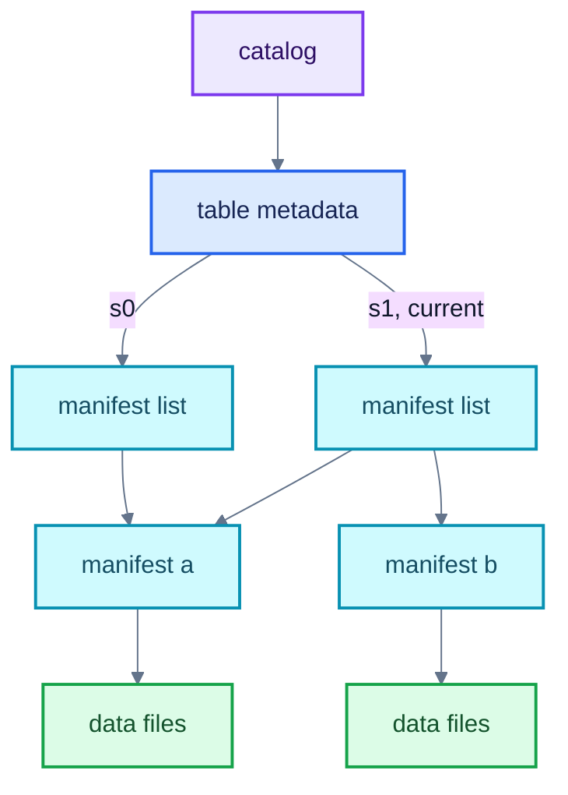
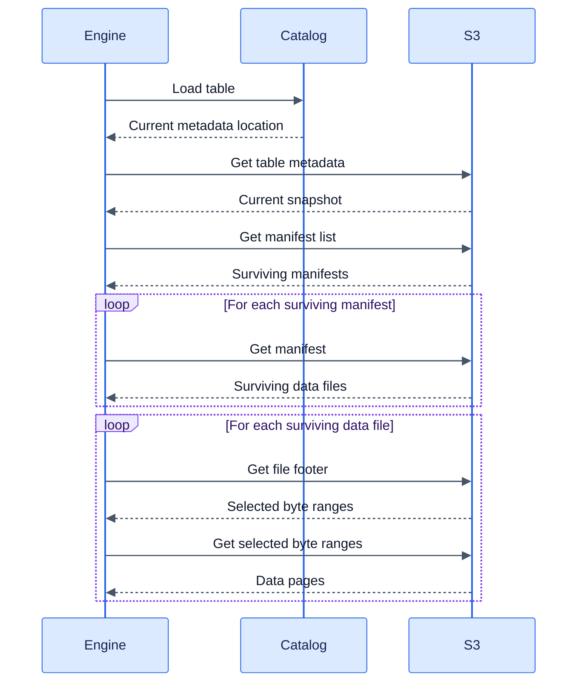
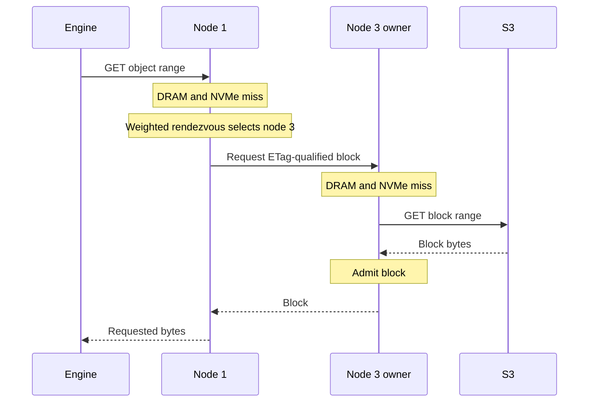
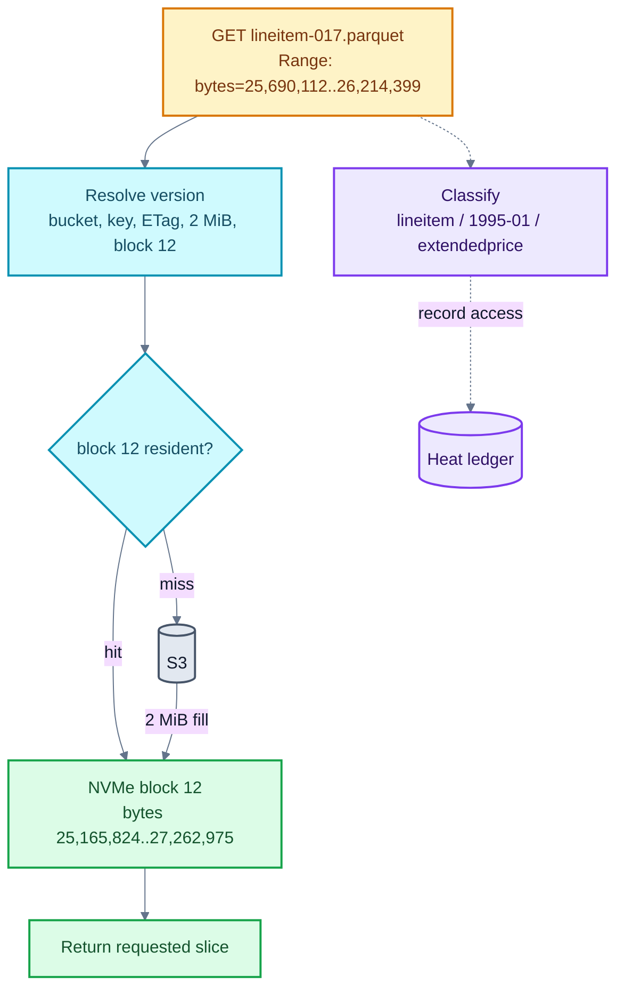
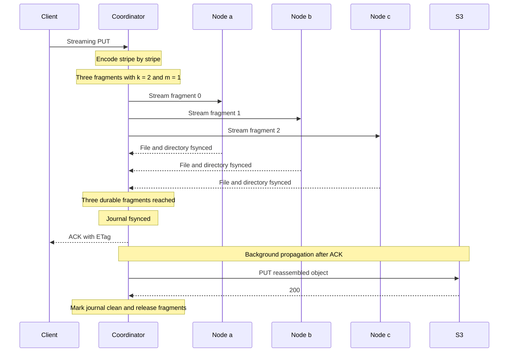
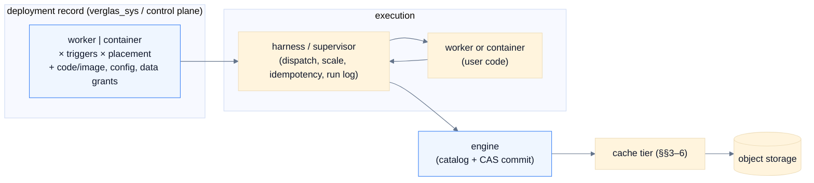

**An Iceberg-aware caching layer that brings the warehouse to compute**

---

## Abstract

Iceberg over object storage has become the dominant substrate for analytical data, but object-store latency makes direct reads too slow for interactive queries and low-latency serving. Production estates therefore maintain derived copies in real-time OLAP stores, key-value caches, feature stores, and vector databases. Each copy adds ingest pipelines, synchronization cost, and another source of inconsistency. Format-blind caching can reduce repeated fetches, but cannot infer immutability or table-level change notifications, and so must trade staleness against hit rate through operator tuning.

We propose Verglas, an Iceberg-aware local tier that colocates an S3-compatible storage endpoint with compute and serves frequently accessed bytes from DRAM and NVMe. In a self-hosted deployment, one REST composition exposes the cache S3 endpoint, query/write API, and a shallow Iceberg REST proxy; the proxy caches successful metadata reads, polls for changes, and writes mutations through to the configured customer catalog. Verglas never becomes the catalog system of record. Verglas keys cached blocks by object version, yielding correctness properties that format-blind systems cannot achieve at any configuration. An erasure-coded, quorum-acknowledged write-back path stages writes durably in front of object storage, which remains the system of record. Above the cache, Verglas runs a pipeline platform (§7). A deployment is a single record — kind, triggers, and placement — carrying user code written against one SDK; the record executes on the local server under the Docker vessel runtime and the durable worker scheduler, and pipeline I/O is routed through the cache, so the working set of an operator's pipelines is exactly the set the cache keeps resident.

---

## Repository scope

This open-source repository is the self-hosted Verglas stack: the Iceberg-aware
cache server (including WAL and virtual block devices), the query and write
roles, Docker vessel runtimes, the local worker scheduler, and the SDKs that
talk to them — `/v1/query`, graph traversal, vector search, and table scans.
The server is a catalog **client**, not a catalog implementation: it connects
to the configured Iceberg REST catalog and never stores authoritative catalog
state. The on-prem `verglas-rest` composition may expose a shallow cached proxy
at `/catalog`.

External proprietary services are out of this repository.

---

## 1 Background

The lakehouse architecture stores analytical tables as open-format files on cloud object storage and lets independent query engines share them. Apache Iceberg has become the leading open specification for this arrangement. Two properties of the resulting stack shape everything deployments build around it: object-store access latency, and the catalog's dependence on a transactional database.

### 1.1 The Iceberg table format

Iceberg tracks the individual data files of a table rather than its directories. Table state lives in an immutable metadata file recording the schema, partition specs, and a log of snapshots, where each snapshot represents the complete table contents at a point in time [1]. The only mutable state is held by a catalog: the location of the current metadata file. Figure 1 shows the resulting structure for a table with two snapshots.



*Figure 1: Iceberg metadata for a table with two snapshots. Snapshot s1 reuses manifest a and adds manifest b. The catalog pointer is mutable; the files it references are immutable.*

**Catalog.** The catalog maps a table identifier to the location of its current metadata file. It is the entry point for every table load and the coordination point for commits. Changing this mapping atomically publishes a new table state [1].

**Table metadata.** The metadata file records the table schema, partition specifications, properties, snapshot history, and the identifier of the current snapshot. Each snapshot entry points to its own manifest list. The edges labeled s0 and s1 in Figure 1 represent these references.

**Manifest list.** A manifest list defines the manifests that belong to one snapshot. Its entries include partition summaries and file counts, allowing a query planner to discard irrelevant manifests without fetching them.

**Manifest.** A manifest is an immutable Avro file containing entries for a subset of the table's data or delete files. Each entry records the file path, partition tuple, row count, and column-level metrics used to discard irrelevant files. A manifest may be shared by multiple snapshots. In Figure 1, both s0 and s1 reference manifest a, while only s1 references manifest b.

**Data and delete files.** Data files hold table rows in Parquet, ORC, or Avro. Delete files encode row-level deletions separately from the data files they affect. Both are immutable and are included in a snapshot through manifest entries [1].

Writers create new files instead of modifying existing ones. A commit writes any required data or delete files, manifests, manifest list, and table metadata before atomically updating the catalog to reference the new metadata file. Readers that loaded the previous metadata file continue to see the previous snapshot, while later readers see the new snapshot. This atomic publication provides serializable isolation without modifying files already visible to readers [1].

Query planning follows the same hierarchy. An engine loads the metadata location from the catalog, reads the current snapshot's manifest list, uses its partition summaries to select manifests, and uses manifest metrics to select data and delete files. It may then read format-specific metadata, such as Parquet footers, to select byte ranges. Requests within one level can run concurrently, but each level depends on the results of the preceding level.

### 1.2 Object-store access latency

The metadata tree of §1.1 determines the request pattern of every Iceberg query. Figure 2 shows the calls a single query issues against the catalog and the object store before any result is produced.



*Figure 2: Catalog and object-store calls for one Iceberg query. Manifest and data-file requests run concurrently within their respective stages, but each stage depends on the results of the preceding stage.*

The cost of this pattern is well characterized. Durner et al. measure AWS S3 at a median base latency of roughly 30ms per request, with first-byte latency dominating small reads, and show that saturating a 100 Gbit/s instance requires 200–250 concurrent requests [2]. Three consequences follow:

1. **Serial metadata reads pay full round-trips.** Each level in Figure 2 depends on the output of the previous one; concurrency shortens none of the chain. Caching immutable Iceberg manifests inside the engine has been shown to reduce Impala query compilation time by up to 12× on TPC-DS, direct evidence that repeated metadata fetches dominate planning cost [3].
2. **Selective reads cannot hide latency.** A point lookup or index probe issues few requests, so per-request latency, not bandwidth, bounds its response time.
3. **Request sizing is an economic trade-off.** Object stores charge per request. Larger reads amortize latency and cost but over-fetch relative to partition, column, and page pruning; smaller reads do the opposite. Cost-model analyses of cloud caching find the break-even points workload-dependent, and observe that object-store caches are near-universal in cloud analytics systems for exactly this reason [4].

Aggregate bandwidth is not the constraint: in-region object-store throughput is high and scales with concurrency [2]. The constraint is latency under repetition. The same manifests, footers, and hot data ranges are fetched by many queries, from many engines, every day, and a cache inside any single engine cannot serve its neighbors.

### 1.3 Workload patterns around the lakehouse

Lakehouse deployments serve heterogeneous consumers, and for many of them the latency floor of §1.2 is disqualifying. The prevailing mitigation is to materialize a derived copy in a system built for the workload's access pattern.

**Interactive analytics.** Dashboards and user-facing analytics require low query latency over recent data. Real-time OLAP systems meet this requirement by continuously ingesting source data into indexed, column-oriented storage designed for high query concurrency. Pinot, for example, combines near-real-time stream ingestion with tens of thousands of analytical queries per second [5]. Freshness therefore depends on the progress and correctness of a separate ingestion path.

The on-prem composition may attach Rill Developer as an optional analytics
service. `verglas-rest` resolves a selected table through the configured Iceberg
catalog, then manages the corresponding Rill model, metrics view, and Explore
resource through Rill's runtime API. Rill currently discovers Iceberg through a
direct metadata location rather than an Iceberg REST catalog, so Verglas supplies
the catalog-resolved current metadata file and an S3 connector pointed back at the Verglas
S3 endpoint. Rill remains the owner of its project and query engine; Verglas
remains the catalog-aware cache path. No Rill project filesystem is mounted by
Verglas, and no dashboard registry is stored in customer tables.

**Online serving and feature stores.** Applications and ML inference require low-latency retrieval by entity key. Feature-store architectures address this by retaining historical features in an offline store and materializing their latest values into a separate online store. Scheduled or streaming materialization keeps the two stores eventually consistent; failed or partial updates can produce training-serving skew [6].

**Vector retrieval.** Embedding-based search conventionally requires a dedicated vector database that owns its index storage, consistency model, and operational lifecycle, an arrangement at odds with compute-disaggregated analytics, where executors are stateless and read all state from object storage [7]. The embeddings themselves typically originate in lakehouse tables and are copied out at index-build time.

Verglas instead serializes each Vamana ANN index as a `verglas-vamana-v1` Puffin blob, writes the Puffin file through the source table's `FileIO`, and publishes it as the `StatisticsFile` of the exact Iceberg snapshot it reflects. The catalog therefore exposes the durable snapshot-to-index binding to every Iceberg client; clients that understand the blob type can use it, while other clients ignore it. Verglas fetches the attached Puffin file through its S3 endpoint and retains a decoded local copy for ANN serving, so customer object storage remains authoritative and local DRAM/NVMe remains disposable acceleration. A query never uses an index attached to a different snapshot.

**ML training.** Training jobs repeatedly consume the same dataset across epochs and parameter-search experiments. Quiver reports that deep-learning jobs commonly run 50–100 epochs and that many concurrent jobs may read the same underlying dataset in different random orders, motivating distributed caches between cloud storage and GPU workers [8].

These systems are effective because they change the physical access path: they place selected rows, features, indexes, or training samples on faster media in layouts matched to the workload [5–8]. Their recurring cost is a second data lifecycle. Each derived representation needs a process that selects and transfers updates, recovers from interruption, and exposes its freshness boundary to readers. Unless the source and destination participate in the same commit protocol, publication cannot be atomic across both systems; the design must tolerate lag or add coordination.

### 1.4 Catalog persistence

Iceberg leaves catalog implementation outside the table format but requires it to perform the atomic pointer swap [1]. Production catalogs therefore keep their state in a transactional database. Lakekeeper requires PostgreSQL [9]; Apache Polaris recommends its PostgreSQL JDBC metastore for production [10]; Nessie lists PostgreSQL among its production version stores [11]. Hosted catalogs such as AWS Glue provide the same mutable service behind an API without exposing the database.

A complete lakehouse deployment thus contains two kinds of state: immutable table metadata and data files in object storage, and mutable catalog, authorization, and coordination state in a transactional service. The transactional side is what makes atomic commits possible, but it is provisioned, secured, backed up, and scaled separately from the data it governs. A parallel industry trend couples operational Postgres to lakehouse tables through replication (§2.4), adding a further synchronization boundary between row-oriented and columnar representations of the same data.

---

## 2 Related Work

Existing systems address different portions of the problem described in §1: engine-local caches accelerate one runtime, distributed filesystems place a new namespace over object storage, faster storage products change the backing medium, and OLTP–lakehouse products replicate between storage engines. The relevant distinction is not whether each system caches data, but which layer owns naming, consistency, and lifecycle.

### 2.1 Engine-captive caches

Engine-integrated caches exploit information already available to the query runtime: split placement, projected columns, file-format metadata, and the local availability of worker storage. Databricks disk cache, for example, copies remote Parquet data into a proprietary intermediate format on worker SSDs [12]. Trino is a query engine, but its Iceberg connector can cache object-store reads on each worker. The cache uses Alluxio libraries beneath the connector and treats Iceberg metadata and data as files; snapshot and manifest interpretation remains inside Trino. Each worker maintains and evicts its own cache, while scheduling only expresses a preference for workers that may already hold the requested file [13]. Dremio similarly allocates its local cache independently on each executor node [14].

This placement removes an additional network hop and lets the scheduler favor workers that already hold the requested data. The cache, however, exists only on those workers. Replacing the cluster discards it. A second cluster or query engine builds another cache from the same objects, duplicating both remote reads and local storage.

Engine integration also determines which Iceberg operations are available. Iceberg standardizes metadata and commit semantics, not connector feature sets or maintenance policy. For example, Databricks reserves automatic compaction and snapshot expiration for Iceberg tables managed by Unity Catalog. Foreign Iceberg tables remain under their external catalog, are read-only in Databricks, and do not receive those maintenance services [15]. Obtaining managed-table behavior therefore requires adopting Unity Catalog as the table's lifecycle owner, not merely exposing an Iceberg table to Databricks. Dremio makes a similar trade-off. Automatic compaction and cleanup apply to tables in its built-in Open Catalog and run on a Dremio-configured maintenance engine [14]. This reduces manual work inside Dremio, but ties maintenance policy and execution to Dremio's catalog and runtime.

Externally managed tables require an additional synchronization boundary. Snowflake accesses Iceberg through an external volume and catalog integration [16]. It discovers external catalog changes by polling, with a default refresh interval of 30 seconds, and schema changes made only through DDL require a manual refresh [17]. The files remain Iceberg, but visibility and freshness inside the engine depend on its catalog adapter.

Open-source engines expose the same maintenance burden more directly. Trino supplies separate procedures for compacting files, expiring snapshots, and removing orphan files, and recommends that operators run the cleanup procedures regularly [18]. These operations modify shared table state, so their retention settings and schedules must be coordinated with writers and with every other engine that relies on older snapshots.

The central limitation is that storage interoperability stops at the engine boundary. Iceberg files can be read by many engines, but cached bytes, catalog state, and maintenance policy remain private to the engine that produced them. A second engine reading the same table begins cold, builds another cache, and may observe commits through a different refresh path. Engine-captive caching preserves format portability without providing performance portability.

### 2.2 Format-blind neutral caches

Distributed filesystem and data-orchestration systems provide a shared, engine-neutral layer, but their contracts are filesystem contracts rather than table contracts.

**Alluxio** mounts under-file systems into a unified namespace and caches their contents. Its documentation notes that changes made directly in an under-file system can leave the Alluxio namespace out of sync until metadata synchronization runs [19]. This is a valid filesystem contract, but it introduces namespace state that must be reconciled with the object store.

**JuiceFS** takes a different approach: it is an independent filesystem whose clients split files into chunks in object storage while a separate metadata engine records paths, attributes, and chunk mappings [20]. This avoids mirroring an external namespace, but the bucket no longer contains the original files in their original layout. JuiceFS is therefore a primary filesystem over object storage, not a transparent cache for an existing Iceberg warehouse.

Neither design interprets Iceberg snapshots, manifests, or logical file identity. A compaction rewrite consequently appears as unrelated new files, and the system cannot transfer observed heat from old files to their replacements or warm a snapshot from its catalog commit. Adding those behaviors requires a table-aware layer above the filesystem cache.

### 2.3 Faster storage products

Faster object and file stores reduce remote-read latency directly. This is appropriate when the faster store can become the authoritative location. It is less attractive for an existing lakehouse when doing so requires moving data, rewriting producers, or provisioning low-latency capacity for the full dataset rather than its active working set.

Research systems such as AnyBlob instead optimize the object-store client through high concurrency, request sizing, and lower CPU overhead [2]. These techniques improve cold-scan throughput and complement any caching layer, but they do not eliminate repeated remote reads or the latency of serial metadata dependencies. Caching and retrieval optimization address different portions of the path [4].

### 2.4 Lakehouse–OLTP integration via replication

Databricks Lakebase combines disaggregated Postgres with lakehouse data through explicit synchronization. Synced tables copy Unity Catalog tables into Postgres for low-latency serving. Delta sources may use continuous synchronization with a documented minimum 15-second interval, while Iceberg sources currently support snapshot synchronization because they do not expose Delta Change Data Feed [21]. In the other direction, Lakebase Change Data Feed uses logical decoding to batch Postgres WAL changes into managed Delta tables at approximately 15-second intervals [22].

This architecture provides operational and analytical access under one platform, but the row and columnar representations remain separate physical copies with an explicit freshness boundary. Neon's underlying storage architecture independently demonstrates that Postgres compute can be made stateless when durability is delegated to a quorum-acknowledged WAL service, pageservers, and object storage as durable history [23]. This is evidence that the transactional side of the lakehouse does not inherently require a dedicated storage stack.

---

## 3. Verglas Overview

Verglas interposes a shared storage service between query engines and an existing object store. Engines continue to issue S3 requests, and Iceberg continues to define table state through its catalog and metadata files. The service changes neither the table format nor the query engine. It changes the location from which repeated reads are served and uses Iceberg metadata to prepare cache state before those reads occur.

The design separates a data path from a table-control path. The data path implements the S3 operations used to read and write objects. The control path polls an Iceberg REST catalog, parses table metadata, and schedules metadata warming and snapshot-driven prefetch. Clients resolve namespaces, schemas, snapshots, and commits directly against that catalog. The self-hosted REST composition may expose a shallow cached Iceberg REST proxy, but it implements no catalog semantics and never becomes the catalog system of record. Logical SQL and table-write requests are dispatched to isolated `verglas-query` and `verglas-write` roles, whose object I/O returns through the S3 cache endpoint. This lets table-level information guide a byte-addressed cache without embedding query or write engines in the storage server.

### 3.1 System boundary

Each server serves one configured bucket through an S3-compatible endpoint. Adoption requires changing the engine's S3 endpoint and supplying endpoint credentials; no engine connector is required. The server obtains origin credentials independently and forwards cache misses to S3-compatible storage, Azure Blob Storage, or Google Cloud Storage through the configured backend.

The server implements the S3 object operations Iceberg clients use: signed GET, HEAD, range, LIST, PUT, DELETE, COPY, and multipart requests. Compatibility is exercised by the Ceph `s3-tests` suite. A separate engine matrix compares direct, cold-cache, and warm-cache results from DuckDB and Polars at the Arrow level. Parquet queries are compared end to end; Avro and mixed-format fixtures are additionally compared byte for byte because the tested engine versions do not decode Avro data files.

The server runs as a container. Self-hosted deployments use the published Docker image; production fleets sit behind an L4 load balancer and deploy through container orchestration such as Terraform or Helm. The CLI remains a client of the server's admin API and does not manage server processes.

### 3.2 Design requirements

Four requirements constrain the design.

1. **Durable object storage.** Verglas does not replace Iceberg objects with a proprietary representation. Writes either reach object storage before acknowledgment or enter the erasure-coded buffer described in §6 and propagate asynchronously. Once buffered writes have drained, the complete table remains standard Iceberg in object storage and no Verglas-specific state is required to read it: switch Verglas off and the lakehouse still works, just slower.
2. **Version-specific reads.** Cached blocks are identified by object ETag, bucket, key, block geometry, and block index. A mutable read spanning multiple blocks commits to one ETag before streaming, so a response cannot combine cached bytes from one object version with origin bytes from another.
3. **Shared acceleration.** Cache state belongs to the Verglas nodes rather than to a query-engine process. Any S3 client using the endpoint can reuse blocks populated by another client. Cluster ownership distributes the cache across nodes while preserving a backend path for every miss.
4. **Bounded resource use.** DRAM, NVMe, metadata, and write-back fragment capacity are configured as ceilings. Admission and background warming operate within those budgets. Property tests exercise the DRAM and disk ceilings under randomized workloads.

---

## 4. System Architecture

Figure 3 follows one pod-wide miss through the cluster. A request may arrive at any node; the receiving node checks its own tiers, computes the key's owner locally, and asks that owner directly. Ownership is a pure function of the key and the membership set — there is no directory service, no routing tier, and no extra hop to consult.



*Figure 3: One pod-wide miss, the slowest path a read can take. Node 1 misses locally, computes the owner with no lookup hop, and fetches the exact ETag-qualified block from node 3, which fills from the origin once — concurrent requests for the same block coalesce at the owner. A warm read stops at the first or second step; node 1 may retain the returned block as a local replica, subject to admission.*

### 4.1 Cache node

A cache node is one `verglas-server` process. Process startup and listener ownership remain in that binary; `verglas-rest` owns the on-prem HTTP composition. Its S3 front end validates SigV4 requests and maps supported operations onto separate read and write interfaces, while its execution listener exposes query/write and the shallow catalog proxy. The backend layer applies concurrency limits, retry policy, and circuit breaking before issuing origin requests. The cache engine and Iceberg layer sit between these interfaces.

The data cache divides objects into configurable 1–8 MiB blocks (2 MiB by default) and stores them in a hybrid DRAM and NVMe cache. The default follows a local Iceberg TPC-DS SF1000 measurement: DuckDB's 1–2 MiB Parquet ranges made 8 MiB fills fetch 70.67 GB from S3 to serve 12.61 GB, while 2 MiB blocks fetched 33.29 GB and cut cold wall time from 658.142 s to 329.440 s. Block geometry is part of the block identity, so a divergent peer configuration is a miss rather than a wrong-offset serve. Changing the configured geometry is a pre-release flag day and requires an empty cache directory; Verglas deliberately has no on-disk compatibility layer. A separate hybrid store holds metadata files and bounded Parquet footer suffixes. Separating the stores prevents a data scan from consuming the capacity reserved for planning metadata. Both stores recover their NVMe indexes after restart; a recovery test reopened a 256 MiB cache containing 32 blocks in approximately 11 ms.

Admission is scan resistant after the cache reaches pressure. A compact frequency sketch rejects one-touch blocks unless they meet the configured admission threshold. The metadata store bypasses this admission rule because metadata objects are small and lie on the serial planning path. A constrained SF1 experiment found that probabilistically thinning later admissions to 10% increased backend fills from 317–325 to 493–500, so deterministic second-touch admission is the default; admission policy stays configurable because it is workload dependent.

### 4.2 Cluster organization

Nodes exchange membership and configured cache capacity through gossip. For each `(bucket, key)`, every node computes a deterministic score for every live member from the key, node identity, and advertised capacity. The member with the highest weighted score owns the object. Nodes with more capacity therefore win a proportionally larger share of keys.

This calculation requires no directory lookup or coordination on the request path. Given the same membership view, an ingress node and the selected owner independently reach the same result. Adding, removing, or resizing a node changes only the keys for which the winning score changes. Property tests cover deterministic placement, minimal movement on membership changes, and capacity proportionality; an in-process three-node test covers convergence and failure detection.

Any node may receive a client request, and it checks its own DRAM and NVMe tiers before consulting ownership. The order is safe because ownership is a placement mechanism, not a consistency mechanism: blocks are version-keyed (§5.1), so a locally retained replica is exactly as authoritative as the owner's copy, and there is no freshness question a peer hop could answer that the local lookup cannot. The ring instead determines where the canonical copy lives, where concurrent fills coalesce, and whom a joining node warms from — which copy serves is decided purely by latency. Deterministic placement states where misses converge, not where all copies are: replicas accumulate on non-owners deliberately (a sole owner of a hot block is a NIC bottleneck; retained replicas spread read load), and membership changes reassign ownership instantly while bytes move only as they are re-requested. The local probe that catches these copies is a memory-resident index lookup the node performs to serve from its own tiers at all — roughly nanoseconds against a peer round trip of hundreds of microseconds, a break-even hit rate of a fraction of a percent. On a local miss, the node asks the home node for the exact ETag-qualified block; a peer hit may be retained as a local replica subject to admission, so hot keys stop paying the peer hop. A peer miss or transport failure falls through to the origin rather than failing the read. Concurrent identical backend fills are coalesced by singleflight, with the owning node as the coalescing point: requests for the same cold object converge on its home node, so a request stampede produces one backend fill.

When ownership moves, a joining node requests blocks from its rendezvous predecessor during a bounded warming interval. A draining node remains available as a donor while it is removed from new ownership, so scale-in and replacement transfer warmth instead of discarding it.

### 4.3 Failure behavior

The read path does not require consensus. If a node disappears, gossip removes it from the live membership view and the ring reassigns its objects. Blocks unavailable from a peer are fetched from the origin. The consequence is lost cache warmth rather than lost table data.

NVMe entries survive process restart and checksum-failed tail entries are discarded during recovery. A permanent node loss discards that node's cache contents. If all cache nodes are unavailable, clients must use the origin endpoint directly or through deployment-level failover; this transition is not performed by the server.

Write-back changes the failure model because acknowledged objects may not yet exist at the origin; §6 describes its protocol.

---

## 5. Iceberg Awareness

Iceberg awareness contributes four properties to the cache, each unavailable to a system that sees only buckets, keys, and bytes:

1. **Exact consistency without revalidation** (§5.1). Version-keyed block identity plus the format's immutability contract reduce the cache-invalidation problem from every cached object to a single mutable pointer per table.
2. **Version-atomic reads** (§5.1). A read commits to one object version before it streams, so concurrent overwrites cannot produce a response stitched from two versions.
3. **Planning-path residency** (§5.2). The metadata that gates every query — about 1% of table bytes, read serially — lives in an isolated store that data scans structurally cannot evict, warmed at commit time rather than on first miss.
4. **Heat that survives rewrites** (§5.3). Access frequency is recorded against logical identity (table, partition, column), which compaction preserves, rather than physical identity (file, offset), which compaction destroys.

Figure 4 shows the cache's handling of one illustrative range read. The query engine plans through the walk of Figure 2 — manifest pruning selects the file, the Parquet footer selects the column chunk's byte range — and issues an ordinary range GET; Verglas never parses SQL. Two things then happen to that request independently: the serving path resolves it to version-keyed blocks, and the classification path maps it to its logical table, partition, and column and records the access in the heat ledger, off the serving path.

```sql
SELECT sum(l_extendedprice)
FROM lineitem
WHERE l_shipdate >= DATE '1995-01-01'
  AND l_shipdate <  DATE '1995-02-01';
```



*Figure 4: Serving and classification of one range read (offsets illustrative). The solid path serves: the requested 512 KiB column slice resolves to block 12 under `(bucket, key, ETag, block_bytes, block_index)`; a miss fills the covering 2 MiB block from the origin, and only the requested slice is returned. The dotted path classifies: the same range maps to its table, partition, and column, and the access is recorded in the heat ledger without touching the serving path — the logical identity that lets heat survive compaction while the physical cache key stays version-exact.*

### 5.1 Versioned block identity

A shared cache must answer one question before serving any byte: are these bytes current? The generic answer is a freshness policy — TTLs and conditional revalidation — which costs origin round-trips proportional to the cached population and still leaves a staleness window between checks (§2.2). Verglas restructures the problem so that, for most of the estate, the question does not arise.

The cache stores blocks under `(bucket, key, etag, block_bytes, block_index)`: the object version and block geometry are part of the identity. An overwrite produces new block identities rather than modifying existing entries, so a cached block cannot hold wrong bytes for its key — it can only be the bytes of the version and byte range named in its key. Staleness is thereby confined to a single small mapping per object, from `(bucket, key)` to the current ETag, and correctness reduces to resolving that mapping. Ring ownership uses `(bucket, key)`, so placement remains stable across versions while stored bytes remain version specific.

The Iceberg contract then eliminates the mapping problem for the bytes that dominate the estate. Data files, delete files, manifests, manifest lists, and metadata files are immutable [1]: once resolved, their mappings are valid forever, with no revalidation traffic at any interval. The consistency workload of the cache collapses from all cached objects, forever to the catalog pointer plus whatever non-Iceberg objects share the bucket — the former invalidated when the private watcher observes commits, the latter given a configurable TTL with `If-None-Match` revalidation. Immutability is classified from object paths and, when the catalog watcher is active, from catalog metadata, which is authoritative.

Version-in-key identity also yields read atomicity. A read resolves the key-to-ETag mapping once, before streaming; every cache hit and origin fill for that read then resolves against the committed ETag. A concurrent overwrite either remains invisible to the read or surfaces as an ETag mismatch — never as a response mixing bytes of two versions across a block boundary. A deterministic regression test and randomized interleaving tests exercise this boundary-crossing overwrite case in addition to ETag isolation, singleflight, post-ack mutation ordering, purge behavior, and resource ceilings.

### 5.2 Metadata isolation and warming

The planning walk of §1.2 is a serial dependency chain: its latency is depth times per-level round-trip, and no concurrency shortens it. The only lever is the per-level latency itself, which makes table metadata — roughly 1% of table bytes that gates 100% of queries — the highest-leverage bytes in the system. Two mechanisms exploit this asymmetry.

**Isolation.** Metadata is admitted into a dedicated store rather than the data-block cache. A shared eviction policy cannot express that a manifest is worth more than a data block of equal recency — under LRU-family policies a large scan evicts both alike. A separate store encodes the priority structurally: no data workload, at any scan rate, can displace planning state. The store bypasses scan-resistant admission for the same reason; metadata objects are small and always on the critical path.

**Commit-driven warming.** A demand cache faults metadata in one miss at a time, on the first query after every change. Verglas instead treats the catalog as a change feed: the table-control path polls the Iceberg REST catalog and, on startup and after each observed commit, walks the new metadata — table metadata file, current manifest list, manifests, and Parquet footers — through the normal cache interface into the metadata store. Catalog availability and mutation semantics remain the catalog service's responsibility. Footer warming uses a bounded suffix request, with a second request only when the footer exceeds the initial window. Warming concurrency and byte rate are bounded independently, and if a table's metadata footprint exceeds the configured budget the warmer stops admitting rather than thrashing the store.

The combined effect is that the serial planning walk runs against local media for the first query after a deployment and the first query after every commit — the cases where a demand cache is coldest; §8.1 measures the resulting origin-request elimination.

### 5.3 Snapshot transitions and heat transfer

Compaction is where demand-driven caching fails structurally. An `OPTIMIZE` rewrites data files without changing table contents: every physical identity the cache has learned — file path, ETag, byte offset — is destroyed, while the logical distribution of future accesses is unchanged. A cache that indexes heat by physical identity loses its entire learned working set on the schedule its own table maintenance runs, and relearns it one miss at a time (§2.2).

The algorithm that avoids this separates the two identities. A background heat ledger aggregates accesses under logical coordinates — table, partition, column — which survive any rewrite; the classification from request to logical coordinate is the mapper's job (Figure 4). When the watcher observes a commit, the lifecycle component classifies it from Iceberg snapshot metadata: an append introduces new data, an overwrite changes contents, and a compaction (`replace`) preserves contents under new files. For a compaction, diffing the changed manifests yields the replacement file set, and the prefetcher projects the accumulated logical heat onto it — the heat of a partition's hot columns transfers to the new files that now hold them. Prefetch fetches footers before hot column ranges, shares a byte-rate budget with metadata warming, and yields to foreground requests.

Version-keyed identity also makes the transition itself a non-event for concurrent clients. A commit creates version skew by design: engines that planned against the previous snapshot continue reading the old files, possibly for hours, while new queries read their replacements. Because blocks are keyed by object version (§5.1), the cache serves both file sets hot side by side — there is no invalidation event, no flush, and no revalidation storm at the moment of commit. Each client stays warm on whatever snapshot it is pinned to, and the old files retire on a grace window aligned with snapshot expiry, so time-travel reads stay fast until the snapshots themselves are gone. When the new snapshot does become visible, the first wave of workers faulting the same replacement files coalesces through owner-keyed singleflight into one origin fill per object.

The compaction job itself also runs through the endpoint. Its reads of source files are served from cache rather than the origin, and its rewritten files can enter the write-back path of §6, acknowledged at NVMe latency and propagated in the background. Maintenance therefore runs faster and stops competing with query traffic for origin bandwidth — and a shorter compaction directly shrinks the window in which its commit can conflict with concurrent writers at the catalog.

The S3 serving path pays nothing for any of this. The mapper's index — parsed Iceberg metadata, manifest lists, manifests, and Parquet footers — is immutable in memory; request classification reads it through an atomic snapshot, and catalog updates build a replacement index off the serving path and publish it in one pointer swap. No lock, allocation, or catalog I/O appears on an S3 request. The watcher communicates privately with the customer's catalog service; cache hits require no provider I/O.

A hermetic cache-engine test models a compaction rewrite: with prefetch disabled, the first post-compaction query wave is constrained to at most 5% cache hits; with prefetch enabled, the test requires at least 90% hits before the first query arrives. A live Polaris harness exercises the same watcher and prefetch path end to end.

### 5.4 Format coverage

Manifest entries identify Parquet, ORC, and Avro data files, and the mapper records all three formats. Parquet receives column-chunk classification and footer warming. ORC and Avro use whole-file classification: row-oriented formats do not expose sub-file structure worth keying on, and they still receive metadata warming, snapshot-driven prefetch, and compaction heat transfer. The engine matrix verifies Parquet query results and direct-versus-cached byte identity for Avro and mixed-format snapshots.

The catalog watcher implements the Iceberg REST interface, with Glue following. Puffin deletion-vector warming, persistent Puffin checkpoints for the heat ledger, and prewarm manifests layer onto the same warming pipeline.

LIST requests are forwarded to the origin. Requests that specify an S3 `versionId` are also served directly from the origin and are not admitted to the cache. These choices keep unsupported namespace and version semantics out of the cached read path while the protocol surface is expanded.

---

## 6. Erasure-Coded Write Path

Write-back acknowledges a PUT before the object reaches the origin, so the cluster must first make the object durable across nodes. The classical form of this guarantee is a write quorum over complete copies: a write is acknowledged once `W` of `N` replicas are durable, survives `W − 1` subsequent node failures, and costs `W` times the object's bytes in storage and replication traffic [24, 25].

Erasure coding changes the unit the quorum counts. A Reed–Solomon code [26] transforms an object into `k` data fragments and `m` parity fragments such that any `k` of the `k + m` reconstruct the original exactly; each node stores a fragment of roughly `1/k` of the object rather than a copy of it. An acknowledgment threshold `w` over fragments then plays the same role a replica quorum plays over copies: once `w` distinct nodes have durably persisted their fragments, the object remains reconstructible after any `w − k` of them fail. The durability of a `w`-fragment quorum therefore matches a `(w − k + 1)`-copy replica quorum while writing `w/k` times the object instead of `w − k + 1` times — the standard argument for erasure coding over replication [27], applied in production storage systems at cloud scale [28]. For the staging buffer this economy matters twice: fragments compete for the same NVMe that serves reads, and encoding fans a single PUT's bytes across the pod's NICs instead of sending full copies to multiple nodes.

A write transaction against the buffer is therefore: encode, place fragments on distinct nodes, count durable fragment acknowledgments to `w`, journal, acknowledge. The remainder of this section describes that path and its failure handling.

### 6.1 Quorum staging

Encoding and placement stream one stripe at a time, bounding memory use independently of object size. Fragment capacity is reserved from each node's configured NVMe ceiling.

The coordinator orders candidate nodes by rendezvous hash and places at most one fragment on each node. A fragment counts toward acknowledgment only after its file and parent directory have been synchronized to local storage. Once `w` distinct fragments have completed, the coordinator writes and synchronizes a journal containing the object identity, metadata, coding geometry, and observed placements. It then acknowledges the client and continues collecting successful stragglers. Configuration requires `k ≤ w ≤ k + m`; tolerating all `m` fragment losses requires acknowledging all `k + m` fragments.

Figure 5 shows how the cluster builds the acknowledgment. The receiving node coordinates: it stream-encodes the body one stripe at a time and places each of the `k + m` fragments on a distinct node, chosen by rendezvous order over the object. A fragment counts toward the quorum only when its node reports the fragment file and its directory fsynced — a durability report, not a receipt. The coordinator counts these reports; at the `w`-th it fsyncs its journal (object identity, coding geometry, observed placements) and only then acknowledges the client. Enforcement is structural: there is no code path to an acknowledgment that does not pass through `w` counted fsyncs and a journal fsync, and if the count cannot reach `w` the write degrades as described in §6.2 rather than acknowledging early.



*Figure 5: The acknowledgment quorum for one write-back PUT with `k = 2, m = 1, w = 3`. Each fragment lands on a distinct node and reports durability only after fsync; the coordinator acknowledges only after counting `w` reports and fsyncing its own journal. Propagation to the origin runs after the acknowledgment; fragments are released only once the origin write succeeds.*

Concurrent writers need no consensus. Every PUT is an independent, immutable erasure-coded object under a pod-unique identifier: two writes to the same key share no fragments and no journal state, so the quorum counts the durability of one write rather than agreement among writers. Ordering between them is the contract the origin itself offers for concurrent PUTs — the last acknowledged write wins. A per-key dirty index points at the most recently acknowledged object, reads of the key serve that object, version-committed reads (§5.1) never interleave two versions, and propagation delivers to an origin whose own semantics for concurrent PUTs are also last-writer-wins. The quorum of this section is a durability quorum, not an agreement protocol; the coordination problem concurrent writers usually pose is dissolved by immutability, exactly as on the read path.

### 6.2 Degraded operation

Before consuming a request body, the coordinator checks live membership and fragment-store headroom. If fewer than `w` nodes are eligible, it streams the request directly to the origin. If placement falls below `w` after the body has been consumed but at least `k` fragments committed, the coordinator reconstructs the object and completes a synchronous origin write before acknowledging the client. Fewer than `k` committed fragments produce an explicit write failure.

An acknowledged but unpropagated object is readable through the same S3 endpoint. GET and HEAD consult the dirty journal and reconstruct the requested object from its fragments. Background propagation uploads the object to the origin with bounded retries, marks the journal clean, and releases fragments only after the origin write succeeds. Dirty journals are replayed after restart.

The repair loop observes membership changes. If a journaled object loses a fragment node but retains at least `k` placements, the coordinator reconstructs the object, re-encodes the missing fragments, and places them on unused live nodes. Coordinator tests cover acknowledgment threshold, insufficient-node fallback, mid-stream shortfall, read-after-write, propagation, and node-loss repair. Journal tests verify that dirty state is recovered when the journal directory is reopened.

### 6.3 Fragment integrity and scrubbing

Each persisted fragment carries a CRC32C trailer computed as the fragment is streamed to disk. Reassembly and node-loss repair verify this checksum before passing a fragment to the Reed–Solomon decoder. A corrupt fragment is treated as an erasure and reconstructed from healthy fragments; if fewer than `k` verified fragments remain, reconstruction fails rather than returning unchecked bytes.

A background scrubber periodically walks the fragments associated with dirty journals. It verifies each checksum and re-encodes missing or corrupt fragments while at least `k` healthy fragments remain. The scrubber yields between objects and reports the number of fragments examined, corrupt fragments found, and fragments repaired. Integration tests inject fragment corruption, verify byte-identical reconstruction, require failure when corruption exceeds the parity budget, and exercise repair by the scrubber.

Journals are synchronized on the coordinator's local storage and replay after process restart; journal records additionally replicate to the fragment nodes themselves, so an acknowledged object remains discoverable and recoverable even after permanent loss of the coordinator's storage.

The AWS evaluation (§8) reports acknowledgment latency across object sizes, encoding throughput and CPU cost, time to origin propagation, and recovery of acknowledged objects under fragment corruption, node loss, origin outage, and restart during propagation.

---

## 7. The Agent-Data Platform

The preceding sections argued that derived read copies — OLAP stores, feature stores, caches — should collapse into one Iceberg-native tier. The same argument applies to the compute that feeds and serves them. A production estate around a lakehouse accumulates ingestion scripts, transformation jobs, delivery servers, and the long-running services that answer for the data, each with its own scheduler, offset store, retry logic, scaling policy, and logging; each is a copy of the same operational machinery, differing only in the few lines that move or serve the data. Verglas runs that machinery once, as a platform over the cache, and reduces each program to the few lines that differ. The design is shaped by one further observation: the code that differs is now routinely written by coding agents. The platform therefore fixes hard contracts around small user programs — the shape a framework must take when its programs are generated rather than hand-maintained, since a generated program can be regenerated against a stable contract but cannot be trusted to re-implement scheduling, scaling, or exactly-once bookkeeping correctly each time.

The user-facing compute primitives are two: the **worker** and the **container**. A worker is a stateless handler invoked once per trigger event; it reads and writes tables through the client and returns. A container is a user image the platform runs as a service — stateless and scaled horizontally, or stateful and scaled vertically while kept to a single instance. Tables (§§1–6), queues (§7.8), and serverless Postgres (§7.5) are the data the two operate over. The guiding property is one line: **a datalake that scales from zero to infinity with complete control over your stack** — every workload idles to nothing when unused, grows to the tenant's allocation when loaded, and is defined by the tenant, not chosen from a fixed menu.

Three doctrines run through the whole design and are stated once here:

- **Local-first.** Everything runs on the open-source self-hosted stack — workers, Docker vessels, tables, the whole stack on one machine or a small pod. A deployment is one record the local scheduler and container runtime reconcile; there is no second plane to push onto.
- **Scale-to-zero by default.** Every workload idles to zero when unused. A worker holds nothing between runs; a stateless container scales horizontally up to the operator's allocation limit and back to zero; a stateful container scales vertically (cpu/ram) while staying a single instance, and snapshots to idle when quiet. The runtime monitors every active job and owns scaling decisions — the user declares the shape, not the schedule of scale.
- **Sockets never pin compute.** Container edge sockets and the SDK's `follow` terminate on a hibernating edge object. Lakekeeper sends committed catalog mutations directly to the tenant cache ring over its private network. Worker scheduling accepts bounded events, including complete HTTP callbacks; it never owns a client connection.



*Figure 7: one deployment record drives a harness that supervises the workload; all data flows through the engine's commit path, which locally points at the cache tier.*

### 7.1 The deployment record

A deployment is one record: kind (worker | container) × triggers (zero or more cron, webhook, and event subscriptions for a worker) × local placement, plus the code or image, its configuration, the tables and databases it is granted (§7.5), and — for a stateful or stateless container — its scaling shape. Everything the platform does — scheduling, dispatch, scale, pause and resume, audit — is a function of this record, which is why it must be one record: a workload whose schedule lives in a crontab, whose code lives in a repository, and whose scaling lives in a separate orchestrator cannot be inspected, moved, or replayed as a unit. The registry is the `verglas_sys` namespace: Iceberg tables whose rows are append-only revisions, so the registry inherits the audit and time-travel properties of §1.1 — the snapshot log is the complete lifecycle history of every deployment, readable by any engine.

### 7.2 The worker contract and harness

A worker is a single default-exported handler, `worker(ctx)`, invoked once per trigger event. Its context supplies the connected client (table read/write through the same verbs everywhere), the trigger event that invoked it, the deployment-configured output table(s), the environment (secret bindings and config), and a logger. A worker is a **pure function of two inputs**: the trigger event and the data currently committed. It holds no state between runs, and — this is a deliberate change from earlier designs — it has no durable watermark in its programming model. Progress is not something a worker tracks; it is something the platform hands the worker as input (§7.3). The output table is deployment configuration, passed in on the context, never hardcoded in the handler, so the same worker code can be pointed at a different table by editing the record.

One harness executes a worker run. It builds the context, invokes the handler once, appends structured run events to the deployment's `_LOGS` table — start, a commit event per append, and end or error, with row counts — and returns the result. There is no watermark bookkeeping to get wrong because there is no watermark in the loop. Correctness under retry rests on idempotency keys the worker attaches to its commits, recorded in the committed snapshot's summary: a replayed run re-commits the same rows under the same key, and the table itself detects and absorbs the duplicate, with no side channel to keep consistent. The delivery semantics are therefore at-least-once execution with exactly-once table effects — carried, as in §1, by the lakehouse's own commit log rather than an external offset store.

Workers are ordinary code in the tenant's language, run as subprocesses under the local scheduler (§7.6); the harness bounds a run to one trigger dispatch, so a misbehaving worker is killed without touching the server's serve path. A conformance check asserts the two properties that a generated program can violate without a type error: schema stability across runs (a worker must not silently drift its output shape) and kill-and-resume equivalence (a run killed at any point and re-dispatched produces the same table state — the observable form of the idempotent-commit discipline). Watermark monotonicity, a property of the retired job model, is no longer a conformance concern: there is no worker-visible watermark to move backward.

### 7.3 Triggers and scheduling

Triggers are deployment configuration, not runtime payload variants. One worker may declare any combination of **cron**, **webhook**, and **event** subscriptions, while every dispatch is one CloudEvents 1.0 envelope delivered to `ctx.trigger`. Manual requests, cron ticks, and complete inbound HTTP requests are CloudEvent producers. Lakekeeper emits Iceberg mutation events after successful commits. An event subscription matches exact `type` and optional `source` and `subject` attributes. The on-prem REST composition accepts structured CloudEvents and fans them out to matching subscriptions, so Kafka, RabbitMQ, and other transports connect through bridges without adding broker payloads to the scheduler. The scheduler stores bounded CloudEvents and never owns an HTTP or WebSocket connection.

Scheduling follows the Airflow model: a cron dispatch carries the run's **logical time** — a nominal `logicalDate` and the half-open interval `[intervalStart, intervalEnd)` the run is responsible for. A worker doing an incremental pull ranges its query over that interval; the logical interval is the *only* progress concept a worker sees. This makes **backfill a first-class scheduling feature rather than application code**: a cron trigger declares a `startDate` and a `catchup` policy — `sequential` (replay each past interval in order), `parallel` (fan the backlog out concurrently), or `none` (start live) — and the platform dispatches the historical intervals, each as an ordinary run with its own logical window, until the schedule catches up to now. Because each run is pinned to a bounded interval and commits idempotently, a backfill and a live run are the same code path over a different window.

Scheduling is a separate stateless service. Each deployment has one logical worker queue. Manual REST calls, complete HTTP callbacks, cron reconciliation, and catalog data-update subscriptions all materialize the same durable job shape in that queue. A deterministic trigger identity makes enqueue idempotent; lease generations fence competing or recovered consumers; a completion is accepted only for the live generation. The scheduler can therefore restart or migrate without a filesystem guard or process-local cursor. Postgres owns queue state: an operator supplies a Postgres URL to the optional scheduler container. If the scheduler is not configured, Verglas serves storage, catalog, and query normally and does not mount worker-trigger routes.

The scheduler is a running queue consumer. Pushed worker events are persisted before the event API acknowledges them and are eligible to run immediately. Cron, retry, and lease deadlines use exact timers derived from durable queue state; there is no periodic queue poll and no separate wake endpoint. Lakekeeper can submit matching data-update events to the scheduler, which claims work and runs the local worker harness; cache invalidation is delivered independently and directly to the cache ring.

There is no per-deployment watermark cell. Cross-run state a worker genuinely needs belongs in a table or KV the worker writes through the connected client; scheduling progress remains the platform's responsibility, expressed as logical time.

### 7.4 Containers and scale-to-zero

A container is a user image the platform runs as a service when a worker's per-trigger shape is the wrong fit — a long-running server, a model runtime, an interactive session. Two shapes are offered, and the choice is the whole of the scaling contract:

- A **stateless** container holds no durable in-memory state between requests, so the platform scales it **horizontally**: zero replicas when idle, up to the tenant's allocation limit under load, and back to zero. This is the shape for request/response services and embarrassingly parallel work.
- A **stateful** container keeps in-memory state that must survive across requests, so it is kept to a **single instance** and scaled **vertically** — cpu and ram grow and shrink under the runtime's watch, but the instance is never duplicated. When it goes quiet it is snapshotted to idle (snapshot-to-idle) and restored on the next request, so a stateful service also scales to zero without losing its state — this restore-on-request wake is designed-but-not-yet-fully-shipped.

In both shapes the container runtime monitors the active job and owns the scaling decision; the user declares only the shape and the allocation ceiling. A container runs on the server's host as an ordinary Docker image reconciled by `verglas-container-runtime` (§7.6).

### 7.5 Data grants and serverless Postgres

A deployment declares the data it may touch: the tables and databases it is granted, per record. A grant is the access-control boundary: a worker or container sees only what its record lists. CloudEvent subscription attributes independently determine which events invoke a worker; receiving an event never expands its data grants. Grants are part of the one record (§7.1), so what a workload can reach is inspectable and auditable as a unit, not scattered across IAM policies and connection strings.

Beyond Iceberg tables and queues, a deployment may be granted a **Postgres** database: `db create` provisions one through the local Neon vessel composition, scaled on the same scale-to-zero basis as the rest of the stack — idle to nothing, wake on connection through the same hibernating-socket path as everything else (§7.9).

Each cache node may also embed the Postgres WAL ingress. Neon compute speaks its ordinary safekeeper protocol to one selected reachable cache node; that ingress preserves PostgreSQL LSNs and terms and acknowledges only after the new WAL is erasure-coded and fsynced across the Verglas ring. The compute is not given the ring members as a Neon safekeeper quorum: one ingress coordinates the Verglas durability quorum, while service discovery may select any healthy ingress after a failure. Committed WAL drains to object storage in the background, and pageserver reads both the EC tail and the object-resident prefix through the same safekeeper protocol. Running the listener inside `verglas-cache-node` shares its NVMe fragment store, peer plane, failure detection, and scheduler lifecycle without introducing another deployable instance.

### 7.6 Placement: local server, vessels, and workers

The standalone scheduler runs each active worker as a bundled subprocess fired by one of its triggers, while `verglas-container-runtime` reconciles containers as Docker images on the host. The engine's storage endpoint points at the server's own cache surface. The commit and read contract between user code and the platform is one HTTP surface — commit, snapshot, rows, delta — served by the local server from the engine library. Because idempotency lives in snapshot summaries (§7.2), a worker or container observes identical semantics whether invoked by cron, HTTP, or a CloudEvent producer.

### 7.7 Cache-pathed I/O

Local I/O routes through the server's own S3 surface — the cache. This is a wiring property, not a code dependency: the engine reads and writes through whatever storage endpoint it is given, and the server hands it its own. Two guarantees follow. First, residency: every read and write a workload makes populates the cache as a side effect, so the tables an operator's workloads touch are precisely the tables the cache keeps warm — the working set is defined by use rather than by prediction. Second, ownership: the §4 ring routes below the engine, so no user or harness code path can assume a key is locally owned, and workloads behave identically on one node or a pod. The turn-off invariant of §3 is preserved: output is ordinary committed Iceberg, and with Verglas removed the tables remain readable by any engine.

### 7.8 Queues

Some stages need decoupling that a table's commit cadence does not provide: a burst-prone producer should not block on downstream consumers, and several consumers may need independent positions in one stream. A deployment may therefore be granted a queue instead of (or as well as) a table. The queue is a durable segment log — append-only segment files with per-consumer-group acknowledged positions, expired by retention. Delivery is at-least-once with consumer-side idempotency, deliberately the same discipline as the commit path (§7.2), so moving a stage between queue and table changes its coupling, not its correctness reasoning.

### 7.9 Sockets on hibernating edge objects

A long-lived inbound socket must not pin a backend that is supposed to scale to zero. Verglas terminates client-facing sockets on a hibernating edge object. Catalog mutation delivery is not client traffic: Lakekeeper publishes each successful mutation directly to every member of the tenant cache ring. Worker scheduling accepts bounded HTTP callback events and does not retain the client connection.

### 7.11 Layering

A configured Iceberg REST catalog remains the authoritative customer-facing service. A local Verglas server connects to it as a client and may expose a shallow cached `/catalog` proxy as part of the on-prem REST composition; that proxy implements no catalog semantics of its own. The engine's Iceberg REST client and metadata-warming trigger (§5) remain transport-agnostic. The hosted Lakekeeper integration calls that trigger directly after a successful mutation; self-hosted deployments may continue to discover changes through catalog polling.

---

## 8. Benchmarks

Results include an SF1,000 capacity run (§8.1) and a single-node compaction run (§8.2).

### 8.1 SF1,000 query wave (measured)

TPC-DS SF1,000 contains approximately 279 GB of Iceberg/Parquet data in S3 Standard. The representative wave contains three fixed queries: a fact-table count, monthly sales aggregation, and item-revenue aggregation. It is not the full 99-query TPC-DS suite. Each engine ran directly against S3 and through its applicable cache. Cold cache starts with no data blocks resident; warm cache is a replay after population converged. DuckDB has no built-in S3 cache. Speedup compares the warm-cache result with that engine's direct-S3 result.

| Engine | Storage path | Cold Cache | Warm Cache | Speedup |
|---|---|---:|---:|---:|
| DuckDB 1.4.5 | S3 direct | 618.098 s | — | 1.00× |
| DuckDB 1.4.5 | Verglas | 636.725 s | **42.128 s** | **14.67×** |
| Trino 446 | S3 direct | 296.762 s | — | 1.00× |
| Trino 446 | own file-system cache | 348.948 s | 69.892 s | 4.25× |
| Trino 446 | Verglas | 398.269 s | **67.060 s** | **4.43×** |
| ClickHouse 26.6.1 | S3 direct | 227.043 s | — | 1.00× |
| ClickHouse 26.6.1 | own file-system cache | 447.397 s | 25.776 s | 8.81× |
| ClickHouse 26.6.1 | Verglas | 461.587 s | **22.390 s** | **10.14×** |

*Hardware: Mac Studio with an Apple M3 Ultra (28 CPU cores) and 256 GB unified memory. Engines were limited to 48 GB and 24 CPUs and ran one at a time. Cache-owning configurations received the same 400 GB logical cache budget; Verglas used 48 GiB of DRAM and 2 MiB block geometry.*

DuckDB's warm Verglas replay was 14.67× faster than direct S3 and recorded zero backend fills and zero backend bytes. The corrected same-network Trino-through-Verglas warm runs were 67.060, 68.770, and 66.463 seconds; their 67.060-second median was 4.1% faster than Trino's own file-system cache and served 77.5 GB from DRAM with zero backend fills. Trino's catalog-prewarmed empty-data-cache run remained 14.1% slower than Trino's own cold cache because startup warming loaded metadata, manifests, and footers rather than the query's data ranges. The final weighted-egress ClickHouse-through-Verglas runs were 22.390, 21.921, and 23.081 seconds; the 22.390-second median was 13.1% faster than ClickHouse's own cache, again with zero backend data bytes and zero backend fills.

### 8.2 Cache recovery after compaction (measured)

Iceberg compaction rewrites a table into fewer, larger Parquet files. Those files have new S3 object names. A normal file cache indexes bytes by object name, so its entries for the old files are useless after the new snapshot commits. Verglas also sees the catalog commit: it connects the old hot files to their replacements and starts prefetching the replacement ranges before another query asks for them.

The experiment warmed a three-query working set, compacted one target table with `rewrite_data_files`, and measured the same workload after compaction. Each cache used a separate copy of the target table. The Verglas result below is the settled measurement after its catalog watcher prefetched the replacement files.

| Query path | Before compaction | After compaction |
|---|---:|---:|
| DuckDB through Verglas | 2.770 s | **2.587 s** |
| Trino with its file-system cache | 26.967 s | 25.981 s |

Verglas briefly rose to 4.489 seconds while prefetch was still running, then returned to 2.587 seconds with zero origin reads. Trino's result is its first post-compaction query; the improved file layout offset the cost of loading the new paths into its cache on demand. DuckDB through Verglas was 9.7× faster before compaction and 10.0× faster after Verglas recovered the replacement files.

ClickHouse is excluded from the table because the tested Iceberg path did not support compaction and then errored while reading the rewritten table, so it produced no comparable timing. ClickHouse's published Iceberg roadmap lists background merges as future work [29].

*Hardware: one `i4i.2xlarge` in `us-west-2a` with 8 vCPUs, 64 GB DRAM, and 1.75 TB NVMe. The dataset was TPC-DS SF100 in S3 Standard: 28.4 GB across 806 objects and 24 tables.*

---

## 9. Conclusion

The lakehouse settled where analytical data lives; it has not settled where hot bytes are served from or where its own transactional state runs. Today those gaps are filled by derived copies — OLAP stores, feature stores, vector databases, replicated Postgres — each with its own pipeline, freshness boundary, and failure modes, and by a managed database quietly required underneath every catalog.

Verglas closes both gaps with one tier. Because it is built on Iceberg's contract rather than merely compatible with its files, its two central properties are structural: version-keyed blocks cannot serve stale bytes at any configuration, and catalog subscription warms metadata and data before queries ask. Engines adopt it by changing an endpoint; removing it leaves a standard Iceberg lakehouse, just slower.

The platform layer applies the same discipline to data movement. A pipeline is a deployment record executed by a harness against the same commit contract everywhere; correctness rests on commit-before-acknowledgment and snapshot-recorded idempotency keys rather than on any property of the runtime that happens to host the job.

---

## 10. References

1. Apache Software Foundation. [*Apache Iceberg Table Specification*](https://iceberg.apache.org/spec/).
2. Dominik Durner, Viktor Leis, and Thomas Neumann. [*Exploiting Cloud Object Storage for High-Performance Analytics*](https://www.vldb.org/pvldb/vol16/p2769-durner.pdf). PVLDB 16(11), 2023.
3. Riza Suminto. [*12 Times Faster Query Planning with Iceberg Manifest Caching in Impala*](https://www.cloudera.com/blog/technical/12-times-faster-query-planning-with-iceberg-manifest-caching-in-impala.html). Cloudera, 2023.
4. Kira Duwe et al. [*The Five-Minute Rule for the Cloud: Caching in Analytics Systems*](https://www.vldb.org/cidrdb/papers/2025/p4-duwe.pdf). CIDR 2025.
5. Jean-François Im et al. [*Pinot: Realtime OLAP for 530 Million Users*](https://doi.org/10.1145/3183713.3190661). SIGMOD 2018.
6. Anya Li et al. [*Managed Geo-Distributed Feature Store: Architecture and System Design*](https://arxiv.org/abs/2305.20077). arXiv:2305.20077, 2023.
7. Artur Borycki. [*Puffin-Backed Vector Indexes: Attaching Approximate Nearest Neighbor Indexes to Apache Iceberg Snapshots for Compute-Disaggregated Query Engines*](https://arxiv.org/abs/2606.04196). arXiv:2606.04196, 2026.
8. Abhishek Vijaya Kumar and Muthian Sivathanu. [*Quiver: An Informed Storage Cache for Deep Learning*](https://www.usenix.org/conference/fast20/presentation/kumar). FAST 2020.
9. Lakekeeper. [*Concepts: Persistence Backend*](https://docs.lakekeeper.io/docs/0.11.x/concepts/).
10. Apache Polaris. [*Metastores*](https://polaris.apache.org/releases/1.5.0/metastores/).
11. Project Nessie. [*Server Configuration: Version Stores*](https://projectnessie.org/nessie-latest/configuration/).
12. Databricks. [*Optimize performance with caching on Databricks*](https://docs.databricks.com/aws/en/optimizations/disk-cache).
13. Trino. [*File system cache*](https://trino.io/docs/current/object-storage/file-system-cache.html).
14. Dremio. [*Open Catalog*](https://docs.dremio.com/current/data-sources/open-catalog/).
15. Databricks. [*What is Apache Iceberg in Databricks?*](https://docs.databricks.com/aws/en/iceberg/).
16. Snowflake. [*Apache Iceberg tables*](https://docs.snowflake.com/en/user-guide/tables-iceberg).
17. Snowflake. [*Automatically refresh Apache Iceberg tables*](https://docs.snowflake.com/en/user-guide/tables-iceberg-auto-refresh).
18. Trino. [*Iceberg connector*](https://trino.io/docs/current/connector/iceberg).
19. Alluxio. [*Unified Namespace and Under File System Namespaces*](https://documentation.alluxio.io/os-en/core-services/unified-namespace).
20. JuiceFS. [*Architecture*](https://github.com/juicedata/juicefs/blob/main/docs/en/introduction/architecture.md).
21. Databricks. [*Serve lakehouse data with synced tables*](https://docs.databricks.com/aws/en/oltp/projects/sync-tables).
22. Databricks. [*Lakebase Change Data Feed*](https://docs.databricks.com/aws/en/oltp/projects/lakebase-cdf).
23. Neon. [*Architecture overview*](https://neon.com/docs/introduction/architecture-overview).
24. David K. Gifford. [*Weighted Voting for Replicated Data*](https://doi.org/10.1145/800215.806583). SOSP 1979.
25. Giuseppe DeCandia et al. [*Dynamo: Amazon's Highly Available Key-value Store*](https://doi.org/10.1145/1294261.1294281). SOSP 2007.
26. Irving S. Reed and Gustave Solomon. [*Polynomial Codes over Certain Finite Fields*](https://doi.org/10.1137/0108018). Journal of the SIAM 8(2), 1960.
27. Hakim Weatherspoon and John Kubiatowicz. [*Erasure Coding vs. Replication: A Quantitative Comparison*](https://doi.org/10.1007/3-540-45748-8_31). IPTPS 2002.
28. Cheng Huang et al. [*Erasure Coding in Windows Azure Storage*](https://www.usenix.org/conference/atc12/technical-sessions/presentation/huang). USENIX ATC 2012.
29. ClickHouse. [*ClickHouse Release 25.7 Call*](https://presentations.clickhouse.com/2025-release-25.7/).
30. Apache Software Foundation. [*Kafka Connect*](https://kafka.apache.org/documentation/#connect).
31. Tyler Akidau et al. [*MillWheel: Fault-Tolerant Stream Processing at Internet Scale*](https://doi.org/10.14778/2536222.2536229). PVLDB 6(11), 2013.
