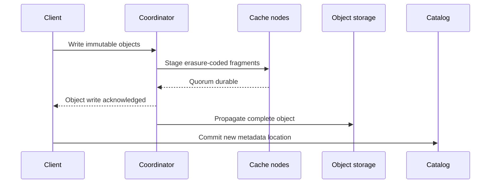

Verglas can acknowledge a write before the origin object store completes only
after the write is durably staged across the configured fault boundary. Object
storage remains the final system of record.

## Commit sequence

The catalog commit happens only after every object referenced by the new
metadata is readable. A failed catalog compare-and-swap leaves unreferenced
objects that normal Iceberg cleanup can remove; it does not publish a partial
table state.

## Quorum staging

Reed–Solomon fragments spread a staged object across independent cache nodes.
The configured quorum must contain enough fragments to reconstruct the object.
A coordinator generation fences a recovered or superseded writer from
completing stale work.

## Degraded operation

A standalone deployment writes through to the origin before acknowledging. A
configured cluster acknowledges only after its EC staging quorum succeeds and
rejects the write when it cannot meet that quorum. Neither topology acknowledges
an object that exists only in volatile memory.

## Repair and scrubbing

Background propagation reconstructs complete objects and retries the origin
upload with capped backoff until it succeeds or the process shuts down. Scrubbing
verifies fragment checksums and repairs damaged fragments
while enough independent fragments remain. Both operate under hard bandwidth
and concurrency limits so cache recovery cannot consume the host.
