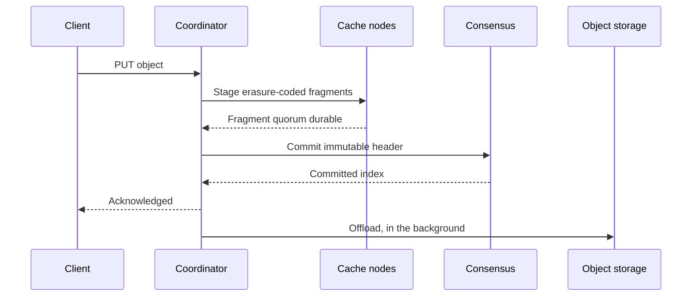

This page describes the independent cache and managed object-storage write
path. Verglas acknowledges a write once it is durably staged across the
configured fault boundary; offload to object storage runs behind that
acknowledgement. It is not a Durable Object commit path. Sink and Catalog own
product-level Parquet and Iceberg publication.

## Storage bindings

A storage binding is either customer-owned or managed, and the write path
differs between them.

| | Customer binding | Managed binding |
| --- | --- | --- |
| Object layout | The customer's | Verglas owns it |
| Read path | Verglas or direct S3 | Verglas only |
| Commit publishes | After referenced objects reach the origin | On the quorum acknowledgement |

A customer binding must stay usable without Verglas, so a table commit waits
for its referenced data files to reach the origin before it publishes. A
managed binding has no direct reader, so the commit publishes as soon as the
write is durable on the ring.

## Commit sequence

## Quorum staging

Reed-Solomon fragments spread a staged object across independent cache nodes.
The acknowledgement quorum must contain enough fragments to reconstruct the
object. Encoding is striped, so only one stripe is resident regardless of
object size, and a large upload never buffers whole.

A write is acknowledged only after the fragment quorum is durable and consensus
commits the object's immutable header. Origin propagation is never an alternate
acknowledgement authority. When the live pod cannot place the configured
quorum, the write is refused rather than acknowledged under a weaker contract.

## Offload

Offload is a stream, not a task per object. Acknowledged objects append to
their binding's offload stream, which flushes when accumulated bytes reach a
size limit or when a caller drains it explicitly.

- Objects below the size limit accumulate, so one flush groups many small
  objects into a single origin object. An index maps each logical key to its
  group object, offset, and length, and commits through consensus.
- Objects above the size limit bypass accumulation and stream to the origin as
  they are written, so a large write never waits behind a buffer.
- Drain is explicit and callable, for lifecycle shutdown.

WAL segments and catalog checkpoints use the same stream with their own size
limits and drain triggers. The three differ only in how a flush unit is named,
whether committed records must advance in order, and whether a new record
supersedes the previous one.

### Offload uses the whole cluster

Fragments are already distributed across every node, so offload runs where the
bytes are. Each flush unit is assigned to a node deterministically from its
identity, preferring a node that already holds fragments for that unit. Uploads
run concurrently under a per-node bound, and the group leader stays out of the
byte path: it remains authoritative for the committed record only. A unit whose
assigned node leaves the live set is reassigned by the same function, and an
upload is idempotent so a brief overlap during a membership change still
commits once.

### Offload never holds a second copy

The offloader is given fragment references, never bytes.

1. Write-back erasure-codes the object and acknowledges on the fragment quorum.
2. The offloader is informed by fragment reference.
3. It builds the group object by streaming from those references.
4. The group object uploads to the origin.
5. The decoded bytes insert into the cache, if admission accepts them.
6. Fragments are removed.

The decode runs once and feeds both the upload and the cache insert. Step 5
precedes step 6, so a just-written object stays locally readable rather than
costing an origin fetch. Admission may reject under budget pressure; that is a
normal result and does not fail the offload.

## Compaction runs before offload

Grouping and compaction solve different problems. Grouping reduces origin
request count. Compaction reduces the number of Parquet data files a query must
plan and read, which grouping does not change, because the logical files stay
separate inside the group object.

Compacting after grouping would leave the group object dead on arrival. Because
acknowledged data files sit as fragments and are not yet persisted, compaction
runs first: a table over its threshold has its buffered files rewritten into
target-sized files, and those exceed the size limit, so they stream out
directly. Files superseded by the rewrite never upload at all.

Grouping then serves what stays genuinely small: manifests, manifest lists,
metadata pointers, and delete files.

## Repair and scrubbing

Repair reconstructs lost fragments from the survivors after a membership
change. Scrubbing verifies fragment checksums on a schedule and repairs damaged
fragments while enough independent fragments remain, because silent bit-rot
fires no membership event. Both operate under hard bandwidth and concurrency
limits so recovery cannot consume the host.

## Leaving a managed binding

A managed binding is left through an explicit detach, never by stopping nodes.
Detach fences new mutations, archives committed WAL, exports and checkpoints the
managed catalog, and drains buffered objects to the origin. After that drain the
data is standard Iceberg in ordinary object storage. Destroying a quorum while
acknowledged state is unarchived is data loss.
