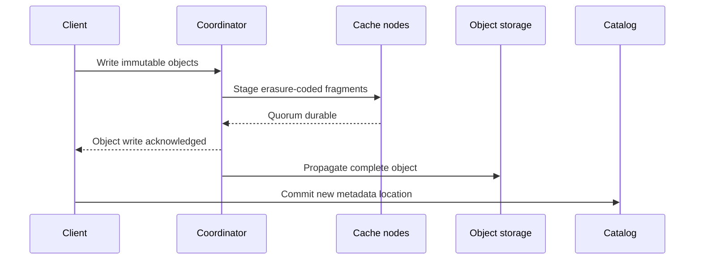

Verglas can acknowledge a write before the origin object store completes only
after the write is durably staged across the configured fault boundary. Object
storage remains the final system of record.

## Commit sequence

The catalog commit happens only after every object referenced by the new
metadata is readable. A failed catalog compare-and-swap leaves unreferenced
objects that normal Iceberg cleanup can remove; it does not publish a partial
table state.

Neon pageservers use the same barrier for immutable layers and `index_part`
publication. Their upload queue does not publish an index until every referenced
layer PUT has reached ring durability. A PUT becomes clean only after object
storage confirms propagation. Until then, its fragments are not candidates for
cache eviction, regardless of their observed heat.

## Quorum staging

Reed–Solomon fragments spread a staged object across independent cache nodes.
The configured quorum must contain enough fragments to reconstruct the object.
A coordinator generation fences a recovered or superseded writer from
completing stale work.

## Degraded operation

If no fragment ring is configured, Verglas writes through to the origin before
acknowledging. A ring-backed cache node that cannot meet its staging quorum
rejects the write; it does not silently change Neon publication durability
modes. Verglas never acknowledges an object that exists only in volatile
memory.

## Repair and scrubbing

Background propagation reconstructs complete objects and uploads them to the
origin. Scrubbing verifies fragment checksums and repairs damaged fragments
while enough independent fragments remain. Both operate under hard bandwidth
and concurrency limits so cache recovery cannot consume the host.
