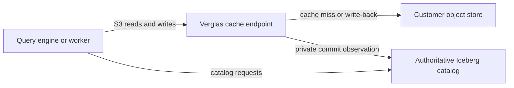

Verglas is an Iceberg-aware object cache with local workers, vessels, and query surfaces. Self-host the server, point engines at its S3 endpoint, and run workloads against your catalog and object store.

<Warning>
Verglas is a pre-release prototype. Commands, configuration keys, wire formats, and on-disk layouts can change between commits.
</Warning>

## Choose a workflow

<CardGroup cols={2}>
  <Card title="Self-host Verglas" icon="server" href="/docs/get-started/self-host">
    Run the cache server with Docker and point an S3-compatible query engine at it.
  </Card>
  <Card title="Create your first table" icon="table" href="/docs/get-started/first-table">
    Ingest a file, query it, and inspect snapshot history through the CLI.
  </Card>
</CardGroup>

## What you can run

Verglas exposes two local compute shapes:

- A **worker** handles one scheduled or event-driven dispatch. Workers hold no durable process state between runs.
- A **vessel** (Application or Integration) runs as a long-lived service under the local Docker runtime manager.

Both use ordinary Iceberg tables. Turning Verglas off leaves those tables readable through their original catalog and object store.

## What the cache changes

Query engines change their S3 endpoint to Verglas. The self-hosted REST service may also expose a shallow cached catalog path for engines that want one address for both interfaces. The configured upstream catalog remains authoritative.

<Note>
The self-hosted catalog path caches successful reads and writes mutations
through. It does not implement catalog semantics or become the catalog system
of record.
</Note>

## Next steps

<CardGroup cols={2}>
  <Card title="Learn the worker model" icon="workflow" href="/docs/workers/overview">
    Understand triggers, logical intervals, outputs, and idempotent commits.
  </Card>
  <Card title="Explore the SDKs" icon="braces" href="/docs/sdk/overview">
    Read and write tables, follow commits, use queues, traverse graphs, and search vector indexes.
  </Card>
</CardGroup>
