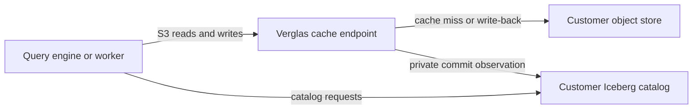

Verglas runs workers and containers next to an Iceberg-aware object cache. Start in Verglas Cloud, where `verglas login` configures the CLI and your tenant lakehouse. Self-host the cache server when you need to keep the data plane on your own infrastructure.

<Warning>
Verglas is a pre-release prototype. Commands, configuration keys, wire formats, and on-disk layouts can change between commits.
</Warning>

## Choose a workflow

<CardGroup cols={2}>
  <Card title="Start with Verglas Cloud" icon="cloud" href="/docs/get-started/cloud-quickstart">
    Log in, create a worker, store its secret, run it, and inspect its logs.
  </Card>
  <Card title="Self-host Verglas" icon="server" href="/docs/get-started/self-host">
    Run the cache server with Docker and point an S3-compatible query engine at it.
  </Card>
</CardGroup>

## What you can run

Verglas exposes two deployment primitives:

- A **worker** handles one scheduled or event-driven dispatch. Workers hold no durable process state between runs.
- A **container** runs an image as a tenant service. Containers can scale, stop, and resume.

Both primitives use ordinary Iceberg tables. Removing Verglas leaves those tables readable through their original catalog and object store.

## What the cache changes

Query engines continue to use their Iceberg catalog directly. You change only the engine's S3 endpoint. Verglas serves hot object ranges from DRAM or NVMe and reads through to the origin on a miss.

<Note>
Verglas does not replace or proxy the customer's Iceberg REST catalog. The server connects to the catalog as a private client for table operations and warming.
</Note>

## Next steps

<CardGroup cols={2}>
  <Card title="Learn the worker model" icon="workflow" href="/docs/platform/workers">
    Understand triggers, logical intervals, outputs, secrets, and idempotent commits.
  </Card>
  <Card title="Explore the SDKs" icon="braces" href="/docs/sdk/overview">
    Read and write tables, follow commits, use queues, traverse graphs, and search vector indexes.
  </Card>
</CardGroup>
