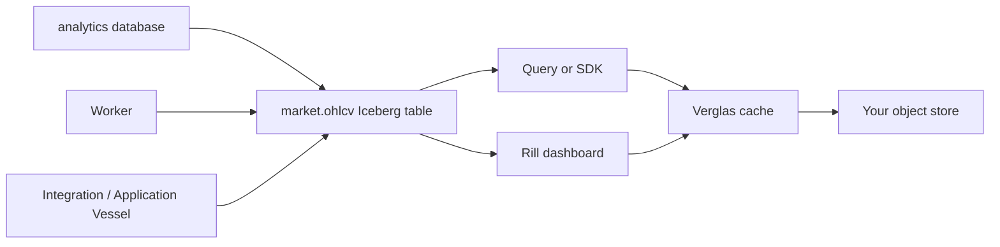

Verglas is an Iceberg-aware cache and local data platform. It keeps ordinary
Iceberg tables in your catalog and object store, then adds a bounded DRAM/NVMe
cache, query API, workers, long-running services, dashboards, and SDKs around
the data journey you already own.

<Warning>
Verglas is a pre-release prototype. The open-source distribution is
self-hosted today; there is no hosted Verglas onboarding or managed cloud
service to sign up for. Commands, configuration, and on-disk layouts can
change between commits.
</Warning>

## One useful journey

Start a self-hosted stack, create the `analytics` lakehouse, and load
`market.ohlcv`. Query it twice: the result remains an ordinary Iceberg query,
while the second read can reuse cache-pathed metadata and object bytes. Then
use that same table as the handoff between a scheduled worker, an optional
Integration or Application Vessel, a Rill dashboard, and an SDK client.

Workers and Vessels are optional runtime workloads. Their data connections and
cache use come from their declared configuration and grants; this journey does
not assume that every service request or worker run uses the cache path.

The cache is not a second database. Your catalog remains authoritative, and
turning Verglas off leaves the table readable from its original catalog and
bucket—just without the local cache path.

## Start here

<CardGroup cols={2}>
  <Card title="Self-host the stack" icon="server" href="/docs/get-started/self-host">
    Connect Cloudflare R2, Lakekeeper, the cache ring, and local runtime.
  </Card>
  <Card title="Get a first result" icon="table" href="/docs/get-started/first-table">
    Create `analytics`, write `market.ohlcv`, query it, and observe cache activity.
  </Card>
</CardGroup>

## Continue the same table

<CardGroup cols={3}>
  <Card title="Automate ingestion" icon="workflow" href="/docs/workers/overview">
    Reuse `market.ohlcv` from manual, HTTP, cron, or CloudEvents dispatch.
  </Card>
  <Card title="Run a service" icon="container-storage" href="/docs/platform/vessels">
    Connect an Integration or Application Vessel to the same local runtime.
  </Card>
  <Card title="Explore it in Rill" icon="chart-line" href="/docs/analytics/rill">
    Generate an optional Explore dashboard over the table.
  </Card>
</CardGroup>

For application code, begin with the [SDK overview](/docs/sdk/overview). For
cache behavior, limits, and failure semantics, read the
[architecture overview](/docs/architecture/overview).
