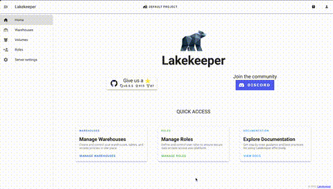

# Lakekeeper Catalog for Apache Iceberg

[](https://lakekeeper.io/)
[](https://discord.gg/jkAGG8p93B)
[](https://quay.io/repository/lakekeeper/catalog?tab=tags&filter_tag_name=like%3Av)
[](https://github.com/lakekeeper/lakekeeper-charts/tree/main/charts/lakekeeper)
[](https://artifacthub.io/packages/helm/lakekeeper/lakekeeper)


[](https://opensource.org/licenses/Apache-2.0)
[](https://github.com/lakekeeper/lakekeeper/actions/workflows/unittests.yml)
[](https://github.com/lakekeeper/lakekeeper/actions/workflows/spark-integration.yml)
[](https://github.com/lakekeeper/lakekeeper/actions/workflows/pyiceberg-integration.yml)
[](https://github.com/lakekeeper/lakekeeper/actions/workflows/trino-integration.yml)
[](https://github.com/lakekeeper/lakekeeper/actions/workflows/starrocks-integration.yml)


Please visit [https://docs.lakekeeper.io](https://docs.lakekeeper.io) for Documentation!

This is Lakekeeper: An Apache-Licensed, **secure**, **fast** and **easy-to-use**  implementation of the [Apache Iceberg](https://iceberg.apache.org/) REST Catalog specification based on [apache/iceberg-rust](https://github.com/apache/iceberg-rust). Define access control once, in the catalog, and enforce it across every compute engine — no rules duplicated per engine. Every request is checked against your policy before any data is read, and recorded. If you have questions, feature requests or just want a chat, we are hanging around in [Discord](https://discord.gg/jkAGG8p93B)!

<p align="center">

</p>
<br/>
<p align="center">

</p>

# Quickstart

A Docker Container is available on [quay.io](https://quay.io/repository/lakekeeper/catalog?tab=info).
We have prepared a minimal docker-compose file to demonstrate how to use the Lakekeeper catalog with common query engines.

```sh
git clone https://github.com/lakekeeper/lakekeeper.git
cd lakekeeper/examples/minimal
docker compose up
```

Then open your browser and head to [localhost:8888](http://localhost:8888) to load the example Jupyter notebooks or head to [localhost:8181](http://localhost:8181) for the [Lakekeeper UI](https://github.com/lakekeeper/console) (the open-source Console).

For more information on deployment, please check the [Getting Started Guide](https://docs.lakekeeper.io/getting-started/).

# Scope and Features

The Iceberg Catalog REST interface has become the standard for catalogs in open Lakehouses. It natively enables multi-table commits, server-side deconflicting and much more. It is figuratively the (**TIP**) of the Iceberg.

- **Written in Rust**: Single all-in-one binary - no JVM or Python env required.
- **Storage Access Management**: Lakekeeper secures access to your data using Vended-Credentials and remote signing for S3. All major Hyperscalers (AWS, Azure, GCP) as well as on-premise deployments with S3 are supported.
- **Openid Provider Integration**: Use your own identity provider for authentication, just set `LAKEKEEPER__OPENID_PROVIDER_URI` and you are good to go.
- **Native Kubernetes Integration**: Use our helm chart to easily deploy high available setups and natively authenticate kubernetes service accounts with Lakekeeper. Kubernetes and OpenID authentication can be used simultaneously. A [Kubernetes Operator](https://github.com/lakekeeper/lakekeeper-operator) is currently in development.
- **Change Events**: Built-in support to emit change events (CloudEvents), which enables you to react to any change that happen to your tables.
- **Change Approval**: Changes can also be prohibited by external systems. This can be used to prohibit changes to tables that would invalidate Data Contracts, Quality SLOs etc. Simply integrate with your own change approval via our `ContractVerification` trait.
- **Multi-Tenant capable**: A single deployment of Lakekeeper can serve multiple projects - all with a single entrypoint. Each project itself supports multiple Warehouses to which compute engines can connect.
- **Customizable**: Lakekeeper is meant to be extended. We expose the Database implementation (`Catalog`), `SecretsStore`, `Authorizer`, Events (`CloudEventBackend`) and `ContractVerification` as interfaces (Traits). This allows you to tap into any access management system of your company or stream change events to any system you like - simply by implementing a handful methods.
- **Well-Tested**: Integration-tested with `spark`, `pyiceberg`, `trino` and `starrocks`.
- **High Available & Horizontally Scalable**: There is no local state - the catalog can be scaled horizontally easily.
- **Fine Grained Access (FGA):** Lakekeeper's default Authorization system leverages [OpenFGA](https://openfga.dev/). If your company already has a different system in place, you can integrate with it by implementing a handful of methods in the `Authorizer` trait.

If you are missing something, we would love to hear about it in a [GitHub Issue](https://github.com/lakekeeper/lakekeeper/issues/new).


# Status

### Storage Profile Support

| Storage              | Status  | Comment                                     |
|----------------------|:-------:|---------------------------------------------|
| S3 - AWS             | ![done] | vended-credentials & remote-signing with optional role assumption, support for session Tags |
| S3 - Custom          | ![done] | vended-credentials & remote-signing; MinIO, Ceph and other S3-compatible stores |
| S3 - Cloudflare R2    | ![done] | vended-credentials via R2 temporary-access-credentials |
| S3 - Alibaba Cloud OSS (Aliyun / 阿里云) | ![done] | vended-credentials via Alibaba Cloud STS `AssumeRole` |
| Azure ADLS Gen2      | ![done] |                                             |
| Microsoft OneLake    | ![done] | Microsoft Fabric / OneLake with SAS-token vending; supports regional and private-link endpoints |
| Google Cloud Storage | ![done] | Support for GCS with and without hierarchical namespace |

Details on how to configure the storage profiles can be found in the [Docs](https://docs.lakekeeper.io).

### Supported Catalog Backends

| Backend  | Status  | Comment |
|----------|:-------:|---------|
| Postgres | ![done] | \>=15   |

### Supported Secret Stores

| Backend         | Status  | Comment       |
|-----------------|:-------:|---------------|
| Postgres        | ![done] |               |
| kv2 (hcp-vault) | ![done] | userpass auth |

### Supported Event Stores

| Backend | Status  | Comment |
|---------|:-------:|---------|
| NATS    | ![done] |         |
| Kafka   | ![done] |         |

### Supported Operations

Operations outside of the Iceberg REST specification that are supported by Lakekeeper.

| Operation             | Status  | Description                                |
|-----------------------|:-------:|--------------------------------------------|
| Project Management    | ![done] |                                            |
| Warehouse Management  | ![done] |                                            |
| Soft Deletion         | ![done] | Configurable on Warehouse level            |
| Deletion Protection   | ![done] | Deletion Protection for Warehouses, Namespaces, Tables and Views |
| Recursive Drop        | ![done] | Recursively drop all items inside Namespaces |
| Search                | ![done] | Fuzzy search for Tables on Warehouse level |
| Task Management       | ![done] |                                            |
| User Management       | ![done] | User discovery and management for permission assignment. Includes fuzzy search functionality. Note: Lakekeeper does not serve as an identity provider |
| Role Management       | ![done] |                                            |
| Permission Management | ![done] | Table level, Requires OpenFGA              |

### Auth(N/Z) Handlers

| Operation       | Status  | Description                                      |
|-----------------|:-------:|--------------------------------------------------|
| OIDC (AuthN)    | ![done] | Secure access to the catalog via OIDC            |
| Custom (AuthZ)  | ![done] | If you are willing to implement a single rust Trait, the `AuthZHandler` can be implement to connect to your system |
| OpenFGA (AuthZ) | ![done] | Internal Authorization management                |
| Cedar           | ![done] | Available in Lakekeeper+                         |
| OPA bridge      | ![done] | Exposes Lakekeeper permissions via [Open Policy Agent](https://docs.lakekeeper.io/docs/nightly/opa/) so engines like Trino enforce them |

### Web Console

| UI                 | Status  | Comment |
|--------------------|:-------:|---------|
| [Lakekeeper Console](https://github.com/lakekeeper/console) | ![done] | Open-source web UI, bundled via the `ui` feature. Manage warehouses, namespaces, tables, views, users, roles and permissions |


# Contributors

Lakekeeper is built by a community of contributors.

<a href="https://github.com/lakekeeper/lakekeeper/graphs/contributors">
  
</a>

See [DEVELOPMENT.md](./DEVELOPMENT.md) to get started, or join us on [Discord](https://discord.gg/jkAGG8p93B).

# Support

Community support is available on [Discord](https://discord.gg/jkAGG8p93B) and via [GitHub Issues](https://github.com/lakekeeper/lakekeeper/issues/new).

Lakekeeper is maintained by [Vakamo](https://vakamo.com), which also offers Lakekeeper
Plus — an edition adding Cedar-based authorization (see the Auth(N/Z) table above),
audit and an SLA.

# License

Licensed under the [Apache License, Version 2.0](http://www.apache.org/licenses/LICENSE-2.0)

[open]: https://cdn.jsdelivr.net/gh/Readme-Workflows/Readme-Icons@main/icons/octicons/IssueNeutral.svg
[semi-done]: https://cdn.jsdelivr.net/gh/Readme-Workflows/Readme-Icons@main/icons/octicons/ApprovedChangesGrey.svg
[done]: https://cdn.jsdelivr.net/gh/Readme-Workflows/Readme-Icons@main/icons/octicons/ApprovedChanges.svg
